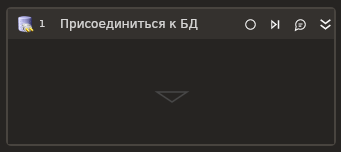

# Присоединиться к БД



Элемент осуществляет подключение к базе данных (БД). Установленное соединение обеспечивает возможность передачи запросов и получения ответов между приложением и базой данных. 

В сценарии компонент **Присоединиться к БД** выступает контейнером для других элементов, работающих с БД.


## Свойства
Символ `*` в названии свойства указывает на обязательность заполнения. Описание общих свойств см. в разделе [Свойства элемента](https://docs.primo-rpa.ru/primo-rpa/primo-studio/process/elements#svoistva-elementa).

**База данных** 
1. **Строка соединения\*** *[String]* - Строка соединения с БД. Строку можно сформировать автоматически по кнопке  — в этом случае откроется окно мастера (Wizard). Пример: <p>Ole DB:</p> <p>`"Provider=SQLOLEDB;Data Source=<servername>;Initial Catalog=<dbname>;Integrated Security=SSPI"`</p> <p>PostgreSQL:</p> <p> `"Host=<host>;Port=5432;Password=<password>;Username=<username>;Database=<dbname>"`</p> <p>ODBC:</p> <p>`"DRIVER=<ODBC Driver>; SERVER=<host>; PORT=<port number>;DATABASE=<dbname>; USER=<username>; PASSWORD=<password>"`</p> 
1. **Тип БД\*** *[LTools.Database.Model.DatabaseTypes]* - Выберите тип подсоединяемой базы данных. Доступные значения: <p>1. Ole DB — по умолчанию;</p> <p>2. Postgre Sql;</p> <p>3. ODBC</p> Пример: `Ole DB` 

**Вывод**
1. **Соединение с БД** *[LTools.Database.DatabaseInst]* - Инстанс соединения с БД. Позволяет сохранить активное соединение в переменную, чтобы использовать в других местах сценария для более быстрого подключения или отключения от БД.

## Только код

Пример использования элемента в процессе с типом **Только код** (Pure code):



```csharp
LTools.Database.DatabaseApp app = LTools.Database.DatabaseApp.Init(wf, "Provider=SQLOLEDB;Data Source=<servername>;Initial Catalog=<dbname>;Integrated Security=SSPI");
```



```python
app = LTools.Database.DatabaseApp.Init(wf, "Provider=SQLOLEDB;Data Source=<servername>;Initial Catalog=<dbname>;Integrated Security=SSPI")
```



```javascript
var app = _lib.LTools.Database.DatabaseApp.Init(wf, "Provider=SQLOLEDB;Data Source=<servername>;Initial Catalog=<dbname>;Integrated Security=SSPI");
```


