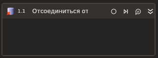

# Отсоединиться от БД



Элемент завершает соединение с базой данных.

## Свойства
Символ `*` в названии свойства указывает на обязательность заполнения. Описание общих свойств см. в разделе [Свойства элемента](https://docs.primo-rpa.ru/primo-rpa/primo-studio/process/elements#svoistva-elementa).

1. **Соединение с БД\*** *[LTools.Database.DatabaseInst]* - Название переменной, хранящей активное подключение к БД, которое вы хотите завершить.

## Только код

Пример использования элемента в процессе с типом **Только код** (Pure code):



```csharp
var connectionString = "Provider=SQLOLEDB;Data Source=<servername>;Initial Catalog=<dbname>;Integrated Security=SSPI";

var databaseType = LTools.Database.Model.DatabaseTypes.OleDB;

LTools.Database.DatabaseApp app = LTools.Database.DatabaseApp.Init(wf, connectionString, databaseType);

app.Disconnect();
```



```python
connectionString = "Provider=SQLOLEDB;Data Source=<servername>;Initial Catalog=<dbname>;Integrated Security=SSPI";

databaseType = LTools.Database.Model.DatabaseTypes.OleDB;

app = LTools.Database.DatabaseApp.Init(wf, connectionString, databaseType)

app.Disconnect()
```



```javascript
var databaseType = LTools.Database.Model.DatabaseTypes.OleDB;

var app = _lib.LTools.Database.DatabaseApp.Init(wf, connectionString, databaseType);

app.Disconnect();
```


