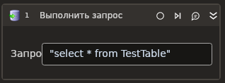

# Выполнить запрос



Элемент выполняет запрос к базе данных (БД). В сценарии элемент может использоваться:
* внутри контейнера **Присоединиться к БД**;
* автономно — если другие действия с БД не предполагаются.

**Рекомендации:**

1. Если вы работаете с MS SQL, то вместо использования встроенных элементов из группы **База данных** установите nuget-пакет [Primo.Database.SqlServer.Linux](https://www.nuget.org/packages/Primo.Database.SqlServer.Linux) — в нем есть поддержка именованных аргументов для SQL-запроса (через _@Parameter_).
2. Если вы поместили запрос в контейнер **Присоединиться к БД**, то настройки соединения будут взяты из контейнера. Это значит, в элементе **Выполнить запрос** такие свойства, как **Строка соединения, Соединение с БД, Тип БД** заполнять не нужно — настройки в контейнере имеют приоритет.
3. Если в сценарии вы сначала используете контейнер **Присоединиться к БД**, а сам запрос поместили ниже, вне контейнера, то в запросе можно указать активное подключение из контейнера. Для этого обратитесь к свойствам контейнера и сохраните активное подключение в переменную (свойство вывода **Соединение с БД**), а затем используйте эту переменную в элементе **Выполнить запрос**, в свойстве **Соединение с БД**.

## Свойства

Символ `*` в названии свойства указывает на обязательность заполнения. Описание общих свойств см. в разделе [Свойства элемента](https://docs.primo-rpa.ru/primo-rpa/primo-studio/process/elements#svoistva-elementa).

**База данных** 
1. **Соединение с БД** *[LTools.Database.DatabaseInst]* - Переменная, содержащая инстанс соединения с БД. Свойство заполняется, если вы хотите использовать ранее установленное и активное подключение к БД (см. п.3 рекомендаций). Если вы заполнили это свойство, оставьте пустыми свойства **Строка соединения** и **Тип БД**.
1. **Строка соединения** *[String]* - Строка соединения, которая будет использована для установки подключения к базе данных. Вид строки зависит от выбранного типа БД и его драйвера. См. подробности для <a href="https://www.connectionstrings.com/net-framework-data-provider-for-ole-db/use-an-ole-db-provider-from-net">OLE DB</a> и <a href="https://www.connectionstrings.com/net-framework-data-provider-for-odbc/use-an-odbc-driver-from-net">ODBC</a>.<br><br>Строку можно сформировать автоматически по кнопке  — в этом случае откроется [окно мастера](https://docs.primo-rpa.ru/primo-rpa/g_elements/el_basic/els_db/el_db_exec#okno-mastera-sozdaniya-stroki) (Wizard)</p> Пример: <p>Ole DB:</p> <p>`"Provider=SQLOLEDB;Data Source=<servername>;Initial Catalog=<dbname>;Integrated Security=SSPI"`</p> <p>PostgreSQL:</p> <p> `"Host=<host>;Port=5432;Password=<password>;Username=<username>;Database=<dbname>"`</p> <p>ODBC:</p> <p>`"DRIVER=<ODBC Driver>; SERVER=<host>; PORT=<port number>;DATABASE=<dbname>; USER=<username>; PASSWORD=<password>"`</p>
1. **Тип БД** - Тип базы данных. Нажмите на выпадающий список значений, чтобы выбрать доступный тип: <p>* Ole DB — по умолчанию;</p> <p>* Postgre Sql;</p> <p>* ODBC</p> Пример: `Postgre Sql`

**Данные запроса:** 
1. **Текст запроса\*** *[String]* - Текст запроса SQL. Пример: Postgre: <p>`"SELECT * FROM table1 WHERE column1 = @par1"`</p>
1. **Аргументы (конструктор)** *[String]* - Аргументы запроса в строковом формате. Строку можно сформировать в окне мастера по кнопке  | Результат из мастера: <p> `"{\"Args\":[{\"Position\":0,\"Name\":\"@par1\",\"Script\":\"\\\"test\\\"\"}]}"`</p> Где <strong>Args</strong> — это массив аргументов, а **@par1** — имя первого аргумента массива (для запроса в Postgre). Описание аргументов массива см. в подразделе [ниже](https://docs.primo-rpa.ru/primo-rpa/g_elements/el_basic/els_db/el_db_exec#argument-zaprosa)</p> 
1. **Аргументы (массив)** *[LTools.Database.Model.ArgumentsModel]* - Аргументы запроса в виде массива. Описание аргументов см. в подразделе [ниже](https://docs.primo-rpa.ru/primo-rpa/g_elements/el_basic/els_db/el_db_exec#argument-zaprosa)   
1. **Наличие результатов** *[Boolean]* - Признак ожидания результатов запроса. Поставьте галочку, если запрос должен вернуть в ответ какие-то данные. Например, вы отправили `"SELECT * FROM table` и в ответе ожидаете данные из таблицы. Если же это запрос типа `INSERT TO...` или `DELETE FROM...`, который не возвращает данные, то галочку ставить не нужно.
1. **Таймаут** *[Int32]* - Таймаут запроса в миллисекундах. Верхнее значение ограничено типом данных. Пример: `10000`
   
**Вывод:** 
1. **Кол-во** *[Int32]* - Количество обработанных строк.
1. **Переменная (массив)** *[List\<List\<string>>]* - Переменная для сохранения результатов запроса в массиве.
1. **Переменная (таблица)** *[[System.Data.DataTable](https://learn.microsoft.com/ru-ru/dotnet/api/system.data.datatable?view=netcore-2.1)]* - Переменная для сохранения результатов запроса в Datatable.

## Аргумент запроса

**LTools.Database.Model.ArgumentsModel** — это массив аргументов (Args).

Массив состоит из объектов **LTools.Database.Model.ArgumentsModelItem** — аргументов запроса. Каждый аргумент имеет следующие атрибуты:

* Position — порядковый номер аргумента. Нумерация начинается с 0 (int).
* Name — наименование аргумента (String).
* Script — значение аргумента (Object).

:small_orange_diamond: *Принцип использования аргументов зависит от типа БД:*

1\. Для **Ole DB** и **ODBC** в запросе вместо аргумента нужно указать знак `?`. Пример:

```
"SELECT * FROM table1 WHERE id > ?"
```

Аргумент будет вставляться в запрос вместо знака `?` соответственно заданной позиции. Атрибут имени для них не играет роли.

2\. Для **Postgre**, напротив, имя аргумента важно, поскольку в запросе можно использовать именованные аргументы (через `@<parameterName>`). Пример:

```
"SELECT * FROM table1 WHERE column1 = @par1"
```

Во время выполнения команды имя аргумента будет заменено на его значение.

## Только код

Пример использования элемента в процессе с типом **Только код** (Pure code):



```csharp
var connectionString = "Provider=SQLOLEDB;Data Source=<servername>;Initial Catalog=<dbname>;Integrated Security=SSPI";
var databaseType = LTools.Database.Model.DatabaseTypes.OleDB;

LTools.Database.DatabaseApp app = LTools.Database.DatabaseApp.Init(wf, connectionString, databaseType);

var query = "SELECT * FROM Table1";
var isMakeResult = true;
LTools.Database.Model.ArgumentsModel arguments = null;
var timeout = 10000;

List<List<string>> data = app.Execute(query, isMakeResultisMakeResult, arguments, timeout);
```



```python
connectionString = "Provider=SQLOLEDB;Data Source=<servername>;Initial Catalog=<dbname>;Integrated Security=SSPI";
databaseType = LTools.Database.Model.DatabaseTypes.OleDB;

app = LTools.Database.DatabaseApp.Init(wf, connectionString, databaseType)

query = "SELECT * FROM Table1";
isMakeResult = true;
arguments = None;
timeout = 10000;

data = app.Execute(query, isMakeResultisMakeResult, arguments, timeout);
```



```javascript
var connectionString = "Provider=SQLOLEDB;Data Source=<servername>;Initial Catalog=<dbname>;Integrated Security=SSPI";
var databaseType = LTools.Database.Model.DatabaseTypes.OleDB;

var app = _lib.LTools.Database.DatabaseApp.Init(wf, connectionString, databaseType);

var query = "SELECT * FROM Table1";
var isMakeResult = true;
var arguments = Null;
var timeout = 10000;

var data = app.Execute(query, isMakeResultisMakeResult, arguments, timeout);
```




var tbl = app.ExecuteQueryTbl("SELECT * FROM Table1");
```



