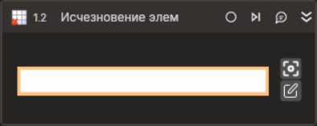

# Исчезновение элемента



Компонент, ожидающий исчезновения элемента управления.

## Свойства
Символ `*` в названии свойства указывает на обязательность заполнения. 
Описание общих свойств см. в разделе [Свойства элемента](https://docs.primo-rpa.ru/primo-rpa/primo-studio/process/elements#svoistva-elementa).

1. **Шаблон поиска\*** *[String]* - Шаблон поиска элемента управления.
1. **Таймаут\*** *[Int32]* - Предельное время ожидания завершения процесса (мс).


## Только код  
Пример использования элемента в процессе с типом **Только код** (Pure code):
>Для демонстрации исчезновения элемента в станице браузера, открытой при работе примера, необходимо ввести любой текст для поиска и нажать клавишу Enter.



```csharp
LTools.WebBrowser.BrowserApp app = LTools.WebBrowser.BrowserApp.Open(wf, LTools.WebBrowser.Model.BrowserTypes.Yandex, "https://www.google.com/");
app.WaitElementVanish("{\"Tag\":\"TEXTAREA\",\"Text\":\"\",\"CSSSelector\":\"\",\"SearchFrames\":false,\"Attributes\":[{\"Key\":\"CLASS\",\"Value\":\"gLFyf\"}]}", 20000);
```



```python
app = LTools.WebBrowser.BrowserApp.Open(wf, LTools.WebBrowser.Model.BrowserTypes.Yandex, "https://www.google.com/")
app.WaitElementVanish("{\"Tag\":\"TEXTAREA\",\"Text\":\"\",\"CSSSelector\":\"\",\"SearchFrames\":false,\"Attributes\":[{\"Key\":\"CLASS\",\"Value\":\"gLFyf\"}]}", 20000)
```



```javascript
var app = LTools.WebBrowser.BrowserApp.Open(wf, LTools.WebBrowser.Model.BrowserTypes.Yandex, "https://www.google.com/");
app.WaitElementVanish("{\"Tag\":\"TEXTAREA\",\"Text\":\"\",\"CSSSelector\":\"\",\"SearchFrames\":false,\"Attributes\":[{\"Key\":\"CLASS\",\"Value\":\"gLFyf\"}]}", 20000);
```


  
