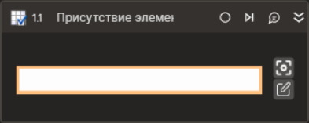

# Присутствие элемента



Компонент, производящий поиск элемента управления. Компонент корректно работает только внутри контейнера "Открыть браузер" либо "Присоединиться к браузеру".

## Свойства
Символ `*` в названии свойства указывает на обязательность заполнения. Описание общих свойств см. в разделе [Свойства элемента](https://docs.primo-rpa.ru/primo-rpa/primo-studio/process/elements#svoistva-elementa).

1. **Шаблон поиска\*** *[String]* - Шаблон поиска элемента управления.
1. **Элемент** *[LTools.WebBrowser.Model.IElementInfo]* - Переменная для хранения ссылки на элемент управления.
1. **Элементы** *[List\<LTools.WebBrowser.Model.IElementInfo>]* - Переменная для хранения ссылок на элементы управления.
1. **Результат** *[Boolean]* - Переменная, хранящая результаты поиска.
1. **Таймаут\*** *[Int32]* - Предельное время ожидания завершения процесса (мс).



```csharp
LTools.WebBrowser.BrowserApp app = LTools.WebBrowser.BrowserApp.Open(wf, LTools.WebBrowser.Model.BrowserTypes.Yandex, "https://www.google.com/");
LTools.WebBrowser.Model.IElementInfo el = app.FindElement("{\"Tag\":\"TEXTAREA\",\"Text\":\"\",\"CSSSelector\":\"\",\"SearchFrames\":false,\"Attributes\":[{\"Key\":\"CLASS\",\"Value\":\"gLFyf\"}]}");
LTools.Workflow.PrimoApp.AddToLog(wf, el.TagName);
List<LTools.WebBrowser.Model.IElementInfo> els = app.FindElements("{\"Tag\":\"TEXTAREA\",\"Text\":\"\",\"CSSSelector\":\"\",\"SearchFrames\":false,\"Attributes\":[{\"Key\":\"CLASS\",\"Value\":\"gLFyf\"}]}");
LTools.Workflow.PrimoApp.AddToLog(wf, els[0].TagName);
```



```python
app = LTools.WebBrowser.BrowserApp.Open(wf, LTools.WebBrowser.Model.BrowserTypes.Yandex, "https://www.google.com/")
el = app.FindElement("{\"Tag\":\"TEXTAREA\",\"Text\":\"\",\"CSSSelector\":\"\",\"SearchFrames\":false,\"Attributes\":[{\"Key\":\"CLASS\",\"Value\":\"gLFyf\"}]}")
LTools.Workflow.PrimoApp.AddToLog(wf, el.TagName)
els = app.FindElements("{\"Tag\":\"TEXTAREA\",\"Text\":\"\",\"CSSSelector\":\"\",\"SearchFrames\":false,\"Attributes\":[{\"Key\":\"CLASS\",\"Value\":\"gLFyf\"}]}")
LTools.Workflow.PrimoApp.AddToLog(wf, els[0].TagName)
```



```javascript
var app = _lib.LTools.WebBrowser.BrowserApp.Open(wf, LTools.WebBrowser.Model.BrowserTypes.Yandex, "https://www.google.com/");
var el = app.FindElement("{\"Tag\":\"TEXTAREA\",\"Text\":\"\",\"CSSSelector\":\"\",\"SearchFrames\":false,\"Attributes\":[{\"Key\":\"CLASS\",\"Value\":\"gLFyf\"}]}");
_lib.LTools.Workflow.PrimoApp.AddToLog(wf, el.TagName);
var els = app.FindElements("{\"Tag\":\"TEXTAREA\",\"Text\":\"\",\"CSSSelector\":\"\",\"SearchFrames\":false,\"Attributes\":[{\"Key\":\"CLASS\",\"Value\":\"gLFyf\"}]}");
_lib.LTools.Workflow.PrimoApp.AddToLog(wf, els[0].TagName);
```


