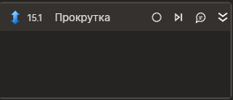

# Прокрутка



Элемент, осуществляющий прокрутку в браузере.

## Свойства

Символ `*` в названии свойства указывает на обязательность заполнения. Описание общих свойств см. в разделе [Свойства элемента](https://docs.primo-rpa.ru/primo-rpa/primo-studio/process/elements#svoistva-elementa).

1. **Горизонтальная** *[int?]* - Горизонтальная прокрутка (смещение)  
1. **Вертикальная** *[int?]* - Вертикальная прокрутка (смещение)  
1. **Прокрутка** *[System.Nullable<System.Windows.Point>]* - Текущее состояние прокрутки  
1. **Таймаут\*** *[Int32]* - Предельное время ожидания завершения процесса (мс)

## Только код  
Пример использования элемента в процессе с типом **Только код** (Pure code):



```csharp
LTools.WebBrowser.BrowserApp app = LTools.WebBrowser.BrowserApp.Init(wf, "Free email*", LTools.WebBrowser.Model.BrowserTypes_Short.IE);
System.Windows.Point? ret = app.Scroll(null, null);
app.Scroll(100, 20, 10000);
```



```python
app = LTools.WebBrowser.BrowserApp.Init(wf, "Free email*", LTools.WebBrowser.Model.BrowserTypes_Short.IE)
ret = app.Scroll(None, None)
app.Scroll(100, 20, 10000)
```



```javascript
var app = _lib.LTools.WebBrowser.BrowserApp.Init(wf, "Free email*", _lib.LTools.WebBrowser.Model.BrowserTypes_Short.IE);
var ret = app.Scroll(null, null);
app.Scroll(100, 20, 10000);
```


