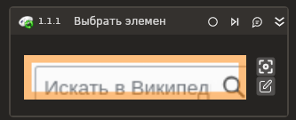

# Выбрать элемент

Элемент ожидает событие нажатия мыши в окне браузера.

Для работы активности необходимо установить утилиту **Evtest** и дать права на чтения всех файлов по пути `/dev/input`.

## Свойства
Символ * в названии свойства указывает на обязательность заполнения. Описание общих свойств см. в разделе [Свойства элемента](https://docs.primo-rpa.ru/primo-rpa/primo-studio/process/elements#svoistva-elementa).

**«Браузер»**:

1. **Тип браузера** - тип используемого браузера. По умолчанию `Chrome`. Чтобы изменить тип, нажмите выпадающий список значений.
1. **Заголовок браузера** *[String]* - заголовок подключаемого браузера. По умолчанию `"*"`.

**«Процесс»**:

1. **Шаблон поиска** *[String]* - [шаблон поиска](https://docs.primo-rpa.ru/primo-rpa/primo-rpa-studio-linux/debug/searchpatterns) элемента управления, на котором ожидается клик мышью.
1. **Основная кнопка** - основная кнопка мыши. По умолчанию `BUTTON_LEFT` - одиночный левый клик. Чтобы изменить тип, нажмите выпадающий список значений:
   * `BUTTON_LEFT_DOUBLECLICK` - двойной клик левой кнопкой мыши.
   * `BUTTON_RIGHT` - одиночный клик правой кнопкой.
   * `BUTTON_MIDDLE` - колесико.
1. **Модификатор** *[Avalonia.Input.KeyModifiers]* - кнопка-модификатор клавиатуры. Чтобы указать кнопку, нажмите выпадающий список значений:
   * `Alt`;
   * `Ctrl`;
   * `Shift`;
   * `Meta`.
1. **Дополнительная кнопка** *[Avalonia.Input.KeyModifiers]* - дополнительная кнопка клавиатуры. Чтобы указать кнопку, нажмите выпадающий список значений:
   * `Alt`;
   * `Ctrl`;
   * `Shift`;
   * `Meta`.
1. **Дочерние** *[Boolean]* - определяет, нужно ли включать события клика от дочерних элементов управления.
