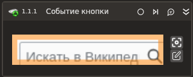

# Событие кнопки браузера

Компонент, ожидающий событие нажатия кнопки приложения.

## Свойства
Символ * в названии свойства указывает на обязательность заполнения. Описание общих свойств см. в разделе [Свойства элемента](https://docs.primo-rpa.ru/primo-rpa/primo-studio/process/elements#svoistva-elementa).

1. **Шаблон поиска** *[String]* - Шаблон поиска элемента управления  
1. **Тип браузера** *[LTools.WebBrowser.Model. BrowserTypes\_Short]* - Тип используемого браузера 
1. **Заголовок браузера** *[String]* - Заголовок подключаемого браузера   
1. **Основная кнопка\*** *[LTools.Common. Model.VirtualKey]* - Основная кнопка
1. **Модификатор** *[LTools.Common. Model.VirtualKey]* - Кнопка-модификатор (Ctrl, Shift...)  
1. **Дополнительная кнопка** *[LTools.Common. Model.VirtualKey]* - Дополнительная кнопка  
1. **Состояние** *[LTools.Common.Model. Triggers.KeyTriggerState]* - Состояние кнопки  
1. **Дочерние** *[Boolean]* - Включая события от дочерних элементов 
