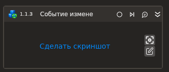

# Событие изменения аттрибута

Компонент, ожидающий событие изменения атрибута элемента страницы.

## Свойства
Символ * в названии свойства указывает на обязательность заполнения. Описание общих свойств см. в разделе [Свойства элемента](https://docs.primo-rpa.ru/primo-rpa/primo-studio/process/elements#svoistva-elementa).

1. **Шаблон поиска** *[String]* - Шаблон поиска элемента управления  
1. **Тип браузера** *[LTools.WebBrowser.Model. BrowserTypes\_Short]* - Тип используемого браузера  
1. **Заголовок браузера** *[String]* - Заголовок подключаемого браузера  
1. **Атрибут** *[String]* - Отслеживаемый атрибут. ".text" для отслеживания изменения текста 
