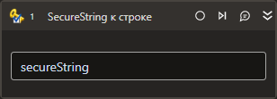

# SecureString к строке



Компонент, который преобразует SecureString в строку. Элемент **SecureString к строке** может быть полезен при автоматизации задач, которые требуют обработки конфиденциальных данных.

## Свойства

Символ `*` в названии свойства указывает на обязательность заполнения. Описание общих свойств см. в разделе [Свойства элемента](https://docs.primo-rpa.ru/primo-rpa/primo-studio/process/elements#svoistva-elementa).

**Процесс:**
1. **Строка\*** *[String]* - Название строковой переменной.

**Вывод:** 
1. **SecureString\*** *[[System.Security.SecureString](https://learn.microsoft.com/ru-ru/dotnet/api/system.security.securestring?view=net-5.0)] - Название переменной вывода, в которую сохранены данные в формате SecureString.

## Только код

Пример использования элемента в процессе с типом **Только код** (Pure code)



```csharp
System.Security.SecureString secureString = LTools.Common.Helpers.CryptographyHelper.StringToSecureString("Защищенная строка");
string ret = LTools.Common.Helpers.CryptographyHelper.SecureStringToString(secureString);
```



```python
secureString = LTools.Common.Helpers.CryptographyHelper.StringToSecureString("Защищенная строка");
ret = LTools.Common.Helpers.CryptographyHelper.SecureStringToString(secureString);
```



```javascript
var secureString = _lib.LTools.Common.Helpers.CryptographyHelper.StringToSecureString("Защищенная строка");
var ret = _lib.LTools.Common.Helpers.CryptographyHelper.SecureStringToString(secureString);
```


