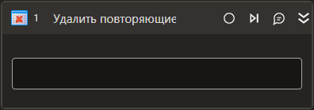

# Удалить повторяющиеся строки

Компонент, удаляющий повторяющиеся строки из таблицы.

## Свойства  
Символ `*` в названии свойства указывает на обязательность заполнения. Описание общих свойств см. в разделе [Свойства элемента](https://docs.primo-rpa.ru/primo-rpa/primo-studio/process/elements#svoistva-elementa).

1. **Таблица\*** *[System.Data.DataTable]* - Исходная таблица.
1. **Результат\*** *[System.Data.DataTable]* - Переменная, в которую нужно сохранить измененную таблицу.
