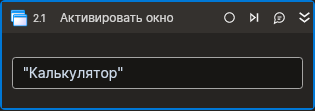

# Активировать окно



Компонент, выводящий окно процесса на передний план. Компонент корректно работает только внутри контейнера Присоединиться к приложению.

## Свойства

Символ `*` в названии свойства указывает на обязательность заполнения. Описание общих свойств см. в разделе [Свойства элемента](https://docs.primo-rpa.ru/primo-rpa/primo-studio/process/elements#svoistva-elementa).

1. **Заголовок** *[String]* - Заголовок окна  
1. **Заголовок (RegEx)** *[String]* - Заголовок окна (регулярное выражение)

## Только код  
Пример использования элемента в процессе с типом **Только код** (Pure code):
> Для работы с примером необходимо установить приложение **mate-calc**.



```csharp
LTools.Desktop.DesktopApp app = LTools.Desktop.DesktopApp.Init(wf, null, "Калькулятор", 10000, true, LTools.Desktop.Model.DesktopTypes.UIAUTOMATION);
app.ActivateWindow("Калькулятор");
```



```python
app = LTools.Desktop.DesktopApp.Init(wf, None, "Калькулятор*", 10000, True, LTools.Desktop.Model.DesktopTypes.UIAUTOMATION)
app.ActivateWindow("Калькулятор")
```



```javascript
let app = _lib.LTools.Desktop.DesktopApp.Init(wf, null, "Калькулятор", 10000, true, _lib.LTools.Desktop.Model.DesktopTypes.UIAUTOMATION);
app.ActivateWindow("Калькулятор");
```


