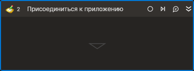

# Присоединиться к приложению



Компонент осуществляет подключение к действующему процессу внешнего приложения.

## Свойства

Символ `*` в названии свойства указывает на обязательность заполнения. 
Описание общих свойств см. в разделе [Свойства элемента](https://docs.primo-rpa.ru/primo-rpa/primo-studio/process/elements#svoistva-elementa).
Утилитарные свойства приведены в таблице ниже.

1. **Заголовок** *[String]* - Заголовок подключаемого приложения  
1. **Имя процесса** *[String]* - Название процесса запущенного приложения. Если указан заголовок приложения, имя процесса можно не указывать. Если заполнены оба свойства, при подключении будут учитываться оба значения.  
1. **Таймаут\*** *[Int32]* - Предельное время ожидания завершения процесса (мс).  

## Только код  
Пример использования элемента в процессе с типом **Только код** (Pure code):
> Для работы с примером необходимо установить приложение **mate-calc**.



```csharp
LTools.Desktop.DesktopApp app = LTools.Desktop.DesktopApp.Init(wf, null, "Калькулятор", 10000, true, LTools.Desktop.Model.DesktopTypes.UIAUTOMATION);
```



```python
app = LTools.Desktop.DesktopApp.Init(wf, None, "Калькулятор", 10000, True, LTools.Desktop.Model.DesktopTypes.UIAUTOMATION)
```



```javascript
let app = _lib.LTools.Desktop.DesktopApp.Init(wf, null, "Калькулятор", 10000, true, LTools.Desktop.Model.DesktopTypes.UIAUTOMATION);
```


