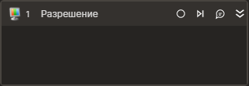

# Разрешение


Элемент, осуществляющий смену разрешения экрана.

## Свойства

Символ `*` в названии свойства указывает на обязательность заполнения. Описание общих свойств см. в разделе [Свойства элемента](https://docs.primo-rpa.ru/primo-rpa/primo-studio/process/elements#svoistva-elementa).

**Процесс**  
1. **Вертикальное** *[int?]* - Вертикальное разрешение.  
1. **Горизонтальное** *[int?]* - Горизонтальное разрешение.   
1. **Таймаут\*** *[Int32]* - Предельное время ожидания завершения процесса (мс).  

**Вывод**
1. **Разрешение** *[Avalonia.Point]* - Текущее разрешение экрана.  

## Только код  
Пример использования элемента в процессе с типом **Только код** (Pure code):  

  
  
```csharp  
LTools.Desktop.ChangeResolutionApplication(wf, 1920, 1080, 20000);  
```
  
  
```python  
LTools.Desktop.ChangeResolutionApplication(wf, 1920, 1080, 20000)  
```
  
  
```javascript  
_lib.LTools.Desktop.ChangeResolutionApplication(wf, 1920, 1080, 20000);  
```
  
  

