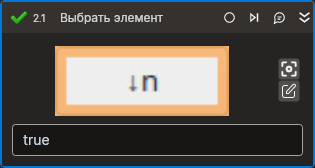

# Выбрать элемент



Компонент, производящий изменение состояния выбранного элемента управления (для чек-боксов и радио-кнопок).

## Свойства
Символ `*` в названии свойства указывает на обязательность заполнения. Описание общих свойств см. в разделе [Свойства элемента](https://docs.primo-rpa.ru/primo-rpa/primo-studio/process/elements#svoistva-elementa).

**Вывод**
1. **Состояние** *[Boolean?]* - Текущее состояние элемента

**Процесс**
1. **Шаблон поиска** *[String]* - Шаблон поиска элемента управления  
1. **Элемент** *[Tools.Desktop. Model.DUIControl]* - Ссылка на элемент управления  
1. **Новое состояние** *[Boolean?]* - Новое состояние элемента  
1. **Таймаут\*** *[Int32]* - Предельное время ожидания завершения процесса (мс)  

## Только код
Пример использования элемента в процессе с типом **Только код** (Pure code):
> - Для работы с примером необходимо установить приложение **mate-calc**.
> - Режим калькулятора `Расширенный`.
> - В результате работы примера должна перейти в нажатое состояние кнопка ``Подстрочный режим`` 



```csharp
LTools.Desktop.DesktopApp app = LTools.Desktop.DesktopApp.Init(wf, null, "Калькулятор", 10000, true, LTools.Desktop.Model.DesktopTypes.UIAUTOMATION);
//Шаблон поиска
app.SetChecked("{\"WinName\":null,\"WinPath\":null,\"WinId\":null,\"AppName\":null,\"TextSearchMode\":0,\"Items\":[{\"Name\":\"subscript\",\"Role\":\"toggle button\",\"Items\":[]}]}", true);
//Ссылка на элемент
LTools.Desktop.Model.DUIControl el = app.FindElement("{\"WinName\":null,\"WinPath\":null,\"WinId\":null,\"AppName\":null,\"TextSearchMode\":0,\"Items\":[{\"Name\":\"subscript\",\"Role\":\"toggle button\",\"Items\":[]}]}");
app.SetChecked(el, true);
```



```python
app = LTools.Desktop.DesktopApp.Init(wf, None, "Калькулятор", 10000, True, LTools.Desktop.Model.DesktopTypes.UIAUTOMATION)
#Шаблон поиска
app.SetChecked("{\"WinName\":null,\"WinPath\":null,\"WinId\":null,\"AppName\":null,\"TextSearchMode\":0,\"Items\":[{\"Name\":\"subscript\",\"Role\":\"toggle button\",\"Items\":[]}]}", True)
#Ссылка на элемент
el = app.FindElement("{\"WinName\":null,\"WinPath\":null,\"WinId\":null,\"AppName\":null,\"TextSearchMode\":0,\"Items\":[{\"Name\":\"subscript\",\"Role\":\"toggle button\",\"Items\":[]}]}")
app.SetChecked(el, True)
```



```javascript
var app = _lib.LTools.Desktop.DesktopApp.Init(wf, null, "Калькулятор", 10000, true, _lib.LTools.Desktop.Model.DesktopTypes.UIAUTOMATION);
//Шаблон поиска
app.SetChecked("{\"WinName\":null,\"WinPath\":null,\"WinId\":null,\"AppName\":null,\"TextSearchMode\":0,\"Items\":[{\"Name\":\"subscript\",\"Role\":\"toggle button\",\"Items\":[]}]}", true);
//Ссылка на элемент
var el = app.FindElement("{\"WinName\":null,\"WinPath\":null,\"WinId\":null,\"AppName\":null,\"TextSearchMode\":0,\"Items\":[{\"Name\":\"subscript\",\"Role\":\"toggle button\",\"Items\":[]}]}");
app.SetChecked(el, true);
```


