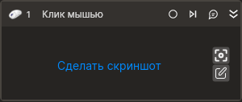

# Клик мышью

Компонент, производящий клик мышью на выбранном элементе управления. Компонент корректно работает только внутри контейнера Присоединиться к приложению.

## Свойства  
Символ `*` в названии свойства указывает на обязательность заполнения. Описание общих свойств см. в разделе [Свойства элемента](https://docs.primo-rpa.ru/primo-rpa/primo-studio/process/elements#svoistva-elementa).

1. **Шаблон поиска** *[String]* - Шаблон поиска элемента управления.  
1. **Элемент** *[LTools.Desktop.Model.DUIControl]* - Ссылка на элемент управления  
1. **Координаты** *[System.Drawing.Rectangle]* - Координаты клика курсора.  
1. **Кнопка клавиатуры** *[LTools.Desktop.Model.KeyboardKeys]* - Кнопка клавиатуры.
1. **Кнопка мыши** *[LTools.Desktop.Model.MouseButtons]* - Кнопка мыши.  
1. **Позиция** *[LTools.Common.Model.ClickPositions]* - Позиция курсора при клике.  
1. **Таймаут\*** *[Int32]* - Предельное время ожидания завершения процесса (мс).  

## Только код
В настоящее время функциональность для использования данного элемента в процессах с типом **Только код** (Pure code) не реализована.
