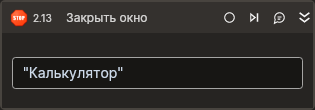

# Закрыть окно



Компонент, закрывающий окно приложения. Компонент корректно работает только внутри контейнера Присоединиться к приложению.

## Свойства

Символ `*` в названии свойства указывает на обязательность заполнения. Описание общих свойств см. в разделе [Свойства элемента](https://docs.primo-rpa.ru/primo-rpa/primo-studio/process/elements#svoistva-elementa).

1. **Заголовок** *[String]* - Заголовок окна  
1. **Заголовок (RegEx)** *[String]* - Заголовок окна (регулярное выражение)

> Если активность находится в контейнере `Присоединиться к приложению`, тогда свойства `Заголовок` и `Заголовок (RegEx)` можно не задавать, так как вся необходимая информация уже указана в самой активности `Присоединиться к приложению`. Но в случае, если у приложения открыто несколько окон, эти свойства необходимо заполнить.


## Только код  

Пример использования элемента в процессе с типом **Только код** (Pure code):  
> Для работы с примером необходимо установить приложение **mate-calc**.  



```csharp
LTools.Desktop.DesktopApp app = LTools.Desktop.DesktopApp.Init(wf, null, "Калькулятор", 10000, true, LTools.Desktop.Model.DesktopTypes.UIAUTOMATION);
app.CloseWindow("Калькулятор");
```


```python
app = LTools.Desktop.DesktopApp.Init(wf, None, "Калькулятор", None, 10000, True, LTools.Desktop.Model.DesktopTypes.UIAUTOMATION)
app.CloseWindow("Калькулятор")
```


```javascript
let app = _lib.LTools.Desktop.DesktopApp.Init(wf, null, "Калькулятор", 10000, true, _lib.LTools.Desktop.Model.DesktopTypes.UIAUTOMATION);
app.CloseWindow("Калькулятор");
```


