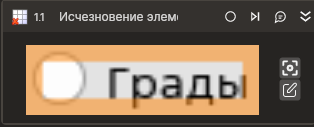

# Исчезновение элемента



Компонент, ожидающий исчезновения элемента управления.

## Свойства

Символ `*` в названии свойства указывает на обязательность заполнения. Описание общих свойств см. в разделе [Свойства элемента](https://docs.primo-rpa.ru/primo-rpa/primo-studio/process/elements#svoistva-elementa).

1. **Шаблон поиска\*** *[String]* - Шаблон поиска элемента управления  
2. **Таймаут\*** *[Int32]* - Предельное время ожидания завершения процесса (мс) 

## Только код  
Пример использования элемента в процессе с типом **Только код** (Pure code):



```csharp
LTools.Desktop.DesktopApp app = LTools.Desktop.DesktopApp.Init(wf, null, "Test_*", 20000, true, LTools.Desktop.Model.DesktopTypes.UIAUTOMATION);
app.WaitElementVanish("{\"Name\":\"Vanish Label\",\"AutomationID\":\"\",\"ClassName\":\"TextBlock\",\"AUIProperties\":[],\"TextSearchMode\":0,\"IsRoot\":false,\"IsQuickSearch\":false}", 2000);
```



```python
app = LTools.Desktop.DesktopApp.Init(wf, None, "Test_*", 20000, True, LTools.Desktop.Model.DesktopTypes.UIAUTOMATION)
app.WaitElementVanish("{\"Name\":\"Vanish Label\",\"AutomationID\":\"\",\"ClassName\":\"TextBlock\",\"AUIProperties\":[],\"TextSearchMode\":0,\"IsRoot\":false,\"IsQuickSearch\":false}", 2000)
```



```javascript
var app = _lib.LTools.Desktop.DesktopApp.Init(wf, null, "Test_*", 20000, true, _lib.LTools.Desktop.Model.DesktopTypes.UIAUTOMATION);
app.WaitElementVanish("{\"Name\":\"Vanish Label\",\"AutomationID\":\"\",\"ClassName\":\"TextBlock\",\"AUIProperties\":[],\"TextSearchMode\":0,\"IsRoot\":false,\"IsQuickSearch\":false}", 2000);
```


