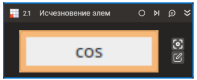

# Исчезновение элемента



Компонент, ожидающий исчезновения элемента управления.

## Свойства

Символ `*` в названии свойства указывает на обязательность заполнения. Описание общих свойств см. в разделе [Свойства элемента](https://docs.primo-rpa.ru/primo-rpa/primo-studio/process/elements#svoistva-elementa).

1. **Шаблон поиска\*** *[String]* - Шаблон поиска элемента управления  
2. **Таймаут\*** *[Int32]* - Предельное время ожидания завершения процесса (мс) 

## Только код  
Пример использования элемента в процессе с типом **Только код** (Pure code):
> - Для работы с примером необходимо установить приложение **mate-calc**.
> - Для демонстрации `Исчезновения элемента` необходимо переключиться из режима калькулятора `Расширенный` в режим `Простой` во время запуска примера (кнопка `cos` должна исчезнуть).



```csharp
LTools.Desktop.DesktopApp app = LTools.Desktop.DesktopApp.Init(wf, null, "Калькулятор", 20000, true, LTools.Desktop.Model.DesktopTypes.UIAUTOMATION);
app.WaitElementVanish("{\"WinName\":null,\"WinPath\":null,\"WinId\":null,\"AppName\":\"mate-calc\",\"TextSearchMode\":0,\"Items\":[{\"Name\":\"cosine\",\"Role\":\"push button\",\"Items\":[]}]}", 20000);
```



```python
app = LTools.Desktop.DesktopApp.Init(wf, None, "Калькулятор", 20000, True, LTools.Desktop.Model.DesktopTypes.UIAUTOMATION)
app.WaitElementVanish("{\"WinName\":null,\"WinPath\":null,\"WinId\":null,\"AppName\":\"mate-calc\",\"TextSearchMode\":0,\"Items\":[{\"Name\":\"cosine\",\"Role\":\"push button\",\"Items\":[]}]}", 20000)
```



```javascript
var app = _lib.LTools.Desktop.DesktopApp.Init(wf, null, "Калькулятор", 20000, true, _lib.LTools.Desktop.Model.DesktopTypes.UIAUTOMATION);
app.WaitElementVanish("{\"WinName\":null,\"WinPath\":null,\"WinId\":null,\"AppName\":\"mate-calc\",\"TextSearchMode\":0,\"Items\":[{\"Name\":\"cosine\",\"Role\":\"push button\",\"Items\":[]}]}", 20000);
```




