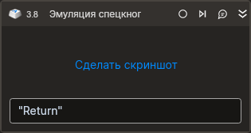

# Эмуляция спецкнопки



Предназначен для эмуляции нажатия клавиш клавиатуры или их комбинаций. Этот элемент часто используется для автоматизации действий, требующих ввода с клавиатуры.

## Свойства
Символ `*` в названии свойства указывает на обязательность заполнения. 
Описание общих свойств см. в разделе [Свойства элемента](https://docs.primo-rpa.ru/primo-rpa/primo-studio/process/elements#svoistva-elementa).

1. **Спецкнопки\*** *[String]* - Нажимаемые Спецкнопки ("Return").  
1. **Пауза\*** *[Int32]* - Пауза между нажатиями кнопок (мс).  
1. **Таймаут\*** *[Int32]* - Предельное время ожидания завершения процесса (мс). 

## Только код
Пример использования элемента в процессе с типом **Только код** (Pure code):
> Для работы с примером необходимо установить приложение **mate-calc**.



```csharp
LTools.Desktop.DesktopApp app = LTools.Desktop.DesktopApp.Init(wf, null, "Калькулятор", 20000, true, LTools.Desktop.Model.DesktopTypes.UIAUTOMATION);
app.SetFocus("{\"WinName\":null,\"WinPath\":null,\"WinId\":null,\"AppName\":null,\"TextSearchMode\":0,\"Items\":[{\"Role\":\"editbar\",\"Items\":[]}]}");
LTools.Desktop.DesktopApp.TypeSimulate(wf, "100+23", 500, 20000);
LTools.Desktop.DesktopApp.HotKeySimulate(wf, "Return");
```



```python
app = LTools.Desktop.DesktopApp.Init(wf, None, "Калькулятор", 20000, True, LTools.Desktop.Model.DesktopTypes.UIAUTOMATION)
app.SetFocus("{\"WinName\":null,\"WinPath\":null,\"WinId\":null,\"AppName\":null,\"TextSearchMode\":0,\"Items\":[{\"Role\":\"editbar\",\"Items\":[]}]}")
LTools.Desktop.DesktopApp.TypeSimulate(wf, "100+23", 500, 20000)
LTools.Desktop.DesktopApp.HotKeySimulate(wf, "Return")
```



```javascript
var app = _lib.LTools.Desktop.DesktopApp.Init(wf, null, "Калькулятор", 20000, true, _lib.LTools.Desktop.Model.DesktopTypes.UIAUTOMATION);
app.SetFocus("{\"WinName\":null,\"WinPath\":null,\"WinId\":null,\"AppName\":null,\"TextSearchMode\":0,\"Items\":[{\"Role\":\"editbar\",\"Items\":[]}]}");
_lib.LTools.Desktop.DesktopApp.TypeSimulate(wf, "100+23", 500, 20000);
_lib.LTools.Desktop.DesktopApp.HotKeySimulate(wf, "Return");
```



## Стандартное обозначение спецкнопок в системе Linux
| Название клавиши | Обозначение в Linux
| ---------------- | -------------------
| Back space, back char | BackSpace
| Linefeed, LF | Linefeed
| Return, enter | Return
| Pause, hold | Pause
| International & multi-key character composition | Delete
| Multi-key character compose | Multi_key
| Japanese keyboard support | PreviousCandidate
| Kanji, Kanji convert | Kanji
| Cancel Conversion | Muhenkan
| Start/Stop Conversion | Henkan_Mode
| Alias for Henkan_Mode | Henkan
| to Romaji | Romaji
| to Hiragana | Hiragana
| to Katakana | Katakana
| Hiragana/Katakana toggle | Hiragana_Katakana
| to Zenkaku | Zenkaku
| to Hankaku | Hankaku
| Zenkaku/Hankaku toggle | Zenkaku_Hankaku
| Add to Dictionary | Touroku
| Delete from Dictionary | Massyo
| Kana Lock | Kana_Lock
| Kana Shift | Kana_Shift
| Alphanumeric Shift | Eisu_Shift
| Alphanumeric toggle | Eisu_toggle
| Codeinput | Kanji_Bangou
| Multiple/All Candidate(s) | Zen_Koho
| Cursor control & motion | Mae_Koho
| Move left, left arrow | Left
| Move up, up arrow | Up
| Move right, right arrow | Right
| Move down, down arrow | Down
| Prior, previous | Prior
| Next | Next
| EOL | End
| Misc functions | Begin
| Select, mark | Select
| Execute, run, do | Execute
| Insert, insert here | Insert
| Redo, again | Redo
| Find, search | Find
| Cancel, stop, abort, exit | Cancel
| Help | Help
| Character set switch | Mode_switch
| Alias for mode_switch | script_switch
| Keypad functions, keypad numbers cleverly chosen to map to ASCII | Num_Lock
| Space | KP_Space
| Enter | KP_Enter
| PF1, KP_A, ... | KP_F1
| Equals | KP_Equal
| Separator, often comma | KP_Separator
| Modifiers | R15
| Left shift | Shift_L
| Right shift | Shift_R
| Left control | Control_L
| Right control | Control_R
| Caps lock | Caps_Lock
| Shift lock | Shift_Lock
| Left meta | Meta_L
| Right meta | Meta_R
| Left alt | Alt_L
| Right alt | Alt_R
| Left super | Super_L
| Right super | Super_R
| Left hyper | Hyper_L
| Right hyper | Hyper_R
| Alias for mode_switch | ISO_Group_Shift
| alias for dead_tilde | dead_perispomeni
| alias for dead_abovecomma | dead_psili
| alias for dead_abovereversedcomma | dead_dasia
| extra dead elements for German T3 layout | dead_currency
| dead vowels for universal syllable entry | dead_longsolidusoverlay
| Single-Stroke Multiple-Character N-Graph Keysyms For The X Input Method | Pointer_DfltBtnPrev
| U+0020 SPACE | space
| U+0021 EXCLAMATION MARK | exclam
| U+0022 QUOTATION MARK | quotedbl
| U+0023 NUMBER SIGN | numbersign
| U+0024 DOLLAR SIGN | dollar
| U+0025 PERCENT SIGN | percent
| U+0026 AMPERSAND | ampersand
| U+0027 APOSTROPHE | apostrophe
| deprecated | quoteright
| U+0028 LEFT PARENTHESIS | parenleft
| U+0029 RIGHT PARENTHESIS | parenright
| U+002A ASTERISK | asterisk
| U+002B PLUS SIGN | plus
| U+002C COMMA | comma
| U+002D HYPHEN-MINUS | minus
| U+002E FULL STOP | period
| U+002F SOLIDUS | slash
| U+0030 DIGIT ZERO | 0
| U+0031 DIGIT ONE | 1
| U+0032 DIGIT TWO | 2
| U+0033 DIGIT THREE | 3
| U+0034 DIGIT FOUR | 4
| U+0035 DIGIT FIVE | 5
| U+0036 DIGIT SIX | 6
| U+0037 DIGIT SEVEN | 7
| U+0038 DIGIT EIGHT | 8
| U+0039 DIGIT NINE | 9
| U+003A COLON | colon
| U+003B SEMICOLON | semicolon
| U+003C LESS-THAN SIGN | less
| U+003D EQUALS SIGN | equal
| U+003E GREATER-THAN SIGN | greater
| U+003F QUESTION MARK | question
| U+0040 COMMERCIAL AT | at
| U+0041 LATIN CAPITAL LETTER A | A
| U+0042 LATIN CAPITAL LETTER B | B
| U+0043 LATIN CAPITAL LETTER C | C
| U+0044 LATIN CAPITAL LETTER D | D
| U+0045 LATIN CAPITAL LETTER E | E
| U+0046 LATIN CAPITAL LETTER F | F
| U+0047 LATIN CAPITAL LETTER G | G
| U+0048 LATIN CAPITAL LETTER H | H
| U+0049 LATIN CAPITAL LETTER I | I
| U+004A LATIN CAPITAL LETTER J | J
| U+004B LATIN CAPITAL LETTER K | K
| U+004C LATIN CAPITAL LETTER L | L
| U+004D LATIN CAPITAL LETTER M | M
| U+004E LATIN CAPITAL LETTER N | N
| U+004F LATIN CAPITAL LETTER O | O
| U+0050 LATIN CAPITAL LETTER P | P
| U+0051 LATIN CAPITAL LETTER Q | Q
| U+0052 LATIN CAPITAL LETTER R | R
| U+0053 LATIN CAPITAL LETTER S | S
| U+0054 LATIN CAPITAL LETTER T | T
| U+0055 LATIN CAPITAL LETTER U | U
| U+0056 LATIN CAPITAL LETTER V | V
| U+0057 LATIN CAPITAL LETTER W | W
| U+0058 LATIN CAPITAL LETTER X | X
| U+0059 LATIN CAPITAL LETTER Y | Y
| U+005A LATIN CAPITAL LETTER Z | Z
| U+005B LEFT SQUARE BRACKET | bracketleft
| U+005C REVERSE SOLIDUS | backslash
| U+005D RIGHT SQUARE BRACKET | bracketright
| U+005E CIRCUMFLEX ACCENT | asciicircum
| U+005F LOW LINE | underscore
| U+0060 GRAVE ACCENT | grave
| deprecated | quoteleft
| U+0061 LATIN SMALL LETTER A | a
| U+0062 LATIN SMALL LETTER B | b
| U+0063 LATIN SMALL LETTER C | c
| U+0064 LATIN SMALL LETTER D | d
| U+0065 LATIN SMALL LETTER E | e
| U+0066 LATIN SMALL LETTER F | f
| U+0067 LATIN SMALL LETTER G | g
| U+0068 LATIN SMALL LETTER H | h
| U+0069 LATIN SMALL LETTER I | i
| U+006A LATIN SMALL LETTER J | j
| U+006B LATIN SMALL LETTER K | k
| U+006C LATIN SMALL LETTER L | l
| U+006D LATIN SMALL LETTER M | m
| U+006E LATIN SMALL LETTER N | n
| U+006F LATIN SMALL LETTER O | o
| U+0070 LATIN SMALL LETTER P | p
| U+0071 LATIN SMALL LETTER Q | q
| U+0072 LATIN SMALL LETTER R | r
| U+0073 LATIN SMALL LETTER S | s
| U+0074 LATIN SMALL LETTER T | t
| U+0075 LATIN SMALL LETTER U | u
| U+0076 LATIN SMALL LETTER V | v
| U+0077 LATIN SMALL LETTER W | w
| U+0078 LATIN SMALL LETTER X | x
| U+0079 LATIN SMALL LETTER Y | y
| U+007A LATIN SMALL LETTER Z | z
| U+007B LEFT CURLY BRACKET | braceleft
| U+007C VERTICAL LINE | bar
| U+007D RIGHT CURLY BRACKET | braceright
| U+007E TILDE | asciitilde
| U+00A0 NO-BREAK SPACE | nobreakspace
| U+00A1 INVERTED EXCLAMATION MARK | exclamdown
| U+00A2 CENT SIGN | cent
| U+00A3 POUND SIGN | sterling
| U+00A4 CURRENCY SIGN | currency
| U+00A5 YEN SIGN | yen
| U+00A6 BROKEN BAR | brokenbar
| U+00A7 SECTION SIGN | section
| U+00A8 DIAERESIS | diaeresis
| U+00A9 COPYRIGHT SIGN | copyright
| U+00AA FEMININE ORDINAL INDICATOR | ordfeminine
| U+00AB LEFT-POINTING DOUBLE ANGLE QUOTATION MARK | guillemotleft
| U+00AC NOT SIGN | notsign
| U+00AD SOFT HYPHEN | hyphen
| U+00AE REGISTERED SIGN | registered
| U+00AF MACRON | macron
| U+00B0 DEGREE SIGN | degree
| U+00B1 PLUS-MINUS SIGN | plusminus
| U+00B2 SUPERSCRIPT TWO | twosuperior
| U+00B3 SUPERSCRIPT THREE | threesuperior
| U+00B4 ACUTE ACCENT | acute
| U+00B5 MICRO SIGN | mu
| U+00B6 PILCROW SIGN | paragraph
| U+00B7 MIDDLE DOT | periodcentered
| U+00B8 CEDILLA | cedilla
| U+00B9 SUPERSCRIPT ONE | onesuperior
| U+00BA MASCULINE ORDINAL INDICATOR | masculine
| U+00BB RIGHT-POINTING DOUBLE ANGLE QUOTATION MARK | guillemotright
| U+00BC VULGAR FRACTION ONE QUARTER | onequarter
| U+00BD VULGAR FRACTION ONE HALF | onehalf
| U+00BE VULGAR FRACTION THREE QUARTERS | threequarters
| U+00BF INVERTED QUESTION MARK | questiondown
| U+00C0 LATIN CAPITAL LETTER A WITH GRAVE | Agrave
| U+00C1 LATIN CAPITAL LETTER A WITH ACUTE | Aacute
| U+00C2 LATIN CAPITAL LETTER A WITH CIRCUMFLEX | Acircumflex
| U+00C3 LATIN CAPITAL LETTER A WITH TILDE | Atilde
| U+00C4 LATIN CAPITAL LETTER A WITH DIAERESIS | Adiaeresis
| U+00C5 LATIN CAPITAL LETTER A WITH RING ABOVE | Aring
| U+00C6 LATIN CAPITAL LETTER AE | AE
| U+00C7 LATIN CAPITAL LETTER C WITH CEDILLA | Ccedilla
| U+00C8 LATIN CAPITAL LETTER E WITH GRAVE | Egrave
| U+00C9 LATIN CAPITAL LETTER E WITH ACUTE | Eacute
| U+00CA LATIN CAPITAL LETTER E WITH CIRCUMFLEX | Ecircumflex
| U+00CB LATIN CAPITAL LETTER E WITH DIAERESIS | Ediaeresis
| U+00CC LATIN CAPITAL LETTER I WITH GRAVE | Igrave
| U+00CD LATIN CAPITAL LETTER I WITH ACUTE | Iacute
| U+00CE LATIN CAPITAL LETTER I WITH CIRCUMFLEX | Icircumflex
| U+00CF LATIN CAPITAL LETTER I WITH DIAERESIS | Idiaeresis
| U+00D0 LATIN CAPITAL LETTER ETH | ETH
| deprecated | Eth
| U+00D1 LATIN CAPITAL LETTER N WITH TILDE | Ntilde
| U+00D2 LATIN CAPITAL LETTER O WITH GRAVE | Ograve
| U+00D3 LATIN CAPITAL LETTER O WITH ACUTE | Oacute
| U+00D4 LATIN CAPITAL LETTER O WITH CIRCUMFLEX | Ocircumflex
| U+00D5 LATIN CAPITAL LETTER O WITH TILDE | Otilde
| U+00D6 LATIN CAPITAL LETTER O WITH DIAERESIS | Odiaeresis
| U+00D7 MULTIPLICATION SIGN | multiply
| U+00D8 LATIN CAPITAL LETTER O WITH STROKE | Oslash
| U+00D8 LATIN CAPITAL LETTER O WITH STROKE | Ooblique
| U+00D9 LATIN CAPITAL LETTER U WITH GRAVE | Ugrave
| U+00DA LATIN CAPITAL LETTER U WITH ACUTE | Uacute
| U+00DB LATIN CAPITAL LETTER U WITH CIRCUMFLEX | Ucircumflex
| U+00DC LATIN CAPITAL LETTER U WITH DIAERESIS | Udiaeresis
| U+00DD LATIN CAPITAL LETTER Y WITH ACUTE | Yacute
| U+00DE LATIN CAPITAL LETTER THORN | THORN
| deprecated | Thorn
| U+00DF LATIN SMALL LETTER SHARP S | ssharp
| U+00E0 LATIN SMALL LETTER A WITH GRAVE | agrave
| U+00E1 LATIN SMALL LETTER A WITH ACUTE | aacute
| U+00E2 LATIN SMALL LETTER A WITH CIRCUMFLEX | acircumflex
| U+00E3 LATIN SMALL LETTER A WITH TILDE | atilde
| U+00E4 LATIN SMALL LETTER A WITH DIAERESIS | adiaeresis
| U+00E5 LATIN SMALL LETTER A WITH RING ABOVE | aring
| U+00E6 LATIN SMALL LETTER AE | ae
| U+00E7 LATIN SMALL LETTER C WITH CEDILLA | ccedilla
| U+00E8 LATIN SMALL LETTER E WITH GRAVE | egrave
| U+00E9 LATIN SMALL LETTER E WITH ACUTE | eacute
| U+00EA LATIN SMALL LETTER E WITH CIRCUMFLEX | ecircumflex
| U+00EB LATIN SMALL LETTER E WITH DIAERESIS | ediaeresis
| U+00EC LATIN SMALL LETTER I WITH GRAVE | igrave
| U+00ED LATIN SMALL LETTER I WITH ACUTE | iacute
| U+00EE LATIN SMALL LETTER I WITH CIRCUMFLEX | icircumflex
| U+00EF LATIN SMALL LETTER I WITH DIAERESIS | idiaeresis
| U+00F0 LATIN SMALL LETTER ETH | eth
| U+00F1 LATIN SMALL LETTER N WITH TILDE | ntilde
| U+00F2 LATIN SMALL LETTER O WITH GRAVE | ograve
| U+00F3 LATIN SMALL LETTER O WITH ACUTE | oacute
| U+00F4 LATIN SMALL LETTER O WITH CIRCUMFLEX | ocircumflex
| U+00F5 LATIN SMALL LETTER O WITH TILDE | otilde
| U+00F6 LATIN SMALL LETTER O WITH DIAERESIS | odiaeresis
| U+00F7 DIVISION SIGN | division
| U+00F8 LATIN SMALL LETTER O WITH STROKE | oslash
| U+00F8 LATIN SMALL LETTER O WITH STROKE | ooblique
| U+00F9 LATIN SMALL LETTER U WITH GRAVE | ugrave
| U+00FA LATIN SMALL LETTER U WITH ACUTE | uacute
| U+00FB LATIN SMALL LETTER U WITH CIRCUMFLEX | ucircumflex
| U+00FC LATIN SMALL LETTER U WITH DIAERESIS | udiaeresis
| U+00FD LATIN SMALL LETTER Y WITH ACUTE | yacute
| U+00FE LATIN SMALL LETTER THORN | thorn
| U+00FF LATIN SMALL LETTER Y WITH DIAERESIS | ydiaeresis
| U+0104 LATIN CAPITAL LETTER A WITH OGONEK | Aogonek
| U+02D8 BREVE | breve
| U+0141 LATIN CAPITAL LETTER L WITH STROKE | Lstroke
| U+013D LATIN CAPITAL LETTER L WITH CARON | Lcaron
| U+015A LATIN CAPITAL LETTER S WITH ACUTE | Sacute
| U+0160 LATIN CAPITAL LETTER S WITH CARON | Scaron
| U+015E LATIN CAPITAL LETTER S WITH CEDILLA | Scedilla
| U+0164 LATIN CAPITAL LETTER T WITH CARON | Tcaron
| U+0179 LATIN CAPITAL LETTER Z WITH ACUTE | Zacute
| U+017D LATIN CAPITAL LETTER Z WITH CARON | Zcaron
| U+017B LATIN CAPITAL LETTER Z WITH DOT ABOVE | Zabovedot
| U+0105 LATIN SMALL LETTER A WITH OGONEK | aogonek
| U+02DB OGONEK | ogonek
| U+0142 LATIN SMALL LETTER L WITH STROKE | lstroke
| U+013E LATIN SMALL LETTER L WITH CARON | lcaron
| U+015B LATIN SMALL LETTER S WITH ACUTE | sacute
| U+02C7 CARON | caron
| U+0161 LATIN SMALL LETTER S WITH CARON | scaron
| U+015F LATIN SMALL LETTER S WITH CEDILLA | scedilla
| U+0165 LATIN SMALL LETTER T WITH CARON | tcaron
| U+017A LATIN SMALL LETTER Z WITH ACUTE | zacute
| U+02DD DOUBLE ACUTE ACCENT | doubleacute
| U+017E LATIN SMALL LETTER Z WITH CARON | zcaron
| U+017C LATIN SMALL LETTER Z WITH DOT ABOVE | zabovedot
| U+0154 LATIN CAPITAL LETTER R WITH ACUTE | Racute
| U+0102 LATIN CAPITAL LETTER A WITH BREVE | Abreve
| U+0139 LATIN CAPITAL LETTER L WITH ACUTE | Lacute
| U+0106 LATIN CAPITAL LETTER C WITH ACUTE | Cacute
| U+010C LATIN CAPITAL LETTER C WITH CARON | Ccaron
| U+0118 LATIN CAPITAL LETTER E WITH OGONEK | Eogonek
| U+011A LATIN CAPITAL LETTER E WITH CARON | Ecaron
| U+010E LATIN CAPITAL LETTER D WITH CARON | Dcaron
| U+0110 LATIN CAPITAL LETTER D WITH STROKE | Dstroke
| U+0143 LATIN CAPITAL LETTER N WITH ACUTE | Nacute
| U+0147 LATIN CAPITAL LETTER N WITH CARON | Ncaron
| U+0150 LATIN CAPITAL LETTER O WITH DOUBLE ACUTE | Odoubleacute
| U+0158 LATIN CAPITAL LETTER R WITH CARON | Rcaron
| U+016E LATIN CAPITAL LETTER U WITH RING ABOVE | Uring
| U+0170 LATIN CAPITAL LETTER U WITH DOUBLE ACUTE | Udoubleacute
| U+0162 LATIN CAPITAL LETTER T WITH CEDILLA | Tcedilla
| U+0155 LATIN SMALL LETTER R WITH ACUTE | racute
| U+0103 LATIN SMALL LETTER A WITH BREVE | abreve
| U+013A LATIN SMALL LETTER L WITH ACUTE | lacute
| U+0107 LATIN SMALL LETTER C WITH ACUTE | cacute
| U+010D LATIN SMALL LETTER C WITH CARON | ccaron
| U+0119 LATIN SMALL LETTER E WITH OGONEK | eogonek
| U+011B LATIN SMALL LETTER E WITH CARON | ecaron
| U+010F LATIN SMALL LETTER D WITH CARON | dcaron
| U+0111 LATIN SMALL LETTER D WITH STROKE | dstroke
| U+0144 LATIN SMALL LETTER N WITH ACUTE | nacute
| U+0148 LATIN SMALL LETTER N WITH CARON | ncaron
| U+0151 LATIN SMALL LETTER O WITH DOUBLE ACUTE | odoubleacute
| U+0159 LATIN SMALL LETTER R WITH CARON | rcaron
| U+016F LATIN SMALL LETTER U WITH RING ABOVE | uring
| U+0171 LATIN SMALL LETTER U WITH DOUBLE ACUTE | udoubleacute
| U+0163 LATIN SMALL LETTER T WITH CEDILLA | tcedilla
| U+02D9 DOT ABOVE | abovedot
| U+0126 LATIN CAPITAL LETTER H WITH STROKE | Hstroke
| U+0124 LATIN CAPITAL LETTER H WITH CIRCUMFLEX | Hcircumflex
| U+0130 LATIN CAPITAL LETTER I WITH DOT ABOVE | Iabovedot
| U+011E LATIN CAPITAL LETTER G WITH BREVE | Gbreve
| U+0134 LATIN CAPITAL LETTER J WITH CIRCUMFLEX | Jcircumflex
| U+0127 LATIN SMALL LETTER H WITH STROKE | hstroke
| U+0125 LATIN SMALL LETTER H WITH CIRCUMFLEX | hcircumflex
| U+0131 LATIN SMALL LETTER DOTLESS I | idotless
| U+011F LATIN SMALL LETTER G WITH BREVE | gbreve
| U+0135 LATIN SMALL LETTER J WITH CIRCUMFLEX | jcircumflex
| U+010A LATIN CAPITAL LETTER C WITH DOT ABOVE | Cabovedot
| U+0108 LATIN CAPITAL LETTER C WITH CIRCUMFLEX | Ccircumflex
| U+0120 LATIN CAPITAL LETTER G WITH DOT ABOVE | Gabovedot
| U+011C LATIN CAPITAL LETTER G WITH CIRCUMFLEX | Gcircumflex
| U+016C LATIN CAPITAL LETTER U WITH BREVE | Ubreve
| U+015C LATIN CAPITAL LETTER S WITH CIRCUMFLEX | Scircumflex
| U+010B LATIN SMALL LETTER C WITH DOT ABOVE | cabovedot
| U+0109 LATIN SMALL LETTER C WITH CIRCUMFLEX | ccircumflex
| U+0121 LATIN SMALL LETTER G WITH DOT ABOVE | gabovedot
| U+011D LATIN SMALL LETTER G WITH CIRCUMFLEX | gcircumflex
| U+016D LATIN SMALL LETTER U WITH BREVE | ubreve
| U+015D LATIN SMALL LETTER S WITH CIRCUMFLEX | scircumflex
| U+0138 LATIN SMALL LETTER KRA | kra
| deprecated | kappa
| U+0156 LATIN CAPITAL LETTER R WITH CEDILLA | Rcedilla
| U+0128 LATIN CAPITAL LETTER I WITH TILDE | Itilde
| U+013B LATIN CAPITAL LETTER L WITH CEDILLA | Lcedilla
| U+0112 LATIN CAPITAL LETTER E WITH MACRON | Emacron
| U+0122 LATIN CAPITAL LETTER G WITH CEDILLA | Gcedilla
| U+0166 LATIN CAPITAL LETTER T WITH STROKE | Tslash
| U+0157 LATIN SMALL LETTER R WITH CEDILLA | rcedilla
| U+0129 LATIN SMALL LETTER I WITH TILDE | itilde
| U+013C LATIN SMALL LETTER L WITH CEDILLA | lcedilla
| U+0113 LATIN SMALL LETTER E WITH MACRON | emacron
| U+0123 LATIN SMALL LETTER G WITH CEDILLA | gcedilla
| U+0167 LATIN SMALL LETTER T WITH STROKE | tslash
| U+014A LATIN CAPITAL LETTER ENG | ENG
| U+014B LATIN SMALL LETTER ENG | eng
| U+0100 LATIN CAPITAL LETTER A WITH MACRON | Amacron
| U+012E LATIN CAPITAL LETTER I WITH OGONEK | Iogonek
| U+0116 LATIN CAPITAL LETTER E WITH DOT ABOVE | Eabovedot
| U+012A LATIN CAPITAL LETTER I WITH MACRON | Imacron
| U+0145 LATIN CAPITAL LETTER N WITH CEDILLA | Ncedilla
| U+014C LATIN CAPITAL LETTER O WITH MACRON | Omacron
| U+0136 LATIN CAPITAL LETTER K WITH CEDILLA | Kcedilla
| U+0172 LATIN CAPITAL LETTER U WITH OGONEK | Uogonek
| U+0168 LATIN CAPITAL LETTER U WITH TILDE | Utilde
| U+016A LATIN CAPITAL LETTER U WITH MACRON | Umacron
| U+0101 LATIN SMALL LETTER A WITH MACRON | amacron
| U+012F LATIN SMALL LETTER I WITH OGONEK | iogonek
| U+0117 LATIN SMALL LETTER E WITH DOT ABOVE | eabovedot
| U+012B LATIN SMALL LETTER I WITH MACRON | imacron
| U+0146 LATIN SMALL LETTER N WITH CEDILLA | ncedilla
| U+014D LATIN SMALL LETTER O WITH MACRON | omacron
| U+0137 LATIN SMALL LETTER K WITH CEDILLA | kcedilla
| U+0173 LATIN SMALL LETTER U WITH OGONEK | uogonek
| U+0169 LATIN SMALL LETTER U WITH TILDE | utilde
| U+016B LATIN SMALL LETTER U WITH MACRON | umacron
| U+0174 LATIN CAPITAL LETTER W WITH CIRCUMFLEX | Wcircumflex
| U+0175 LATIN SMALL LETTER W WITH CIRCUMFLEX | wcircumflex
| U+0176 LATIN CAPITAL LETTER Y WITH CIRCUMFLEX | Ycircumflex
| U+0177 LATIN SMALL LETTER Y WITH CIRCUMFLEX | ycircumflex
| U+1E02 LATIN CAPITAL LETTER B WITH DOT ABOVE | Babovedot
| U+1E03 LATIN SMALL LETTER B WITH DOT ABOVE | babovedot
| U+1E0A LATIN CAPITAL LETTER D WITH DOT ABOVE | Dabovedot
| U+1E0B LATIN SMALL LETTER D WITH DOT ABOVE | dabovedot
| U+1E1E LATIN CAPITAL LETTER F WITH DOT ABOVE | Fabovedot
| U+1E1F LATIN SMALL LETTER F WITH DOT ABOVE | fabovedot
| U+1E40 LATIN CAPITAL LETTER M WITH DOT ABOVE | Mabovedot
| U+1E41 LATIN SMALL LETTER M WITH DOT ABOVE | mabovedot
| U+1E56 LATIN CAPITAL LETTER P WITH DOT ABOVE | Pabovedot
| U+1E57 LATIN SMALL LETTER P WITH DOT ABOVE | pabovedot
| U+1E60 LATIN CAPITAL LETTER S WITH DOT ABOVE | Sabovedot
| U+1E61 LATIN SMALL LETTER S WITH DOT ABOVE | sabovedot
| U+1E6A LATIN CAPITAL LETTER T WITH DOT ABOVE | Tabovedot
| U+1E6B LATIN SMALL LETTER T WITH DOT ABOVE | tabovedot
| U+1E80 LATIN CAPITAL LETTER W WITH GRAVE | Wgrave
| U+1E81 LATIN SMALL LETTER W WITH GRAVE | wgrave
| U+1E82 LATIN CAPITAL LETTER W WITH ACUTE | Wacute
| U+1E83 LATIN SMALL LETTER W WITH ACUTE | wacute
| U+1E84 LATIN CAPITAL LETTER W WITH DIAERESIS | Wdiaeresis
| U+1E85 LATIN SMALL LETTER W WITH DIAERESIS | wdiaeresis
| U+1EF2 LATIN CAPITAL LETTER Y WITH GRAVE | Ygrave
| U+1EF3 LATIN SMALL LETTER Y WITH GRAVE | ygrave
| U+0152 LATIN CAPITAL LIGATURE OE | OE
| U+0153 LATIN SMALL LIGATURE OE | oe
| U+0178 LATIN CAPITAL LETTER Y WITH DIAERESIS | Ydiaeresis
| U+203E OVERLINE | overline
| U+3002 IDEOGRAPHIC FULL STOP | kana_fullstop
| U+300C LEFT CORNER BRACKET | kana_openingbracket
| U+300D RIGHT CORNER BRACKET | kana_closingbracket
| U+3001 IDEOGRAPHIC COMMA | kana_comma
| U+30FB KATAKANA MIDDLE DOT | kana_conjunctive
| deprecated | kana_middledot
| U+30F2 KATAKANA LETTER WO | kana_WO
| U+30A1 KATAKANA LETTER SMALL A | kana_a
| U+30A3 KATAKANA LETTER SMALL I | kana_i
| U+30A5 KATAKANA LETTER SMALL U | kana_u
| U+30A7 KATAKANA LETTER SMALL E | kana_e
| U+30A9 KATAKANA LETTER SMALL O | kana_o
| U+30E3 KATAKANA LETTER SMALL YA | kana_ya
| U+30E5 KATAKANA LETTER SMALL YU | kana_yu
| U+30E7 KATAKANA LETTER SMALL YO | kana_yo
| U+30C3 KATAKANA LETTER SMALL TU | kana_tsu
| deprecated | kana_tu
| U+30FC KATAKANA-HIRAGANA PROLONGED SOUND MARK | prolongedsound
| U+30A2 KATAKANA LETTER A | kana_A
| U+30A4 KATAKANA LETTER I | kana_I
| U+30A6 KATAKANA LETTER U | kana_U
| U+30A8 KATAKANA LETTER E | kana_E
| U+30AA KATAKANA LETTER O | kana_O
| U+30AB KATAKANA LETTER KA | kana_KA
| U+30AD KATAKANA LETTER KI | kana_KI
| U+30AF KATAKANA LETTER KU | kana_KU
| U+30B1 KATAKANA LETTER KE | kana_KE
| U+30B3 KATAKANA LETTER KO | kana_KO
| U+30B5 KATAKANA LETTER SA | kana_SA
| U+30B7 KATAKANA LETTER SI | kana_SHI
| U+30B9 KATAKANA LETTER SU | kana_SU
| U+30BB KATAKANA LETTER SE | kana_SE
| U+30BD KATAKANA LETTER SO | kana_SO
| U+30BF KATAKANA LETTER TA | kana_TA
| U+30C1 KATAKANA LETTER TI | kana_CHI
| deprecated | kana_TI
| U+30C4 KATAKANA LETTER TU | kana_TSU
| deprecated | kana_TU
| U+30C6 KATAKANA LETTER TE | kana_TE
| U+30C8 KATAKANA LETTER TO | kana_TO
| U+30CA KATAKANA LETTER NA | kana_NA
| U+30CB KATAKANA LETTER NI | kana_NI
| U+30CC KATAKANA LETTER NU | kana_NU
| U+30CD KATAKANA LETTER NE | kana_NE
| U+30CE KATAKANA LETTER NO | kana_NO
| U+30CF KATAKANA LETTER HA | kana_HA
| U+30D2 KATAKANA LETTER HI | kana_HI
| U+30D5 KATAKANA LETTER HU | kana_FU
| deprecated | kana_HU
| U+30D8 KATAKANA LETTER HE | kana_HE
| U+30DB KATAKANA LETTER HO | kana_HO
| U+30DE KATAKANA LETTER MA | kana_MA
| U+30DF KATAKANA LETTER MI | kana_MI
| U+30E0 KATAKANA LETTER MU | kana_MU
| U+30E1 KATAKANA LETTER ME | kana_ME
| U+30E2 KATAKANA LETTER MO | kana_MO
| U+30E4 KATAKANA LETTER YA | kana_YA
| U+30E6 KATAKANA LETTER YU | kana_YU
| U+30E8 KATAKANA LETTER YO | kana_YO
| U+30E9 KATAKANA LETTER RA | kana_RA
| U+30EA KATAKANA LETTER RI | kana_RI
| U+30EB KATAKANA LETTER RU | kana_RU
| U+30EC KATAKANA LETTER RE | kana_RE
| U+30ED KATAKANA LETTER RO | kana_RO
| U+30EF KATAKANA LETTER WA | kana_WA
| U+30F3 KATAKANA LETTER N | kana_N
| U+309B KATAKANA-HIRAGANA VOICED SOUND MARK | voicedsound
| U+309C KATAKANA-HIRAGANA SEMI-VOICED SOUND MARK | semivoicedsound
| Alias for mode_switch | kana_switch
| U+06F0 EXTENDED ARABIC-INDIC DIGIT ZERO | Farsi_0
| U+06F1 EXTENDED ARABIC-INDIC DIGIT ONE | Farsi_1
| U+06F2 EXTENDED ARABIC-INDIC DIGIT TWO | Farsi_2
| U+06F3 EXTENDED ARABIC-INDIC DIGIT THREE | Farsi_3
| U+06F4 EXTENDED ARABIC-INDIC DIGIT FOUR | Farsi_4
| U+06F5 EXTENDED ARABIC-INDIC DIGIT FIVE | Farsi_5
| U+06F6 EXTENDED ARABIC-INDIC DIGIT SIX | Farsi_6
| U+06F7 EXTENDED ARABIC-INDIC DIGIT SEVEN | Farsi_7
| U+06F8 EXTENDED ARABIC-INDIC DIGIT EIGHT | Farsi_8
| U+06F9 EXTENDED ARABIC-INDIC DIGIT NINE | Farsi_9
| U+066A ARABIC PERCENT SIGN | Arabic_percent
| U+0670 ARABIC LETTER SUPERSCRIPT ALEF | Arabic_superscript_alef
| U+0679 ARABIC LETTER TTEH | Arabic_tteh
| U+067E ARABIC LETTER PEH | Arabic_peh
| U+0686 ARABIC LETTER TCHEH | Arabic_tcheh
| U+0688 ARABIC LETTER DDAL | Arabic_ddal
| U+0691 ARABIC LETTER RREH | Arabic_rreh
| U+060C ARABIC COMMA | Arabic_comma
| U+06D4 ARABIC FULL STOP | Arabic_fullstop
| U+0660 ARABIC-INDIC DIGIT ZERO | Arabic_0
| U+0661 ARABIC-INDIC DIGIT ONE | Arabic_1
| U+0662 ARABIC-INDIC DIGIT TWO | Arabic_2
| U+0663 ARABIC-INDIC DIGIT THREE | Arabic_3
| U+0664 ARABIC-INDIC DIGIT FOUR | Arabic_4
| U+0665 ARABIC-INDIC DIGIT FIVE | Arabic_5
| U+0666 ARABIC-INDIC DIGIT SIX | Arabic_6
| U+0667 ARABIC-INDIC DIGIT SEVEN | Arabic_7
| U+0668 ARABIC-INDIC DIGIT EIGHT | Arabic_8
| U+0669 ARABIC-INDIC DIGIT NINE | Arabic_9
| U+061B ARABIC SEMICOLON | Arabic_semicolon
| U+061F ARABIC QUESTION MARK | Arabic_question_mark
| U+0621 ARABIC LETTER HAMZA | Arabic_hamza
| U+0622 ARABIC LETTER ALEF WITH MADDA ABOVE | Arabic_maddaonalef
| U+0623 ARABIC LETTER ALEF WITH HAMZA ABOVE | Arabic_hamzaonalef
| U+0624 ARABIC LETTER WAW WITH HAMZA ABOVE | Arabic_hamzaonwaw
| U+0625 ARABIC LETTER ALEF WITH HAMZA BELOW | Arabic_hamzaunderalef
| U+0626 ARABIC LETTER YEH WITH HAMZA ABOVE | Arabic_hamzaonyeh
| U+0627 ARABIC LETTER ALEF | Arabic_alef
| U+0628 ARABIC LETTER BEH | Arabic_beh
| U+0629 ARABIC LETTER TEH MARBUTA | Arabic_tehmarbuta
| U+062A ARABIC LETTER TEH | Arabic_teh
| U+062B ARABIC LETTER THEH | Arabic_theh
| U+062C ARABIC LETTER JEEM | Arabic_jeem
| U+062D ARABIC LETTER HAH | Arabic_hah
| U+062E ARABIC LETTER KHAH | Arabic_khah
| U+062F ARABIC LETTER DAL | Arabic_dal
| U+0630 ARABIC LETTER THAL | Arabic_thal
| U+0631 ARABIC LETTER REH | Arabic_ra
| U+0632 ARABIC LETTER ZAIN | Arabic_zain
| U+0633 ARABIC LETTER SEEN | Arabic_seen
| U+0634 ARABIC LETTER SHEEN | Arabic_sheen
| U+0635 ARABIC LETTER SAD | Arabic_sad
| U+0636 ARABIC LETTER DAD | Arabic_dad
| U+0637 ARABIC LETTER TAH | Arabic_tah
| U+0638 ARABIC LETTER ZAH | Arabic_zah
| U+0639 ARABIC LETTER AIN | Arabic_ain
| U+063A ARABIC LETTER GHAIN | Arabic_ghain
| U+0640 ARABIC TATWEEL | Arabic_tatweel
| U+0641 ARABIC LETTER FEH | Arabic_feh
| U+0642 ARABIC LETTER QAF | Arabic_qaf
| U+0643 ARABIC LETTER KAF | Arabic_kaf
| U+0644 ARABIC LETTER LAM | Arabic_lam
| U+0645 ARABIC LETTER MEEM | Arabic_meem
| U+0646 ARABIC LETTER NOON | Arabic_noon
| U+0647 ARABIC LETTER HEH | Arabic_ha
| deprecated | Arabic_heh
| U+0648 ARABIC LETTER WAW | Arabic_waw
| U+0649 ARABIC LETTER ALEF MAKSURA | Arabic_alefmaksura
| U+064A ARABIC LETTER YEH | Arabic_yeh
| U+064B ARABIC FATHATAN | Arabic_fathatan
| U+064C ARABIC DAMMATAN | Arabic_dammatan
| U+064D ARABIC KASRATAN | Arabic_kasratan
| U+064E ARABIC FATHA | Arabic_fatha
| U+064F ARABIC DAMMA | Arabic_damma
| U+0650 ARABIC KASRA | Arabic_kasra
| U+0651 ARABIC SHADDA | Arabic_shadda
| U+0652 ARABIC SUKUN | Arabic_sukun
| U+0653 ARABIC MADDAH ABOVE | Arabic_madda_above
| U+0654 ARABIC HAMZA ABOVE | Arabic_hamza_above
| U+0655 ARABIC HAMZA BELOW | Arabic_hamza_below
| U+0698 ARABIC LETTER JEH | Arabic_jeh
| U+06A4 ARABIC LETTER VEH | Arabic_veh
| U+06A9 ARABIC LETTER KEHEH | Arabic_keheh
| U+06AF ARABIC LETTER GAF | Arabic_gaf
| U+06BA ARABIC LETTER NOON GHUNNA | Arabic_noon_ghunna
| U+06BE ARABIC LETTER HEH DOACHASHMEE | Arabic_heh_doachashmee
| U+06CC ARABIC LETTER FARSI YEH | Farsi_yeh
| U+06CC ARABIC LETTER FARSI YEH | Arabic_farsi_yeh
| U+06D2 ARABIC LETTER YEH BARREE | Arabic_yeh_baree
| U+06C1 ARABIC LETTER HEH GOAL | Arabic_heh_goal
| Alias for mode_switch | Arabic_switch
| U+0492 CYRILLIC CAPITAL LETTER GHE WITH STROKE | Cyrillic_GHE_bar
| U+0493 CYRILLIC SMALL LETTER GHE WITH STROKE | Cyrillic_ghe_bar
| U+0496 CYRILLIC CAPITAL LETTER ZHE WITH DESCENDER | Cyrillic_ZHE_descender
| U+0497 CYRILLIC SMALL LETTER ZHE WITH DESCENDER | Cyrillic_zhe_descender
| U+049A CYRILLIC CAPITAL LETTER KA WITH DESCENDER | Cyrillic_KA_descender
| U+049B CYRILLIC SMALL LETTER KA WITH DESCENDER | Cyrillic_ka_descender
| U+049C CYRILLIC CAPITAL LETTER KA WITH VERTICAL STROKE | Cyrillic_KA_vertstroke
| U+049D CYRILLIC SMALL LETTER KA WITH VERTICAL STROKE | Cyrillic_ka_vertstroke
| U+04A2 CYRILLIC CAPITAL LETTER EN WITH DESCENDER | Cyrillic_EN_descender
| U+04A3 CYRILLIC SMALL LETTER EN WITH DESCENDER | Cyrillic_en_descender
| U+04AE CYRILLIC CAPITAL LETTER STRAIGHT U | Cyrillic_U_straight
| U+04AF CYRILLIC SMALL LETTER STRAIGHT U | Cyrillic_u_straight
| U+04B0 CYRILLIC CAPITAL LETTER STRAIGHT U WITH STROKE | Cyrillic_U_straight_bar
| U+04B1 CYRILLIC SMALL LETTER STRAIGHT U WITH STROKE | Cyrillic_u_straight_bar
| U+04B2 CYRILLIC CAPITAL LETTER HA WITH DESCENDER | Cyrillic_HA_descender
| U+04B3 CYRILLIC SMALL LETTER HA WITH DESCENDER | Cyrillic_ha_descender
| U+04B6 CYRILLIC CAPITAL LETTER CHE WITH DESCENDER | Cyrillic_CHE_descender
| U+04B7 CYRILLIC SMALL LETTER CHE WITH DESCENDER | Cyrillic_che_descender
| U+04B8 CYRILLIC CAPITAL LETTER CHE WITH VERTICAL STROKE | Cyrillic_CHE_vertstroke
| U+04B9 CYRILLIC SMALL LETTER CHE WITH VERTICAL STROKE | Cyrillic_che_vertstroke
| U+04BA CYRILLIC CAPITAL LETTER SHHA | Cyrillic_SHHA
| U+04BB CYRILLIC SMALL LETTER SHHA | Cyrillic_shha
| U+04D8 CYRILLIC CAPITAL LETTER SCHWA | Cyrillic_SCHWA
| U+04D9 CYRILLIC SMALL LETTER SCHWA | Cyrillic_schwa
| U+04E2 CYRILLIC CAPITAL LETTER I WITH MACRON | Cyrillic_I_macron
| U+04E3 CYRILLIC SMALL LETTER I WITH MACRON | Cyrillic_i_macron
| U+04E8 CYRILLIC CAPITAL LETTER BARRED O | Cyrillic_O_bar
| U+04E9 CYRILLIC SMALL LETTER BARRED O | Cyrillic_o_bar
| U+04EE CYRILLIC CAPITAL LETTER U WITH MACRON | Cyrillic_U_macron
| U+04EF CYRILLIC SMALL LETTER U WITH MACRON | Cyrillic_u_macron
| U+0452 CYRILLIC SMALL LETTER DJE | Serbian_dje
| U+0453 CYRILLIC SMALL LETTER GJE | Macedonia_gje
| U+0451 CYRILLIC SMALL LETTER IO | Cyrillic_io
| U+0454 CYRILLIC SMALL LETTER UKRAINIAN IE | Ukrainian_ie
| deprecated | Ukranian_je
| U+0455 CYRILLIC SMALL LETTER DZE | Macedonia_dse
| U+0456 CYRILLIC SMALL LETTER BYELORUSSIAN-UKRAINIAN I | Ukrainian_i
| deprecated | Ukranian_i
| U+0457 CYRILLIC SMALL LETTER YI | Ukrainian_yi
| deprecated | Ukranian_yi
| U+0458 CYRILLIC SMALL LETTER JE | Cyrillic_je
| deprecated | Serbian_je
| U+0459 CYRILLIC SMALL LETTER LJE | Cyrillic_lje
| deprecated | Serbian_lje
| U+045A CYRILLIC SMALL LETTER NJE | Cyrillic_nje
| deprecated | Serbian_nje
| U+045B CYRILLIC SMALL LETTER TSHE | Serbian_tshe
| U+045C CYRILLIC SMALL LETTER KJE | Macedonia_kje
| U+0491 CYRILLIC SMALL LETTER GHE WITH UPTURN | Ukrainian_ghe_with_upturn
| U+045E CYRILLIC SMALL LETTER SHORT U | Byelorussian_shortu
| U+045F CYRILLIC SMALL LETTER DZHE | Cyrillic_dzhe
| deprecated | Serbian_dze
| U+2116 NUMERO SIGN | numerosign
| U+0402 CYRILLIC CAPITAL LETTER DJE | Serbian_DJE
| U+0403 CYRILLIC CAPITAL LETTER GJE | Macedonia_GJE
| U+0401 CYRILLIC CAPITAL LETTER IO | Cyrillic_IO
| U+0404 CYRILLIC CAPITAL LETTER UKRAINIAN IE | Ukrainian_IE
| deprecated | Ukranian_JE
| U+0405 CYRILLIC CAPITAL LETTER DZE | Macedonia_DSE
| U+0406 CYRILLIC CAPITAL LETTER BYELORUSSIAN-UKRAINIAN I | Ukrainian_I
| deprecated | Ukranian_I
| U+0407 CYRILLIC CAPITAL LETTER YI | Ukrainian_YI
| deprecated | Ukranian_YI
| U+0408 CYRILLIC CAPITAL LETTER JE | Cyrillic_JE
| deprecated | Serbian_JE
| U+0409 CYRILLIC CAPITAL LETTER LJE | Cyrillic_LJE
| deprecated | Serbian_LJE
| U+040A CYRILLIC CAPITAL LETTER NJE | Cyrillic_NJE
| deprecated | Serbian_NJE
| U+040B CYRILLIC CAPITAL LETTER TSHE | Serbian_TSHE
| U+040C CYRILLIC CAPITAL LETTER KJE | Macedonia_KJE
| U+0490 CYRILLIC CAPITAL LETTER GHE WITH UPTURN | Ukrainian_GHE_WITH_UPTURN
| U+040E CYRILLIC CAPITAL LETTER SHORT U | Byelorussian_SHORTU
| U+040F CYRILLIC CAPITAL LETTER DZHE | Cyrillic_DZHE
| deprecated | Serbian_DZE
| U+044E CYRILLIC SMALL LETTER YU | Cyrillic_yu
| U+0430 CYRILLIC SMALL LETTER A | Cyrillic_a
| U+0431 CYRILLIC SMALL LETTER BE | Cyrillic_be
| U+0446 CYRILLIC SMALL LETTER TSE | Cyrillic_tse
| U+0434 CYRILLIC SMALL LETTER DE | Cyrillic_de
| U+0435 CYRILLIC SMALL LETTER IE | Cyrillic_ie
| U+0444 CYRILLIC SMALL LETTER EF | Cyrillic_ef
| U+0433 CYRILLIC SMALL LETTER GHE | Cyrillic_ghe
| U+0445 CYRILLIC SMALL LETTER HA | Cyrillic_ha
| U+0438 CYRILLIC SMALL LETTER I | Cyrillic_i
| U+0439 CYRILLIC SMALL LETTER SHORT I | Cyrillic_shorti
| U+043A CYRILLIC SMALL LETTER KA | Cyrillic_ka
| U+043B CYRILLIC SMALL LETTER EL | Cyrillic_el
| U+043C CYRILLIC SMALL LETTER EM | Cyrillic_em
| U+043D CYRILLIC SMALL LETTER EN | Cyrillic_en
| U+043E CYRILLIC SMALL LETTER O | Cyrillic_o
| U+043F CYRILLIC SMALL LETTER PE | Cyrillic_pe
| U+044F CYRILLIC SMALL LETTER YA | Cyrillic_ya
| U+0440 CYRILLIC SMALL LETTER ER | Cyrillic_er
| U+0441 CYRILLIC SMALL LETTER ES | Cyrillic_es
| U+0442 CYRILLIC SMALL LETTER TE | Cyrillic_te
| U+0443 CYRILLIC SMALL LETTER U | Cyrillic_u
| U+0436 CYRILLIC SMALL LETTER ZHE | Cyrillic_zhe
| U+0432 CYRILLIC SMALL LETTER VE | Cyrillic_ve
| U+044C CYRILLIC SMALL LETTER SOFT SIGN | Cyrillic_softsign
| U+044B CYRILLIC SMALL LETTER YERU | Cyrillic_yeru
| U+0437 CYRILLIC SMALL LETTER ZE | Cyrillic_ze
| U+0448 CYRILLIC SMALL LETTER SHA | Cyrillic_sha
| U+044D CYRILLIC SMALL LETTER E | Cyrillic_e
| U+0449 CYRILLIC SMALL LETTER SHCHA | Cyrillic_shcha
| U+0447 CYRILLIC SMALL LETTER CHE | Cyrillic_che
| U+044A CYRILLIC SMALL LETTER HARD SIGN | Cyrillic_hardsign
| U+042E CYRILLIC CAPITAL LETTER YU | Cyrillic_YU
| U+0410 CYRILLIC CAPITAL LETTER A | Cyrillic_A
| U+0411 CYRILLIC CAPITAL LETTER BE | Cyrillic_BE
| U+0426 CYRILLIC CAPITAL LETTER TSE | Cyrillic_TSE
| U+0414 CYRILLIC CAPITAL LETTER DE | Cyrillic_DE
| U+0415 CYRILLIC CAPITAL LETTER IE | Cyrillic_IE
| U+0424 CYRILLIC CAPITAL LETTER EF | Cyrillic_EF
| U+0413 CYRILLIC CAPITAL LETTER GHE | Cyrillic_GHE
| U+0425 CYRILLIC CAPITAL LETTER HA | Cyrillic_HA
| U+0418 CYRILLIC CAPITAL LETTER I | Cyrillic_I
| U+0419 CYRILLIC CAPITAL LETTER SHORT I | Cyrillic_SHORTI
| U+041A CYRILLIC CAPITAL LETTER KA | Cyrillic_KA
| U+041B CYRILLIC CAPITAL LETTER EL | Cyrillic_EL
| U+041C CYRILLIC CAPITAL LETTER EM | Cyrillic_EM
| U+041D CYRILLIC CAPITAL LETTER EN | Cyrillic_EN
| U+041E CYRILLIC CAPITAL LETTER O | Cyrillic_O
| U+041F CYRILLIC CAPITAL LETTER PE | Cyrillic_PE
| U+042F CYRILLIC CAPITAL LETTER YA | Cyrillic_YA
| U+0420 CYRILLIC CAPITAL LETTER ER | Cyrillic_ER
| U+0421 CYRILLIC CAPITAL LETTER ES | Cyrillic_ES
| U+0422 CYRILLIC CAPITAL LETTER TE | Cyrillic_TE
| U+0423 CYRILLIC CAPITAL LETTER U | Cyrillic_U
| U+0416 CYRILLIC CAPITAL LETTER ZHE | Cyrillic_ZHE
| U+0412 CYRILLIC CAPITAL LETTER VE | Cyrillic_VE
| U+042C CYRILLIC CAPITAL LETTER SOFT SIGN | Cyrillic_SOFTSIGN
| U+042B CYRILLIC CAPITAL LETTER YERU | Cyrillic_YERU
| U+0417 CYRILLIC CAPITAL LETTER ZE | Cyrillic_ZE
| U+0428 CYRILLIC CAPITAL LETTER SHA | Cyrillic_SHA
| U+042D CYRILLIC CAPITAL LETTER E | Cyrillic_E
| U+0429 CYRILLIC CAPITAL LETTER SHCHA | Cyrillic_SHCHA
| U+0427 CYRILLIC CAPITAL LETTER CHE | Cyrillic_CHE
| U+042A CYRILLIC CAPITAL LETTER HARD SIGN | Cyrillic_HARDSIGN
| U+0386 GREEK CAPITAL LETTER ALPHA WITH TONOS | Greek_ALPHAaccent
| U+0388 GREEK CAPITAL LETTER EPSILON WITH TONOS | Greek_EPSILONaccent
| U+0389 GREEK CAPITAL LETTER ETA WITH TONOS | Greek_ETAaccent
| U+038A GREEK CAPITAL LETTER IOTA WITH TONOS | Greek_IOTAaccent
| U+03AA GREEK CAPITAL LETTER IOTA WITH DIALYTIKA | Greek_IOTAdieresis
| old typo | Greek_IOTAdiaeresis
| U+038C GREEK CAPITAL LETTER OMICRON WITH TONOS | Greek_OMICRONaccent
| U+038E GREEK CAPITAL LETTER UPSILON WITH TONOS | Greek_UPSILONaccent
| U+03AB GREEK CAPITAL LETTER UPSILON WITH DIALYTIKA | Greek_UPSILONdieresis
| U+038F GREEK CAPITAL LETTER OMEGA WITH TONOS | Greek_OMEGAaccent
| U+0385 GREEK DIALYTIKA TONOS | Greek_accentdieresis
| U+2015 HORIZONTAL BAR | Greek_horizbar
| U+03AC GREEK SMALL LETTER ALPHA WITH TONOS | Greek_alphaaccent
| U+03AD GREEK SMALL LETTER EPSILON WITH TONOS | Greek_epsilonaccent
| U+03AE GREEK SMALL LETTER ETA WITH TONOS | Greek_etaaccent
| U+03AF GREEK SMALL LETTER IOTA WITH TONOS | Greek_iotaaccent
| U+03CA GREEK SMALL LETTER IOTA WITH DIALYTIKA | Greek_iotadieresis
| U+0390 GREEK SMALL LETTER IOTA WITH DIALYTIKA AND TONOS | Greek_iotaaccentdieresis
| U+03CC GREEK SMALL LETTER OMICRON WITH TONOS | Greek_omicronaccent
| U+03CD GREEK SMALL LETTER UPSILON WITH TONOS | Greek_upsilonaccent
| U+03CB GREEK SMALL LETTER UPSILON WITH DIALYTIKA | Greek_upsilondieresis
| U+03B0 GREEK SMALL LETTER UPSILON WITH DIALYTIKA AND TONOS | Greek_upsilonaccentdieresis
| U+03CE GREEK SMALL LETTER OMEGA WITH TONOS | Greek_omegaaccent
| U+0391 GREEK CAPITAL LETTER ALPHA | Greek_ALPHA
| U+0392 GREEK CAPITAL LETTER BETA | Greek_BETA
| U+0393 GREEK CAPITAL LETTER GAMMA | Greek_GAMMA
| U+0394 GREEK CAPITAL LETTER DELTA | Greek_DELTA
| U+0395 GREEK CAPITAL LETTER EPSILON | Greek_EPSILON
| U+0396 GREEK CAPITAL LETTER ZETA | Greek_ZETA
| U+0397 GREEK CAPITAL LETTER ETA | Greek_ETA
| U+0398 GREEK CAPITAL LETTER THETA | Greek_THETA
| U+0399 GREEK CAPITAL LETTER IOTA | Greek_IOTA
| U+039A GREEK CAPITAL LETTER KAPPA | Greek_KAPPA
| U+039B GREEK CAPITAL LETTER LAMDA | Greek_LAMDA
| U+039B GREEK CAPITAL LETTER LAMDA | Greek_LAMBDA
| U+039C GREEK CAPITAL LETTER MU | Greek_MU
| U+039D GREEK CAPITAL LETTER NU | Greek_NU
| U+039E GREEK CAPITAL LETTER XI | Greek_XI
| U+039F GREEK CAPITAL LETTER OMICRON | Greek_OMICRON
| U+03A0 GREEK CAPITAL LETTER PI | Greek_PI
| U+03A1 GREEK CAPITAL LETTER RHO | Greek_RHO
| U+03A3 GREEK CAPITAL LETTER SIGMA | Greek_SIGMA
| U+03A4 GREEK CAPITAL LETTER TAU | Greek_TAU
| U+03A5 GREEK CAPITAL LETTER UPSILON | Greek_UPSILON
| U+03A6 GREEK CAPITAL LETTER PHI | Greek_PHI
| U+03A7 GREEK CAPITAL LETTER CHI | Greek_CHI
| U+03A8 GREEK CAPITAL LETTER PSI | Greek_PSI
| U+03A9 GREEK CAPITAL LETTER OMEGA | Greek_OMEGA
| U+03B1 GREEK SMALL LETTER ALPHA | Greek_alpha
| U+03B2 GREEK SMALL LETTER BETA | Greek_beta
| U+03B3 GREEK SMALL LETTER GAMMA | Greek_gamma
| U+03B4 GREEK SMALL LETTER DELTA | Greek_delta
| U+03B5 GREEK SMALL LETTER EPSILON | Greek_epsilon
| U+03B6 GREEK SMALL LETTER ZETA | Greek_zeta
| U+03B7 GREEK SMALL LETTER ETA | Greek_eta
| U+03B8 GREEK SMALL LETTER THETA | Greek_theta
| U+03B9 GREEK SMALL LETTER IOTA | Greek_iota
| U+03BA GREEK SMALL LETTER KAPPA | Greek_kappa
| U+03BB GREEK SMALL LETTER LAMDA | Greek_lamda
| U+03BB GREEK SMALL LETTER LAMDA | Greek_lambda
| U+03BC GREEK SMALL LETTER MU | Greek_mu
| U+03BD GREEK SMALL LETTER NU | Greek_nu
| U+03BE GREEK SMALL LETTER XI | Greek_xi
| U+03BF GREEK SMALL LETTER OMICRON | Greek_omicron
| U+03C0 GREEK SMALL LETTER PI | Greek_pi
| U+03C1 GREEK SMALL LETTER RHO | Greek_rho
| U+03C3 GREEK SMALL LETTER SIGMA | Greek_sigma
| U+03C2 GREEK SMALL LETTER FINAL SIGMA | Greek_finalsmallsigma
| U+03C4 GREEK SMALL LETTER TAU | Greek_tau
| U+03C5 GREEK SMALL LETTER UPSILON | Greek_upsilon
| U+03C6 GREEK SMALL LETTER PHI | Greek_phi
| U+03C7 GREEK SMALL LETTER CHI | Greek_chi
| U+03C8 GREEK SMALL LETTER PSI | Greek_psi
| U+03C9 GREEK SMALL LETTER OMEGA | Greek_omega
| Alias for mode_switch | Greek_switch
| U+23B7 RADICAL SYMBOL BOTTOM | leftradical
| U+2320 TOP HALF INTEGRAL | topintegral
| U+2321 BOTTOM HALF INTEGRAL | botintegral
| U+23A1 LEFT SQUARE BRACKET UPPER CORNER | topleftsqbracket
| U+23A3 LEFT SQUARE BRACKET LOWER CORNER | botleftsqbracket
| U+23A4 RIGHT SQUARE BRACKET UPPER CORNER | toprightsqbracket
| U+23A6 RIGHT SQUARE BRACKET LOWER CORNER | botrightsqbracket
| U+239B LEFT PARENTHESIS UPPER HOOK | topleftparens
| U+239D LEFT PARENTHESIS LOWER HOOK | botleftparens
| U+239E RIGHT PARENTHESIS UPPER HOOK | toprightparens
| U+23A0 RIGHT PARENTHESIS LOWER HOOK | botrightparens
| U+23A8 LEFT CURLY BRACKET MIDDLE PIECE | leftmiddlecurlybrace
| U+23AC RIGHT CURLY BRACKET MIDDLE PIECE | rightmiddlecurlybrace
| U+2264 LESS-THAN OR EQUAL TO | lessthanequal
| U+2260 NOT EQUAL TO | notequal
| U+2265 GREATER-THAN OR EQUAL TO | greaterthanequal
| U+222B INTEGRAL | integral
| U+2234 THEREFORE | therefore
| U+221D PROPORTIONAL TO | variation
| U+221E INFINITY | infinity
| U+2207 NABLA | nabla
| U+223C TILDE OPERATOR | approximate
| U+2243 ASYMPTOTICALLY EQUAL TO | similarequal
| U+21D4 LEFT RIGHT DOUBLE ARROW | ifonlyif
| U+21D2 RIGHTWARDS DOUBLE ARROW | implies
| U+2261 IDENTICAL TO | identical
| U+221A SQUARE ROOT | radical
| U+2282 SUBSET OF | includedin
| U+2283 SUPERSET OF | includes
| U+2229 INTERSECTION | intersection
| U+222A UNION | union
| U+2227 LOGICAL AND | logicaland
| U+2228 LOGICAL OR | logicalor
| U+2202 PARTIAL DIFFERENTIAL | partialderivative
| U+0192 LATIN SMALL LETTER F WITH HOOK | function
| U+2190 LEFTWARDS ARROW | leftarrow
| U+2191 UPWARDS ARROW | uparrow
| U+2192 RIGHTWARDS ARROW | rightarrow
| U+2193 DOWNWARDS ARROW | downarrow
| U+25C6 BLACK DIAMOND | soliddiamond
| U+2592 MEDIUM SHADE | checkerboard
| U+2409 SYMBOL FOR HORIZONTAL TABULATION | ht
| U+240C SYMBOL FOR FORM FEED | ff
| U+240D SYMBOL FOR CARRIAGE RETURN | cr
| U+240A SYMBOL FOR LINE FEED | lf
| U+2424 SYMBOL FOR NEWLINE | nl
| U+240B SYMBOL FOR VERTICAL TABULATION | vt
| U+2518 BOX DRAWINGS LIGHT UP AND LEFT | lowrightcorner
| U+2510 BOX DRAWINGS LIGHT DOWN AND LEFT | uprightcorner
| U+250C BOX DRAWINGS LIGHT DOWN AND RIGHT | upleftcorner
| U+2514 BOX DRAWINGS LIGHT UP AND RIGHT | lowleftcorner
| U+253C BOX DRAWINGS LIGHT VERTICAL AND HORIZONTAL | crossinglines
| U+23BA HORIZONTAL SCAN LINE-1 | horizlinescan1
| U+23BB HORIZONTAL SCAN LINE-3 | horizlinescan3
| U+2500 BOX DRAWINGS LIGHT HORIZONTAL | horizlinescan5
| U+23BC HORIZONTAL SCAN LINE-7 | horizlinescan7
| U+23BD HORIZONTAL SCAN LINE-9 | horizlinescan9
| U+251C BOX DRAWINGS LIGHT VERTICAL AND RIGHT | leftt
| U+2524 BOX DRAWINGS LIGHT VERTICAL AND LEFT | rightt
| U+2534 BOX DRAWINGS LIGHT UP AND HORIZONTAL | bott
| U+252C BOX DRAWINGS LIGHT DOWN AND HORIZONTAL | topt
| U+2502 BOX DRAWINGS LIGHT VERTICAL | vertbar
| U+2003 EM SPACE | emspace
| U+2002 EN SPACE | enspace
| U+2004 THREE-PER-EM SPACE | em3space
| U+2005 FOUR-PER-EM SPACE | em4space
| U+2007 FIGURE SPACE | digitspace
| U+2008 PUNCTUATION SPACE | punctspace
| U+2009 THIN SPACE | thinspace
| U+200A HAIR SPACE | hairspace
| U+2014 EM DASH | emdash
| U+2013 EN DASH | endash
| U+2026 HORIZONTAL ELLIPSIS | ellipsis
| U+2025 TWO DOT LEADER | doubbaselinedot
| U+2153 VULGAR FRACTION ONE THIRD | onethird
| U+2154 VULGAR FRACTION TWO THIRDS | twothirds
| U+2155 VULGAR FRACTION ONE FIFTH | onefifth
| U+2156 VULGAR FRACTION TWO FIFTHS | twofifths
| U+2157 VULGAR FRACTION THREE FIFTHS | threefifths
| U+2158 VULGAR FRACTION FOUR FIFTHS | fourfifths
| U+2159 VULGAR FRACTION ONE SIXTH | onesixth
| U+215A VULGAR FRACTION FIVE SIXTHS | fivesixths
| U+2105 CARE OF | careof
| U+2012 FIGURE DASH | figdash
| U+215B VULGAR FRACTION ONE EIGHTH | oneeighth
| U+215C VULGAR FRACTION THREE EIGHTHS | threeeighths
| U+215D VULGAR FRACTION FIVE EIGHTHS | fiveeighths
| U+215E VULGAR FRACTION SEVEN EIGHTHS | seveneighths
| U+2122 TRADE MARK SIGN | trademark
| U+2018 LEFT SINGLE QUOTATION MARK | leftsinglequotemark
| U+2019 RIGHT SINGLE QUOTATION MARK | rightsinglequotemark
| U+201C LEFT DOUBLE QUOTATION MARK | leftdoublequotemark
| U+201D RIGHT DOUBLE QUOTATION MARK | rightdoublequotemark
| U+211E PRESCRIPTION TAKE | prescription
| U+2030 PER MILLE SIGN | permille
| U+2032 PRIME | minutes
| U+2033 DOUBLE PRIME | seconds
| U+271D LATIN CROSS | latincross
| U+2663 BLACK CLUB SUIT | club
| U+2666 BLACK DIAMOND SUIT | diamond
| U+2665 BLACK HEART SUIT | heart
| U+2720 MALTESE CROSS | maltesecross
| U+2020 DAGGER | dagger
| U+2021 DOUBLE DAGGER | doubledagger
| U+2713 CHECK MARK | checkmark
| U+2717 BALLOT X | ballotcross
| U+266F MUSIC SHARP SIGN | musicalsharp
| U+266D MUSIC FLAT SIGN | musicalflat
| U+2642 MALE SIGN | malesymbol
| U+2640 FEMALE SIGN | femalesymbol
| U+260E BLACK TELEPHONE | telephone
| U+2315 TELEPHONE RECORDER | telephonerecorder
| U+2117 SOUND RECORDING COPYRIGHT | phonographcopyright
| U+2038 CARET | caret
| U+201A SINGLE LOW-9 QUOTATION MARK | singlelowquotemark
| U+201E DOUBLE LOW-9 QUOTATION MARK | doublelowquotemark
| U+22A4 DOWN TACK | downtack
| U+230A LEFT FLOOR | downstile
| U+2218 RING OPERATOR | jot
| U+2395 APL FUNCTIONAL SYMBOL QUAD | quad
| U+22A5 UP TACK | uptack
| U+25CB WHITE CIRCLE | circle
| U+2308 LEFT CEILING | upstile
| U+22A3 LEFT TACK | lefttack
| U+22A2 RIGHT TACK | righttack
| U+2017 DOUBLE LOW LINE | hebrew_doublelowline
| U+05D0 HEBREW LETTER ALEF | hebrew_aleph
| U+05D1 HEBREW LETTER BET | hebrew_bet
| deprecated | hebrew_beth
| U+05D2 HEBREW LETTER GIMEL | hebrew_gimel
| deprecated | hebrew_gimmel
| U+05D3 HEBREW LETTER DALET | hebrew_dalet
| deprecated | hebrew_daleth
| U+05D4 HEBREW LETTER HE | hebrew_he
| U+05D5 HEBREW LETTER VAV | hebrew_waw
| U+05D6 HEBREW LETTER ZAYIN | hebrew_zain
| deprecated | hebrew_zayin
| U+05D7 HEBREW LETTER HET | hebrew_chet
| deprecated | hebrew_het
| U+05D8 HEBREW LETTER TET | hebrew_tet
| deprecated | hebrew_teth
| U+05D9 HEBREW LETTER YOD | hebrew_yod
| U+05DA HEBREW LETTER FINAL KAF | hebrew_finalkaph
| U+05DB HEBREW LETTER KAF | hebrew_kaph
| U+05DC HEBREW LETTER LAMED | hebrew_lamed
| U+05DD HEBREW LETTER FINAL MEM | hebrew_finalmem
| U+05DE HEBREW LETTER MEM | hebrew_mem
| U+05DF HEBREW LETTER FINAL NUN | hebrew_finalnun
| U+05E0 HEBREW LETTER NUN | hebrew_nun
| U+05E1 HEBREW LETTER SAMEKH | hebrew_samech
| deprecated | hebrew_samekh
| U+05E2 HEBREW LETTER AYIN | hebrew_ayin
| U+05E3 HEBREW LETTER FINAL PE | hebrew_finalpe
| U+05E4 HEBREW LETTER PE | hebrew_pe
| U+05E5 HEBREW LETTER FINAL TSADI | hebrew_finalzade
| deprecated | hebrew_finalzadi
| U+05E6 HEBREW LETTER TSADI | hebrew_zade
| deprecated | hebrew_zadi
| U+05E7 HEBREW LETTER QOF | hebrew_qoph
| deprecated | hebrew_kuf
| U+05E8 HEBREW LETTER RESH | hebrew_resh
| U+05E9 HEBREW LETTER SHIN | hebrew_shin
| U+05EA HEBREW LETTER TAV | hebrew_taw
| deprecated | hebrew_taf
| Alias for mode_switch | Hebrew_switch
| U+0E01 THAI CHARACTER KO KAI | Thai_kokai
| U+0E02 THAI CHARACTER KHO KHAI | Thai_khokhai
| U+0E03 THAI CHARACTER KHO KHUAT | Thai_khokhuat
| U+0E04 THAI CHARACTER KHO KHWAI | Thai_khokhwai
| U+0E05 THAI CHARACTER KHO KHON | Thai_khokhon
| U+0E06 THAI CHARACTER KHO RAKHANG | Thai_khorakhang
| U+0E07 THAI CHARACTER NGO NGU | Thai_ngongu
| U+0E08 THAI CHARACTER CHO CHAN | Thai_chochan
| U+0E09 THAI CHARACTER CHO CHING | Thai_choching
| U+0E0A THAI CHARACTER CHO CHANG | Thai_chochang
| U+0E0B THAI CHARACTER SO SO | Thai_soso
| U+0E0C THAI CHARACTER CHO CHOE | Thai_chochoe
| U+0E0D THAI CHARACTER YO YING | Thai_yoying
| U+0E0E THAI CHARACTER DO CHADA | Thai_dochada
| U+0E0F THAI CHARACTER TO PATAK | Thai_topatak
| U+0E10 THAI CHARACTER THO THAN | Thai_thothan
| U+0E11 THAI CHARACTER THO NANGMONTHO | Thai_thonangmontho
| U+0E12 THAI CHARACTER THO PHUTHAO | Thai_thophuthao
| U+0E13 THAI CHARACTER NO NEN | Thai_nonen
| U+0E14 THAI CHARACTER DO DEK | Thai_dodek
| U+0E15 THAI CHARACTER TO TAO | Thai_totao
| U+0E16 THAI CHARACTER THO THUNG | Thai_thothung
| U+0E17 THAI CHARACTER THO THAHAN | Thai_thothahan
| U+0E18 THAI CHARACTER THO THONG | Thai_thothong
| U+0E19 THAI CHARACTER NO NU | Thai_nonu
| U+0E1A THAI CHARACTER BO BAIMAI | Thai_bobaimai
| U+0E1B THAI CHARACTER PO PLA | Thai_popla
| U+0E1C THAI CHARACTER PHO PHUNG | Thai_phophung
| U+0E1D THAI CHARACTER FO FA | Thai_fofa
| U+0E1E THAI CHARACTER PHO PHAN | Thai_phophan
| U+0E1F THAI CHARACTER FO FAN | Thai_fofan
| U+0E20 THAI CHARACTER PHO SAMPHAO | Thai_phosamphao
| U+0E21 THAI CHARACTER MO MA | Thai_moma
| U+0E22 THAI CHARACTER YO YAK | Thai_yoyak
| U+0E23 THAI CHARACTER RO RUA | Thai_rorua
| U+0E24 THAI CHARACTER RU | Thai_ru
| U+0E25 THAI CHARACTER LO LING | Thai_loling
| U+0E26 THAI CHARACTER LU | Thai_lu
| U+0E27 THAI CHARACTER WO WAEN | Thai_wowaen
| U+0E28 THAI CHARACTER SO SALA | Thai_sosala
| U+0E29 THAI CHARACTER SO RUSI | Thai_sorusi
| U+0E2A THAI CHARACTER SO SUA | Thai_sosua
| U+0E2B THAI CHARACTER HO HIP | Thai_hohip
| U+0E2C THAI CHARACTER LO CHULA | Thai_lochula
| U+0E2D THAI CHARACTER O ANG | Thai_oang
| U+0E2E THAI CHARACTER HO NOKHUK | Thai_honokhuk
| U+0E2F THAI CHARACTER PAIYANNOI | Thai_paiyannoi
| U+0E30 THAI CHARACTER SARA A | Thai_saraa
| U+0E31 THAI CHARACTER MAI HAN-AKAT | Thai_maihanakat
| U+0E32 THAI CHARACTER SARA AA | Thai_saraaa
| U+0E33 THAI CHARACTER SARA AM | Thai_saraam
| U+0E34 THAI CHARACTER SARA I | Thai_sarai
| U+0E35 THAI CHARACTER SARA II | Thai_saraii
| U+0E36 THAI CHARACTER SARA UE | Thai_saraue
| U+0E37 THAI CHARACTER SARA UEE | Thai_sarauee
| U+0E38 THAI CHARACTER SARA U | Thai_sarau
| U+0E39 THAI CHARACTER SARA UU | Thai_sarauu
| U+0E3A THAI CHARACTER PHINTHU | Thai_phinthu
| U+0E3F THAI CURRENCY SYMBOL BAHT | Thai_baht
| U+0E40 THAI CHARACTER SARA E | Thai_sarae
| U+0E41 THAI CHARACTER SARA AE | Thai_saraae
| U+0E42 THAI CHARACTER SARA O | Thai_sarao
| U+0E43 THAI CHARACTER SARA AI MAIMUAN | Thai_saraaimaimuan
| U+0E44 THAI CHARACTER SARA AI MAIMALAI | Thai_saraaimaimalai
| U+0E45 THAI CHARACTER LAKKHANGYAO | Thai_lakkhangyao
| U+0E46 THAI CHARACTER MAIYAMOK | Thai_maiyamok
| U+0E47 THAI CHARACTER MAITAIKHU | Thai_maitaikhu
| U+0E48 THAI CHARACTER MAI EK | Thai_maiek
| U+0E49 THAI CHARACTER MAI THO | Thai_maitho
| U+0E4A THAI CHARACTER MAI TRI | Thai_maitri
| U+0E4B THAI CHARACTER MAI CHATTAWA | Thai_maichattawa
| U+0E4C THAI CHARACTER THANTHAKHAT | Thai_thanthakhat
| U+0E4D THAI CHARACTER NIKHAHIT | Thai_nikhahit
| U+0E50 THAI DIGIT ZERO | Thai_leksun
| U+0E51 THAI DIGIT ONE | Thai_leknung
| U+0E52 THAI DIGIT TWO | Thai_leksong
| U+0E53 THAI DIGIT THREE | Thai_leksam
| U+0E54 THAI DIGIT FOUR | Thai_leksi
| U+0E55 THAI DIGIT FIVE | Thai_lekha
| U+0E56 THAI DIGIT SIX | Thai_lekhok
| U+0E57 THAI DIGIT SEVEN | Thai_lekchet
| U+0E58 THAI DIGIT EIGHT | Thai_lekpaet
| U+0E59 THAI DIGIT NINE | Thai_lekkao
| Hangul start/stop(toggle) | Hangul
| Hangul start | Hangul_Start
| Hangul end, English start | Hangul_End
| Start Hangul->Hanja Conversion | Hangul_Hanja
| Hangul Jamo mode | Hangul_Jamo
| Hangul Romaja mode | Hangul_Romaja
| Hangul code input mode | Hangul_Codeinput
| Jeonja mode | Hangul_Jeonja
| Banja mode | Hangul_Banja
| Pre Hanja conversion | Hangul_PreHanja
| Post Hanja conversion | Hangul_PostHanja
| Single candidate | Hangul_SingleCandidate
| Multiple candidate | Hangul_MultipleCandidate
| Previous candidate | Hangul_PreviousCandidate
| Special symbols | Hangul_Special
| Hangul Consonant Characters | Hangul_switch
| Hangul Vowel Characters | Hangul_Hieuh
| Hangul syllable-final (JongSeong) Characters | Hangul_I
| Ancient Hangul Consonant Characters | Hangul_J_Hieuh
| Ancient Hangul Vowel Characters | Hangul_YeorinHieuh
| Ancient Hangul syllable-final (JongSeong) Characters | Hangul_AraeAE
| Korean currency symbol | Hangul_J_YeorinHieuh
| U+0587 ARMENIAN SMALL LIGATURE ECH YIWN | Armenian_ligature_ew
| U+0589 ARMENIAN FULL STOP | Armenian_full_stop
| U+0589 ARMENIAN FULL STOP | Armenian_verjaket
| U+055D ARMENIAN COMMA | Armenian_separation_mark
| U+055D ARMENIAN COMMA | Armenian_but
| U+058A ARMENIAN HYPHEN | Armenian_hyphen
| U+058A ARMENIAN HYPHEN | Armenian_yentamna
| U+055C ARMENIAN EXCLAMATION MARK | Armenian_exclam
| U+055C ARMENIAN EXCLAMATION MARK | Armenian_amanak
| U+055B ARMENIAN EMPHASIS MARK | Armenian_accent
| U+055B ARMENIAN EMPHASIS MARK | Armenian_shesht
| U+055E ARMENIAN QUESTION MARK | Armenian_question
| U+055E ARMENIAN QUESTION MARK | Armenian_paruyk
| U+0531 ARMENIAN CAPITAL LETTER AYB | Armenian_AYB
| U+0561 ARMENIAN SMALL LETTER AYB | Armenian_ayb
| U+0532 ARMENIAN CAPITAL LETTER BEN | Armenian_BEN
| U+0562 ARMENIAN SMALL LETTER BEN | Armenian_ben
| U+0533 ARMENIAN CAPITAL LETTER GIM | Armenian_GIM
| U+0563 ARMENIAN SMALL LETTER GIM | Armenian_gim
| U+0534 ARMENIAN CAPITAL LETTER DA | Armenian_DA
| U+0564 ARMENIAN SMALL LETTER DA | Armenian_da
| U+0535 ARMENIAN CAPITAL LETTER ECH | Armenian_YECH
| U+0565 ARMENIAN SMALL LETTER ECH | Armenian_yech
| U+0536 ARMENIAN CAPITAL LETTER ZA | Armenian_ZA
| U+0566 ARMENIAN SMALL LETTER ZA | Armenian_za
| U+0537 ARMENIAN CAPITAL LETTER EH | Armenian_E
| U+0567 ARMENIAN SMALL LETTER EH | Armenian_e
| U+0538 ARMENIAN CAPITAL LETTER ET | Armenian_AT
| U+0568 ARMENIAN SMALL LETTER ET | Armenian_at
| U+0539 ARMENIAN CAPITAL LETTER TO | Armenian_TO
| U+0569 ARMENIAN SMALL LETTER TO | Armenian_to
| U+053A ARMENIAN CAPITAL LETTER ZHE | Armenian_ZHE
| U+056A ARMENIAN SMALL LETTER ZHE | Armenian_zhe
| U+053B ARMENIAN CAPITAL LETTER INI | Armenian_INI
| U+056B ARMENIAN SMALL LETTER INI | Armenian_ini
| U+053C ARMENIAN CAPITAL LETTER LIWN | Armenian_LYUN
| U+056C ARMENIAN SMALL LETTER LIWN | Armenian_lyun
| U+053D ARMENIAN CAPITAL LETTER XEH | Armenian_KHE
| U+056D ARMENIAN SMALL LETTER XEH | Armenian_khe
| U+053E ARMENIAN CAPITAL LETTER CA | Armenian_TSA
| U+056E ARMENIAN SMALL LETTER CA | Armenian_tsa
| U+053F ARMENIAN CAPITAL LETTER KEN | Armenian_KEN
| U+056F ARMENIAN SMALL LETTER KEN | Armenian_ken
| U+0540 ARMENIAN CAPITAL LETTER HO | Armenian_HO
| U+0570 ARMENIAN SMALL LETTER HO | Armenian_ho
| U+0541 ARMENIAN CAPITAL LETTER JA | Armenian_DZA
| U+0571 ARMENIAN SMALL LETTER JA | Armenian_dza
| U+0542 ARMENIAN CAPITAL LETTER GHAD | Armenian_GHAT
| U+0572 ARMENIAN SMALL LETTER GHAD | Armenian_ghat
| U+0543 ARMENIAN CAPITAL LETTER CHEH | Armenian_TCHE
| U+0573 ARMENIAN SMALL LETTER CHEH | Armenian_tche
| U+0544 ARMENIAN CAPITAL LETTER MEN | Armenian_MEN
| U+0574 ARMENIAN SMALL LETTER MEN | Armenian_men
| U+0545 ARMENIAN CAPITAL LETTER YI | Armenian_HI
| U+0575 ARMENIAN SMALL LETTER YI | Armenian_hi
| U+0546 ARMENIAN CAPITAL LETTER NOW | Armenian_NU
| U+0576 ARMENIAN SMALL LETTER NOW | Armenian_nu
| U+0547 ARMENIAN CAPITAL LETTER SHA | Armenian_SHA
| U+0577 ARMENIAN SMALL LETTER SHA | Armenian_sha
| U+0548 ARMENIAN CAPITAL LETTER VO | Armenian_VO
| U+0578 ARMENIAN SMALL LETTER VO | Armenian_vo
| U+0549 ARMENIAN CAPITAL LETTER CHA | Armenian_CHA
| U+0579 ARMENIAN SMALL LETTER CHA | Armenian_cha
| U+054A ARMENIAN CAPITAL LETTER PEH | Armenian_PE
| U+057A ARMENIAN SMALL LETTER PEH | Armenian_pe
| U+054B ARMENIAN CAPITAL LETTER JHEH | Armenian_JE
| U+057B ARMENIAN SMALL LETTER JHEH | Armenian_je
| U+054C ARMENIAN CAPITAL LETTER RA | Armenian_RA
| U+057C ARMENIAN SMALL LETTER RA | Armenian_ra
| U+054D ARMENIAN CAPITAL LETTER SEH | Armenian_SE
| U+057D ARMENIAN SMALL LETTER SEH | Armenian_se
| U+054E ARMENIAN CAPITAL LETTER VEW | Armenian_VEV
| U+057E ARMENIAN SMALL LETTER VEW | Armenian_vev
| U+054F ARMENIAN CAPITAL LETTER TIWN | Armenian_TYUN
| U+057F ARMENIAN SMALL LETTER TIWN | Armenian_tyun
| U+0550 ARMENIAN CAPITAL LETTER REH | Armenian_RE
| U+0580 ARMENIAN SMALL LETTER REH | Armenian_re
| U+0551 ARMENIAN CAPITAL LETTER CO | Armenian_TSO
| U+0581 ARMENIAN SMALL LETTER CO | Armenian_tso
| U+0552 ARMENIAN CAPITAL LETTER YIWN | Armenian_VYUN
| U+0582 ARMENIAN SMALL LETTER YIWN | Armenian_vyun
| U+0553 ARMENIAN CAPITAL LETTER PIWR | Armenian_PYUR
| U+0583 ARMENIAN SMALL LETTER PIWR | Armenian_pyur
| U+0554 ARMENIAN CAPITAL LETTER KEH | Armenian_KE
| U+0584 ARMENIAN SMALL LETTER KEH | Armenian_ke
| U+0555 ARMENIAN CAPITAL LETTER OH | Armenian_O
| U+0585 ARMENIAN SMALL LETTER OH | Armenian_o
| U+0556 ARMENIAN CAPITAL LETTER FEH | Armenian_FE
| U+0586 ARMENIAN SMALL LETTER FEH | Armenian_fe
| U+055A ARMENIAN APOSTROPHE | Armenian_apostrophe
| U+10D0 GEORGIAN LETTER AN | Georgian_an
| U+10D1 GEORGIAN LETTER BAN | Georgian_ban
| U+10D2 GEORGIAN LETTER GAN | Georgian_gan
| U+10D3 GEORGIAN LETTER DON | Georgian_don
| U+10D4 GEORGIAN LETTER EN | Georgian_en
| U+10D5 GEORGIAN LETTER VIN | Georgian_vin
| U+10D6 GEORGIAN LETTER ZEN | Georgian_zen
| U+10D7 GEORGIAN LETTER TAN | Georgian_tan
| U+10D8 GEORGIAN LETTER IN | Georgian_in
| U+10D9 GEORGIAN LETTER KAN | Georgian_kan
| U+10DA GEORGIAN LETTER LAS | Georgian_las
| U+10DB GEORGIAN LETTER MAN | Georgian_man
| U+10DC GEORGIAN LETTER NAR | Georgian_nar
| U+10DD GEORGIAN LETTER ON | Georgian_on
| U+10DE GEORGIAN LETTER PAR | Georgian_par
| U+10DF GEORGIAN LETTER ZHAR | Georgian_zhar
| U+10E0 GEORGIAN LETTER RAE | Georgian_rae
| U+10E1 GEORGIAN LETTER SAN | Georgian_san
| U+10E2 GEORGIAN LETTER TAR | Georgian_tar
| U+10E3 GEORGIAN LETTER UN | Georgian_un
| U+10E4 GEORGIAN LETTER PHAR | Georgian_phar
| U+10E5 GEORGIAN LETTER KHAR | Georgian_khar
| U+10E6 GEORGIAN LETTER GHAN | Georgian_ghan
| U+10E7 GEORGIAN LETTER QAR | Georgian_qar
| U+10E8 GEORGIAN LETTER SHIN | Georgian_shin
| U+10E9 GEORGIAN LETTER CHIN | Georgian_chin
| U+10EA GEORGIAN LETTER CAN | Georgian_can
| U+10EB GEORGIAN LETTER JIL | Georgian_jil
| U+10EC GEORGIAN LETTER CIL | Georgian_cil
| U+10ED GEORGIAN LETTER CHAR | Georgian_char
| U+10EE GEORGIAN LETTER XAN | Georgian_xan
| U+10EF GEORGIAN LETTER JHAN | Georgian_jhan
| U+10F0 GEORGIAN LETTER HAE | Georgian_hae
| U+10F1 GEORGIAN LETTER HE | Georgian_he
| U+10F2 GEORGIAN LETTER HIE | Georgian_hie
| U+10F3 GEORGIAN LETTER WE | Georgian_we
| U+10F4 GEORGIAN LETTER HAR | Georgian_har
| U+10F5 GEORGIAN LETTER HOE | Georgian_hoe
| U+10F6 GEORGIAN LETTER FI | Georgian_fi
| U+1E8A LATIN CAPITAL LETTER X WITH DOT ABOVE | Xabovedot
| U+012C LATIN CAPITAL LETTER I WITH BREVE | Ibreve
| U+01B5 LATIN CAPITAL LETTER Z WITH STROKE | Zstroke
| U+01E6 LATIN CAPITAL LETTER G WITH CARON | Gcaron
| U+01D2 LATIN CAPITAL LETTER O WITH CARON | Ocaron
| U+019F LATIN CAPITAL LETTER O WITH MIDDLE TILDE | Obarred
| U+1E8B LATIN SMALL LETTER X WITH DOT ABOVE | xabovedot
| U+012D LATIN SMALL LETTER I WITH BREVE | ibreve
| U+01B6 LATIN SMALL LETTER Z WITH STROKE | zstroke
| U+01E7 LATIN SMALL LETTER G WITH CARON | gcaron
| U+01D2 LATIN SMALL LETTER O WITH CARON | ocaron
| U+0275 LATIN SMALL LETTER BARRED O | obarred
| U+018F LATIN CAPITAL LETTER SCHWA | SCHWA
| U+0259 LATIN SMALL LETTER SCHWA | schwa
| U+01B7 LATIN CAPITAL LETTER EZH | EZH
| For Inupiak | ezh
| U+1E36 LATIN CAPITAL LETTER L WITH DOT BELOW | Lbelowdot
| U+1E37 LATIN SMALL LETTER L WITH DOT BELOW | lbelowdot
| U+1EA0 LATIN CAPITAL LETTER A WITH DOT BELOW | Abelowdot
| U+1EA1 LATIN SMALL LETTER A WITH DOT BELOW | abelowdot
| U+1EA2 LATIN CAPITAL LETTER A WITH HOOK ABOVE | Ahook
| U+1EA3 LATIN SMALL LETTER A WITH HOOK ABOVE | ahook
| U+1EA4 LATIN CAPITAL LETTER A WITH CIRCUMFLEX AND ACUTE | Acircumflexacute
| U+1EA5 LATIN SMALL LETTER A WITH CIRCUMFLEX AND ACUTE | acircumflexacute
| U+1EA6 LATIN CAPITAL LETTER A WITH CIRCUMFLEX AND GRAVE | Acircumflexgrave
| U+1EA7 LATIN SMALL LETTER A WITH CIRCUMFLEX AND GRAVE | acircumflexgrave
| U+1EA8 LATIN CAPITAL LETTER A WITH CIRCUMFLEX AND HOOK ABOVE | Acircumflexhook
| U+1EA9 LATIN SMALL LETTER A WITH CIRCUMFLEX AND HOOK ABOVE | acircumflexhook
| U+1EAA LATIN CAPITAL LETTER A WITH CIRCUMFLEX AND TILDE | Acircumflextilde
| U+1EAB LATIN SMALL LETTER A WITH CIRCUMFLEX AND TILDE | acircumflextilde
| U+1EAC LATIN CAPITAL LETTER A WITH CIRCUMFLEX AND DOT BELOW | Acircumflexbelowdot
| U+1EAD LATIN SMALL LETTER A WITH CIRCUMFLEX AND DOT BELOW | acircumflexbelowdot
| U+1EAE LATIN CAPITAL LETTER A WITH BREVE AND ACUTE | Abreveacute
| U+1EAF LATIN SMALL LETTER A WITH BREVE AND ACUTE | abreveacute
| U+1EB0 LATIN CAPITAL LETTER A WITH BREVE AND GRAVE | Abrevegrave
| U+1EB1 LATIN SMALL LETTER A WITH BREVE AND GRAVE | abrevegrave
| U+1EB2 LATIN CAPITAL LETTER A WITH BREVE AND HOOK ABOVE | Abrevehook
| U+1EB3 LATIN SMALL LETTER A WITH BREVE AND HOOK ABOVE | abrevehook
| U+1EB4 LATIN CAPITAL LETTER A WITH BREVE AND TILDE | Abrevetilde
| U+1EB5 LATIN SMALL LETTER A WITH BREVE AND TILDE | abrevetilde
| U+1EB6 LATIN CAPITAL LETTER A WITH BREVE AND DOT BELOW | Abrevebelowdot
| U+1EB7 LATIN SMALL LETTER A WITH BREVE AND DOT BELOW | abrevebelowdot
| U+1EB8 LATIN CAPITAL LETTER E WITH DOT BELOW | Ebelowdot
| U+1EB9 LATIN SMALL LETTER E WITH DOT BELOW | ebelowdot
| U+1EBA LATIN CAPITAL LETTER E WITH HOOK ABOVE | Ehook
| U+1EBB LATIN SMALL LETTER E WITH HOOK ABOVE | ehook
| U+1EBC LATIN CAPITAL LETTER E WITH TILDE | Etilde
| U+1EBD LATIN SMALL LETTER E WITH TILDE | etilde
| U+1EBE LATIN CAPITAL LETTER E WITH CIRCUMFLEX AND ACUTE | Ecircumflexacute
| U+1EBF LATIN SMALL LETTER E WITH CIRCUMFLEX AND ACUTE | ecircumflexacute
| U+1EC0 LATIN CAPITAL LETTER E WITH CIRCUMFLEX AND GRAVE | Ecircumflexgrave
| U+1EC1 LATIN SMALL LETTER E WITH CIRCUMFLEX AND GRAVE | ecircumflexgrave
| U+1EC2 LATIN CAPITAL LETTER E WITH CIRCUMFLEX AND HOOK ABOVE | Ecircumflexhook
| U+1EC3 LATIN SMALL LETTER E WITH CIRCUMFLEX AND HOOK ABOVE | ecircumflexhook
| U+1EC4 LATIN CAPITAL LETTER E WITH CIRCUMFLEX AND TILDE | Ecircumflextilde
| U+1EC5 LATIN SMALL LETTER E WITH CIRCUMFLEX AND TILDE | ecircumflextilde
| U+1EC6 LATIN CAPITAL LETTER E WITH CIRCUMFLEX AND DOT BELOW | Ecircumflexbelowdot
| U+1EC7 LATIN SMALL LETTER E WITH CIRCUMFLEX AND DOT BELOW | ecircumflexbelowdot
| U+1EC8 LATIN CAPITAL LETTER I WITH HOOK ABOVE | Ihook
| U+1EC9 LATIN SMALL LETTER I WITH HOOK ABOVE | ihook
| U+1ECA LATIN CAPITAL LETTER I WITH DOT BELOW | Ibelowdot
| U+1ECB LATIN SMALL LETTER I WITH DOT BELOW | ibelowdot
| U+1ECC LATIN CAPITAL LETTER O WITH DOT BELOW | Obelowdot
| U+1ECD LATIN SMALL LETTER O WITH DOT BELOW | obelowdot
| U+1ECE LATIN CAPITAL LETTER O WITH HOOK ABOVE | Ohook
| U+1ECF LATIN SMALL LETTER O WITH HOOK ABOVE | ohook
| U+1ED0 LATIN CAPITAL LETTER O WITH CIRCUMFLEX AND ACUTE | Ocircumflexacute
| U+1ED1 LATIN SMALL LETTER O WITH CIRCUMFLEX AND ACUTE | ocircumflexacute
| U+1ED2 LATIN CAPITAL LETTER O WITH CIRCUMFLEX AND GRAVE | Ocircumflexgrave
| U+1ED3 LATIN SMALL LETTER O WITH CIRCUMFLEX AND GRAVE | ocircumflexgrave
| U+1ED4 LATIN CAPITAL LETTER O WITH CIRCUMFLEX AND HOOK ABOVE | Ocircumflexhook
| U+1ED5 LATIN SMALL LETTER O WITH CIRCUMFLEX AND HOOK ABOVE | ocircumflexhook
| U+1ED6 LATIN CAPITAL LETTER O WITH CIRCUMFLEX AND TILDE | Ocircumflextilde
| U+1ED7 LATIN SMALL LETTER O WITH CIRCUMFLEX AND TILDE | ocircumflextilde
| U+1ED8 LATIN CAPITAL LETTER O WITH CIRCUMFLEX AND DOT BELOW | Ocircumflexbelowdot
| U+1ED9 LATIN SMALL LETTER O WITH CIRCUMFLEX AND DOT BELOW | ocircumflexbelowdot
| U+1EDA LATIN CAPITAL LETTER O WITH HORN AND ACUTE | Ohornacute
| U+1EDB LATIN SMALL LETTER O WITH HORN AND ACUTE | ohornacute
| U+1EDC LATIN CAPITAL LETTER O WITH HORN AND GRAVE | Ohorngrave
| U+1EDD LATIN SMALL LETTER O WITH HORN AND GRAVE | ohorngrave
| U+1EDE LATIN CAPITAL LETTER O WITH HORN AND HOOK ABOVE | Ohornhook
| U+1EDF LATIN SMALL LETTER O WITH HORN AND HOOK ABOVE | ohornhook
| U+1EE0 LATIN CAPITAL LETTER O WITH HORN AND TILDE | Ohorntilde
| U+1EE1 LATIN SMALL LETTER O WITH HORN AND TILDE | ohorntilde
| U+1EE2 LATIN CAPITAL LETTER O WITH HORN AND DOT BELOW | Ohornbelowdot
| U+1EE3 LATIN SMALL LETTER O WITH HORN AND DOT BELOW | ohornbelowdot
| U+1EE4 LATIN CAPITAL LETTER U WITH DOT BELOW | Ubelowdot
| U+1EE5 LATIN SMALL LETTER U WITH DOT BELOW | ubelowdot
| U+1EE6 LATIN CAPITAL LETTER U WITH HOOK ABOVE | Uhook
| U+1EE7 LATIN SMALL LETTER U WITH HOOK ABOVE | uhook
| U+1EE8 LATIN CAPITAL LETTER U WITH HORN AND ACUTE | Uhornacute
| U+1EE9 LATIN SMALL LETTER U WITH HORN AND ACUTE | uhornacute
| U+1EEA LATIN CAPITAL LETTER U WITH HORN AND GRAVE | Uhorngrave
| U+1EEB LATIN SMALL LETTER U WITH HORN AND GRAVE | uhorngrave
| U+1EEC LATIN CAPITAL LETTER U WITH HORN AND HOOK ABOVE | Uhornhook
| U+1EED LATIN SMALL LETTER U WITH HORN AND HOOK ABOVE | uhornhook
| U+1EEE LATIN CAPITAL LETTER U WITH HORN AND TILDE | Uhorntilde
| U+1EEF LATIN SMALL LETTER U WITH HORN AND TILDE | uhorntilde
| U+1EF0 LATIN CAPITAL LETTER U WITH HORN AND DOT BELOW | Uhornbelowdot
| U+1EF1 LATIN SMALL LETTER U WITH HORN AND DOT BELOW | uhornbelowdot
| U+1EF4 LATIN CAPITAL LETTER Y WITH DOT BELOW | Ybelowdot
| U+1EF5 LATIN SMALL LETTER Y WITH DOT BELOW | ybelowdot
| U+1EF6 LATIN CAPITAL LETTER Y WITH HOOK ABOVE | Yhook
| U+1EF7 LATIN SMALL LETTER Y WITH HOOK ABOVE | yhook
| U+1EF8 LATIN CAPITAL LETTER Y WITH TILDE | Ytilde
| U+1EF9 LATIN SMALL LETTER Y WITH TILDE | ytilde
| U+01A0 LATIN CAPITAL LETTER O WITH HORN | Ohorn
| U+01A1 LATIN SMALL LETTER O WITH HORN | ohorn
| U+01AF LATIN CAPITAL LETTER U WITH HORN | Uhorn
| U+01B0 LATIN SMALL LETTER U WITH HORN | uhorn
| U+20A0 EURO-CURRENCY SIGN | EcuSign
| U+20A1 COLON SIGN | ColonSign
| U+20A2 CRUZEIRO SIGN | CruzeiroSign
| U+20A3 FRENCH FRANC SIGN | FFrancSign
| U+20A4 LIRA SIGN | LiraSign
| U+20A5 MILL SIGN | MillSign
| U+20A6 NAIRA SIGN | NairaSign
| U+20A7 PESETA SIGN | PesetaSign
| U+20A8 RUPEE SIGN | RupeeSign
| U+20A9 WON SIGN | WonSign
| U+20AA NEW SHEQEL SIGN | NewSheqelSign
| U+20AB DONG SIGN | DongSign
| U+20AC EURO SIGN | EuroSign
| U+2070 SUPERSCRIPT ZERO | zerosuperior
| U+2074 SUPERSCRIPT FOUR | foursuperior
| U+2075 SUPERSCRIPT FIVE | fivesuperior
| U+2076 SUPERSCRIPT SIX | sixsuperior
| U+2077 SUPERSCRIPT SEVEN | sevensuperior
| U+2078 SUPERSCRIPT EIGHT | eightsuperior
| U+2079 SUPERSCRIPT NINE | ninesuperior
| U+2080 SUBSCRIPT ZERO | zerosubscript
| U+2081 SUBSCRIPT ONE | onesubscript
| U+2082 SUBSCRIPT TWO | twosubscript
| U+2083 SUBSCRIPT THREE | threesubscript
| U+2084 SUBSCRIPT FOUR | foursubscript
| U+2085 SUBSCRIPT FIVE | fivesubscript
| U+2086 SUBSCRIPT SIX | sixsubscript
| U+2087 SUBSCRIPT SEVEN | sevensubscript
| U+2088 SUBSCRIPT EIGHT | eightsubscript
| U+2089 SUBSCRIPT NINE | ninesubscript
| U+2202 PARTIAL DIFFERENTIAL | partdifferential
| U+2205 NULL SET | emptyset
| U+2208 ELEMENT OF | elementof
| U+2209 NOT AN ELEMENT OF | notelementof
| U+220B CONTAINS AS MEMBER | containsas
| U+221A SQUARE ROOT | squareroot
| U+221B CUBE ROOT | cuberoot
| U+221C FOURTH ROOT | fourthroot
| U+222C DOUBLE INTEGRAL | dintegral
| U+222D TRIPLE INTEGRAL | tintegral
| U+2235 BECAUSE | because
| U+2245 ALMOST EQUAL TO | approxeq
| U+2247 NOT ALMOST EQUAL TO | notapproxeq
| U+2262 NOT IDENTICAL TO | notidentical
| U+2263 STRICTLY EQUIVALENT TO | stricteq
| U+2800 BRAILLE PATTERN BLANK | braille_blank
| U+2801 BRAILLE PATTERN DOTS-1 | braille_dots_1
| U+2802 BRAILLE PATTERN DOTS-2 | braille_dots_2
| U+2803 BRAILLE PATTERN DOTS-12 | braille_dots_12
| U+2804 BRAILLE PATTERN DOTS-3 | braille_dots_3
| U+2805 BRAILLE PATTERN DOTS-13 | braille_dots_13
| U+2806 BRAILLE PATTERN DOTS-23 | braille_dots_23
| U+2807 BRAILLE PATTERN DOTS-123 | braille_dots_123
| U+2808 BRAILLE PATTERN DOTS-4 | braille_dots_4
| U+2809 BRAILLE PATTERN DOTS-14 | braille_dots_14
| U+280a BRAILLE PATTERN DOTS-24 | braille_dots_24
| U+280b BRAILLE PATTERN DOTS-124 | braille_dots_124
| U+280c BRAILLE PATTERN DOTS-34 | braille_dots_34
| U+280d BRAILLE PATTERN DOTS-134 | braille_dots_134
| U+280e BRAILLE PATTERN DOTS-234 | braille_dots_234
| U+280f BRAILLE PATTERN DOTS-1234 | braille_dots_1234
| U+2810 BRAILLE PATTERN DOTS-5 | braille_dots_5
| U+2811 BRAILLE PATTERN DOTS-15 | braille_dots_15
| U+2812 BRAILLE PATTERN DOTS-25 | braille_dots_25
| U+2813 BRAILLE PATTERN DOTS-125 | braille_dots_125
| U+2814 BRAILLE PATTERN DOTS-35 | braille_dots_35
| U+2815 BRAILLE PATTERN DOTS-135 | braille_dots_135
| U+2816 BRAILLE PATTERN DOTS-235 | braille_dots_235
| U+2817 BRAILLE PATTERN DOTS-1235 | braille_dots_1235
| U+2818 BRAILLE PATTERN DOTS-45 | braille_dots_45
| U+2819 BRAILLE PATTERN DOTS-145 | braille_dots_145
| U+281a BRAILLE PATTERN DOTS-245 | braille_dots_245
| U+281b BRAILLE PATTERN DOTS-1245 | braille_dots_1245
| U+281c BRAILLE PATTERN DOTS-345 | braille_dots_345
| U+281d BRAILLE PATTERN DOTS-1345 | braille_dots_1345
| U+281e BRAILLE PATTERN DOTS-2345 | braille_dots_2345
| U+281f BRAILLE PATTERN DOTS-12345 | braille_dots_12345
| U+2820 BRAILLE PATTERN DOTS-6 | braille_dots_6
| U+2821 BRAILLE PATTERN DOTS-16 | braille_dots_16
| U+2822 BRAILLE PATTERN DOTS-26 | braille_dots_26
| U+2823 BRAILLE PATTERN DOTS-126 | braille_dots_126
| U+2824 BRAILLE PATTERN DOTS-36 | braille_dots_36
| U+2825 BRAILLE PATTERN DOTS-136 | braille_dots_136
| U+2826 BRAILLE PATTERN DOTS-236 | braille_dots_236
| U+2827 BRAILLE PATTERN DOTS-1236 | braille_dots_1236
| U+2828 BRAILLE PATTERN DOTS-46 | braille_dots_46
| U+2829 BRAILLE PATTERN DOTS-146 | braille_dots_146
| U+282a BRAILLE PATTERN DOTS-246 | braille_dots_246
| U+282b BRAILLE PATTERN DOTS-1246 | braille_dots_1246
| U+282c BRAILLE PATTERN DOTS-346 | braille_dots_346
| U+282d BRAILLE PATTERN DOTS-1346 | braille_dots_1346
| U+282e BRAILLE PATTERN DOTS-2346 | braille_dots_2346
| U+282f BRAILLE PATTERN DOTS-12346 | braille_dots_12346
| U+2830 BRAILLE PATTERN DOTS-56 | braille_dots_56
| U+2831 BRAILLE PATTERN DOTS-156 | braille_dots_156
| U+2832 BRAILLE PATTERN DOTS-256 | braille_dots_256
| U+2833 BRAILLE PATTERN DOTS-1256 | braille_dots_1256
| U+2834 BRAILLE PATTERN DOTS-356 | braille_dots_356
| U+2835 BRAILLE PATTERN DOTS-1356 | braille_dots_1356
| U+2836 BRAILLE PATTERN DOTS-2356 | braille_dots_2356
| U+2837 BRAILLE PATTERN DOTS-12356 | braille_dots_12356
| U+2838 BRAILLE PATTERN DOTS-456 | braille_dots_456
| U+2839 BRAILLE PATTERN DOTS-1456 | braille_dots_1456
| U+283a BRAILLE PATTERN DOTS-2456 | braille_dots_2456
| U+283b BRAILLE PATTERN DOTS-12456 | braille_dots_12456
| U+283c BRAILLE PATTERN DOTS-3456 | braille_dots_3456
| U+283d BRAILLE PATTERN DOTS-13456 | braille_dots_13456
| U+283e BRAILLE PATTERN DOTS-23456 | braille_dots_23456
| U+283f BRAILLE PATTERN DOTS-123456 | braille_dots_123456
| U+2840 BRAILLE PATTERN DOTS-7 | braille_dots_7
| U+2841 BRAILLE PATTERN DOTS-17 | braille_dots_17
| U+2842 BRAILLE PATTERN DOTS-27 | braille_dots_27
| U+2843 BRAILLE PATTERN DOTS-127 | braille_dots_127
| U+2844 BRAILLE PATTERN DOTS-37 | braille_dots_37
| U+2845 BRAILLE PATTERN DOTS-137 | braille_dots_137
| U+2846 BRAILLE PATTERN DOTS-237 | braille_dots_237
| U+2847 BRAILLE PATTERN DOTS-1237 | braille_dots_1237
| U+2848 BRAILLE PATTERN DOTS-47 | braille_dots_47
| U+2849 BRAILLE PATTERN DOTS-147 | braille_dots_147
| U+284a BRAILLE PATTERN DOTS-247 | braille_dots_247
| U+284b BRAILLE PATTERN DOTS-1247 | braille_dots_1247
| U+284c BRAILLE PATTERN DOTS-347 | braille_dots_347
| U+284d BRAILLE PATTERN DOTS-1347 | braille_dots_1347
| U+284e BRAILLE PATTERN DOTS-2347 | braille_dots_2347
| U+284f BRAILLE PATTERN DOTS-12347 | braille_dots_12347
| U+2850 BRAILLE PATTERN DOTS-57 | braille_dots_57
| U+2851 BRAILLE PATTERN DOTS-157 | braille_dots_157
| U+2852 BRAILLE PATTERN DOTS-257 | braille_dots_257
| U+2853 BRAILLE PATTERN DOTS-1257 | braille_dots_1257
| U+2854 BRAILLE PATTERN DOTS-357 | braille_dots_357
| U+2855 BRAILLE PATTERN DOTS-1357 | braille_dots_1357
| U+2856 BRAILLE PATTERN DOTS-2357 | braille_dots_2357
| U+2857 BRAILLE PATTERN DOTS-12357 | braille_dots_12357
| U+2858 BRAILLE PATTERN DOTS-457 | braille_dots_457
| U+2859 BRAILLE PATTERN DOTS-1457 | braille_dots_1457
| U+285a BRAILLE PATTERN DOTS-2457 | braille_dots_2457
| U+285b BRAILLE PATTERN DOTS-12457 | braille_dots_12457
| U+285c BRAILLE PATTERN DOTS-3457 | braille_dots_3457
| U+285d BRAILLE PATTERN DOTS-13457 | braille_dots_13457
| U+285e BRAILLE PATTERN DOTS-23457 | braille_dots_23457
| U+285f BRAILLE PATTERN DOTS-123457 | braille_dots_123457
| U+2860 BRAILLE PATTERN DOTS-67 | braille_dots_67
| U+2861 BRAILLE PATTERN DOTS-167 | braille_dots_167
| U+2862 BRAILLE PATTERN DOTS-267 | braille_dots_267
| U+2863 BRAILLE PATTERN DOTS-1267 | braille_dots_1267
| U+2864 BRAILLE PATTERN DOTS-367 | braille_dots_367
| U+2865 BRAILLE PATTERN DOTS-1367 | braille_dots_1367
| U+2866 BRAILLE PATTERN DOTS-2367 | braille_dots_2367
| U+2867 BRAILLE PATTERN DOTS-12367 | braille_dots_12367
| U+2868 BRAILLE PATTERN DOTS-467 | braille_dots_467
| U+2869 BRAILLE PATTERN DOTS-1467 | braille_dots_1467
| U+286a BRAILLE PATTERN DOTS-2467 | braille_dots_2467
| U+286b BRAILLE PATTERN DOTS-12467 | braille_dots_12467
| U+286c BRAILLE PATTERN DOTS-3467 | braille_dots_3467
| U+286d BRAILLE PATTERN DOTS-13467 | braille_dots_13467
| U+286e BRAILLE PATTERN DOTS-23467 | braille_dots_23467
| U+286f BRAILLE PATTERN DOTS-123467 | braille_dots_123467
| U+2870 BRAILLE PATTERN DOTS-567 | braille_dots_567
| U+2871 BRAILLE PATTERN DOTS-1567 | braille_dots_1567
| U+2872 BRAILLE PATTERN DOTS-2567 | braille_dots_2567
| U+2873 BRAILLE PATTERN DOTS-12567 | braille_dots_12567
| U+2874 BRAILLE PATTERN DOTS-3567 | braille_dots_3567
| U+2875 BRAILLE PATTERN DOTS-13567 | braille_dots_13567
| U+2876 BRAILLE PATTERN DOTS-23567 | braille_dots_23567
| U+2877 BRAILLE PATTERN DOTS-123567 | braille_dots_123567
| U+2878 BRAILLE PATTERN DOTS-4567 | braille_dots_4567
| U+2879 BRAILLE PATTERN DOTS-14567 | braille_dots_14567
| U+287a BRAILLE PATTERN DOTS-24567 | braille_dots_24567
| U+287b BRAILLE PATTERN DOTS-124567 | braille_dots_124567
| U+287c BRAILLE PATTERN DOTS-34567 | braille_dots_34567
| U+287d BRAILLE PATTERN DOTS-134567 | braille_dots_134567
| U+287e BRAILLE PATTERN DOTS-234567 | braille_dots_234567
| U+287f BRAILLE PATTERN DOTS-1234567 | braille_dots_1234567
| U+2880 BRAILLE PATTERN DOTS-8 | braille_dots_8
| U+2881 BRAILLE PATTERN DOTS-18 | braille_dots_18
| U+2882 BRAILLE PATTERN DOTS-28 | braille_dots_28
| U+2883 BRAILLE PATTERN DOTS-128 | braille_dots_128
| U+2884 BRAILLE PATTERN DOTS-38 | braille_dots_38
| U+2885 BRAILLE PATTERN DOTS-138 | braille_dots_138
| U+2886 BRAILLE PATTERN DOTS-238 | braille_dots_238
| U+2887 BRAILLE PATTERN DOTS-1238 | braille_dots_1238
| U+2888 BRAILLE PATTERN DOTS-48 | braille_dots_48
| U+2889 BRAILLE PATTERN DOTS-148 | braille_dots_148
| U+288a BRAILLE PATTERN DOTS-248 | braille_dots_248
| U+288b BRAILLE PATTERN DOTS-1248 | braille_dots_1248
| U+288c BRAILLE PATTERN DOTS-348 | braille_dots_348
| U+288d BRAILLE PATTERN DOTS-1348 | braille_dots_1348
| U+288e BRAILLE PATTERN DOTS-2348 | braille_dots_2348
| U+288f BRAILLE PATTERN DOTS-12348 | braille_dots_12348
| U+2890 BRAILLE PATTERN DOTS-58 | braille_dots_58
| U+2891 BRAILLE PATTERN DOTS-158 | braille_dots_158
| U+2892 BRAILLE PATTERN DOTS-258 | braille_dots_258
| U+2893 BRAILLE PATTERN DOTS-1258 | braille_dots_1258
| U+2894 BRAILLE PATTERN DOTS-358 | braille_dots_358
| U+2895 BRAILLE PATTERN DOTS-1358 | braille_dots_1358
| U+2896 BRAILLE PATTERN DOTS-2358 | braille_dots_2358
| U+2897 BRAILLE PATTERN DOTS-12358 | braille_dots_12358
| U+2898 BRAILLE PATTERN DOTS-458 | braille_dots_458
| U+2899 BRAILLE PATTERN DOTS-1458 | braille_dots_1458
| U+289a BRAILLE PATTERN DOTS-2458 | braille_dots_2458
| U+289b BRAILLE PATTERN DOTS-12458 | braille_dots_12458
| U+289c BRAILLE PATTERN DOTS-3458 | braille_dots_3458
| U+289d BRAILLE PATTERN DOTS-13458 | braille_dots_13458
| U+289e BRAILLE PATTERN DOTS-23458 | braille_dots_23458
| U+289f BRAILLE PATTERN DOTS-123458 | braille_dots_123458
| U+28a0 BRAILLE PATTERN DOTS-68 | braille_dots_68
| U+28a1 BRAILLE PATTERN DOTS-168 | braille_dots_168
| U+28a2 BRAILLE PATTERN DOTS-268 | braille_dots_268
| U+28a3 BRAILLE PATTERN DOTS-1268 | braille_dots_1268
| U+28a4 BRAILLE PATTERN DOTS-368 | braille_dots_368
| U+28a5 BRAILLE PATTERN DOTS-1368 | braille_dots_1368
| U+28a6 BRAILLE PATTERN DOTS-2368 | braille_dots_2368
| U+28a7 BRAILLE PATTERN DOTS-12368 | braille_dots_12368
| U+28a8 BRAILLE PATTERN DOTS-468 | braille_dots_468
| U+28a9 BRAILLE PATTERN DOTS-1468 | braille_dots_1468
| U+28aa BRAILLE PATTERN DOTS-2468 | braille_dots_2468
| U+28ab BRAILLE PATTERN DOTS-12468 | braille_dots_12468
| U+28ac BRAILLE PATTERN DOTS-3468 | braille_dots_3468
| U+28ad BRAILLE PATTERN DOTS-13468 | braille_dots_13468
| U+28ae BRAILLE PATTERN DOTS-23468 | braille_dots_23468
| U+28af BRAILLE PATTERN DOTS-123468 | braille_dots_123468
| U+28b0 BRAILLE PATTERN DOTS-568 | braille_dots_568
| U+28b1 BRAILLE PATTERN DOTS-1568 | braille_dots_1568
| U+28b2 BRAILLE PATTERN DOTS-2568 | braille_dots_2568
| U+28b3 BRAILLE PATTERN DOTS-12568 | braille_dots_12568
| U+28b4 BRAILLE PATTERN DOTS-3568 | braille_dots_3568
| U+28b5 BRAILLE PATTERN DOTS-13568 | braille_dots_13568
| U+28b6 BRAILLE PATTERN DOTS-23568 | braille_dots_23568
| U+28b7 BRAILLE PATTERN DOTS-123568 | braille_dots_123568
| U+28b8 BRAILLE PATTERN DOTS-4568 | braille_dots_4568
| U+28b9 BRAILLE PATTERN DOTS-14568 | braille_dots_14568
| U+28ba BRAILLE PATTERN DOTS-24568 | braille_dots_24568
| U+28bb BRAILLE PATTERN DOTS-124568 | braille_dots_124568
| U+28bc BRAILLE PATTERN DOTS-34568 | braille_dots_34568
| U+28bd BRAILLE PATTERN DOTS-134568 | braille_dots_134568
| U+28be BRAILLE PATTERN DOTS-234568 | braille_dots_234568
| U+28bf BRAILLE PATTERN DOTS-1234568 | braille_dots_1234568
| U+28c0 BRAILLE PATTERN DOTS-78 | braille_dots_78
| U+28c1 BRAILLE PATTERN DOTS-178 | braille_dots_178
| U+28c2 BRAILLE PATTERN DOTS-278 | braille_dots_278
| U+28c3 BRAILLE PATTERN DOTS-1278 | braille_dots_1278
| U+28c4 BRAILLE PATTERN DOTS-378 | braille_dots_378
| U+28c5 BRAILLE PATTERN DOTS-1378 | braille_dots_1378
| U+28c6 BRAILLE PATTERN DOTS-2378 | braille_dots_2378
| U+28c7 BRAILLE PATTERN DOTS-12378 | braille_dots_12378
| U+28c8 BRAILLE PATTERN DOTS-478 | braille_dots_478
| U+28c9 BRAILLE PATTERN DOTS-1478 | braille_dots_1478
| U+28ca BRAILLE PATTERN DOTS-2478 | braille_dots_2478
| U+28cb BRAILLE PATTERN DOTS-12478 | braille_dots_12478
| U+28cc BRAILLE PATTERN DOTS-3478 | braille_dots_3478
| U+28cd BRAILLE PATTERN DOTS-13478 | braille_dots_13478
| U+28ce BRAILLE PATTERN DOTS-23478 | braille_dots_23478
| U+28cf BRAILLE PATTERN DOTS-123478 | braille_dots_123478
| U+28d0 BRAILLE PATTERN DOTS-578 | braille_dots_578
| U+28d1 BRAILLE PATTERN DOTS-1578 | braille_dots_1578
| U+28d2 BRAILLE PATTERN DOTS-2578 | braille_dots_2578
| U+28d3 BRAILLE PATTERN DOTS-12578 | braille_dots_12578
| U+28d4 BRAILLE PATTERN DOTS-3578 | braille_dots_3578
| U+28d5 BRAILLE PATTERN DOTS-13578 | braille_dots_13578
| U+28d6 BRAILLE PATTERN DOTS-23578 | braille_dots_23578
| U+28d7 BRAILLE PATTERN DOTS-123578 | braille_dots_123578
| U+28d8 BRAILLE PATTERN DOTS-4578 | braille_dots_4578
| U+28d9 BRAILLE PATTERN DOTS-14578 | braille_dots_14578
| U+28da BRAILLE PATTERN DOTS-24578 | braille_dots_24578
| U+28db BRAILLE PATTERN DOTS-124578 | braille_dots_124578
| U+28dc BRAILLE PATTERN DOTS-34578 | braille_dots_34578
| U+28dd BRAILLE PATTERN DOTS-134578 | braille_dots_134578
| U+28de BRAILLE PATTERN DOTS-234578 | braille_dots_234578
| U+28df BRAILLE PATTERN DOTS-1234578 | braille_dots_1234578
| U+28e0 BRAILLE PATTERN DOTS-678 | braille_dots_678
| U+28e1 BRAILLE PATTERN DOTS-1678 | braille_dots_1678
| U+28e2 BRAILLE PATTERN DOTS-2678 | braille_dots_2678
| U+28e3 BRAILLE PATTERN DOTS-12678 | braille_dots_12678
| U+28e4 BRAILLE PATTERN DOTS-3678 | braille_dots_3678
| U+28e5 BRAILLE PATTERN DOTS-13678 | braille_dots_13678
| U+28e6 BRAILLE PATTERN DOTS-23678 | braille_dots_23678
| U+28e7 BRAILLE PATTERN DOTS-123678 | braille_dots_123678
| U+28e8 BRAILLE PATTERN DOTS-4678 | braille_dots_4678
| U+28e9 BRAILLE PATTERN DOTS-14678 | braille_dots_14678
| U+28ea BRAILLE PATTERN DOTS-24678 | braille_dots_24678
| U+28eb BRAILLE PATTERN DOTS-124678 | braille_dots_124678
| U+28ec BRAILLE PATTERN DOTS-34678 | braille_dots_34678
| U+28ed BRAILLE PATTERN DOTS-134678 | braille_dots_134678
| U+28ee BRAILLE PATTERN DOTS-234678 | braille_dots_234678
| U+28ef BRAILLE PATTERN DOTS-1234678 | braille_dots_1234678
| U+28f0 BRAILLE PATTERN DOTS-5678 | braille_dots_5678
| U+28f1 BRAILLE PATTERN DOTS-15678 | braille_dots_15678
| U+28f2 BRAILLE PATTERN DOTS-25678 | braille_dots_25678
| U+28f3 BRAILLE PATTERN DOTS-125678 | braille_dots_125678
| U+28f4 BRAILLE PATTERN DOTS-35678 | braille_dots_35678
| U+28f5 BRAILLE PATTERN DOTS-135678 | braille_dots_135678
| U+28f6 BRAILLE PATTERN DOTS-235678 | braille_dots_235678
| U+28f7 BRAILLE PATTERN DOTS-1235678 | braille_dots_1235678
| U+28f8 BRAILLE PATTERN DOTS-45678 | braille_dots_45678
| U+28f9 BRAILLE PATTERN DOTS-145678 | braille_dots_145678
| U+28fa BRAILLE PATTERN DOTS-245678 | braille_dots_245678
| U+28fb BRAILLE PATTERN DOTS-1245678 | braille_dots_1245678
| U+28fc BRAILLE PATTERN DOTS-345678 | braille_dots_345678
| U+28fd BRAILLE PATTERN DOTS-1345678 | braille_dots_1345678
| U+28fe BRAILLE PATTERN DOTS-2345678 | braille_dots_2345678
| U+28ff BRAILLE PATTERN DOTS-12345678 | braille_dots_12345678
| U+0D82 SINHALA ANUSVARAYA | Sinh_ng
| U+0D83 SINHALA VISARGAYA | Sinh_h2
| U+0D85 SINHALA AYANNA | Sinh_a
| U+0D86 SINHALA AAYANNA | Sinh_aa
| U+0D87 SINHALA AEYANNA | Sinh_ae
| U+0D88 SINHALA AEEYANNA | Sinh_aee
| U+0D89 SINHALA IYANNA | Sinh_i
| U+0D8A SINHALA IIYANNA | Sinh_ii
| U+0D8B SINHALA UYANNA | Sinh_u
| U+0D8C SINHALA UUYANNA | Sinh_uu
| U+0D8D SINHALA IRUYANNA | Sinh_ri
| U+0D8E SINHALA IRUUYANNA | Sinh_rii
| U+0D8F SINHALA ILUYANNA | Sinh_lu
| U+0D90 SINHALA ILUUYANNA | Sinh_luu
| U+0D91 SINHALA EYANNA | Sinh_e
| U+0D92 SINHALA EEYANNA | Sinh_ee
| U+0D93 SINHALA AIYANNA | Sinh_ai
| U+0D94 SINHALA OYANNA | Sinh_o
| U+0D95 SINHALA OOYANNA | Sinh_oo
| U+0D96 SINHALA AUYANNA | Sinh_au
| U+0D9A SINHALA KAYANNA | Sinh_ka
| U+0D9B SINHALA MAHA. KAYANNA | Sinh_kha
| U+0D9C SINHALA GAYANNA | Sinh_ga
| U+0D9D SINHALA MAHA. GAYANNA | Sinh_gha
| U+0D9E SINHALA KANTAJA NAASIKYAYA | Sinh_ng2
| U+0D9F SINHALA SANYAKA GAYANNA | Sinh_nga
| U+0DA0 SINHALA CAYANNA | Sinh_ca
| U+0DA1 SINHALA MAHA. CAYANNA | Sinh_cha
| U+0DA2 SINHALA JAYANNA | Sinh_ja
| U+0DA3 SINHALA MAHA. JAYANNA | Sinh_jha
| U+0DA4 SINHALA TAALUJA NAASIKYAYA | Sinh_nya
| U+0DA5 SINHALA TAALUJA SANYOOGA NAASIKYAYA | Sinh_jnya
| U+0DA6 SINHALA SANYAKA JAYANNA | Sinh_nja
| U+0DA7 SINHALA TTAYANNA | Sinh_tta
| U+0DA8 SINHALA MAHA. TTAYANNA | Sinh_ttha
| U+0DA9 SINHALA DDAYANNA | Sinh_dda
| U+0DAA SINHALA MAHA. DDAYANNA | Sinh_ddha
| U+0DAB SINHALA MUURDHAJA NAYANNA | Sinh_nna
| U+0DAC SINHALA SANYAKA DDAYANNA | Sinh_ndda
| U+0DAD SINHALA TAYANNA | Sinh_tha
| U+0DAE SINHALA MAHA. TAYANNA | Sinh_thha
| U+0DAF SINHALA DAYANNA | Sinh_dha
| U+0DB0 SINHALA MAHA. DAYANNA | Sinh_dhha
| U+0DB1 SINHALA DANTAJA NAYANNA | Sinh_na
| U+0DB3 SINHALA SANYAKA DAYANNA | Sinh_ndha
| U+0DB4 SINHALA PAYANNA | Sinh_pa
| U+0DB5 SINHALA MAHA. PAYANNA | Sinh_pha
| U+0DB6 SINHALA BAYANNA | Sinh_ba
| U+0DB7 SINHALA MAHA. BAYANNA | Sinh_bha
| U+0DB8 SINHALA MAYANNA | Sinh_ma
| U+0DB9 SINHALA AMBA BAYANNA | Sinh_mba
| U+0DBA SINHALA YAYANNA | Sinh_ya
| U+0DBB SINHALA RAYANNA | Sinh_ra
| U+0DBD SINHALA DANTAJA LAYANNA | Sinh_la
| U+0DC0 SINHALA VAYANNA | Sinh_va
| U+0DC1 SINHALA TAALUJA SAYANNA | Sinh_sha
| U+0DC2 SINHALA MUURDHAJA SAYANNA | Sinh_ssha
| U+0DC3 SINHALA DANTAJA SAYANNA | Sinh_sa
| U+0DC4 SINHALA HAYANNA | Sinh_ha
| U+0DC5 SINHALA MUURDHAJA LAYANNA | Sinh_lla
| U+0DC6 SINHALA FAYANNA | Sinh_fa
| U+0DCA SINHALA AL-LAKUNA | Sinh_al
| U+0DCF SINHALA AELA-PILLA | Sinh_aa2
| U+0DD0 SINHALA AEDA-PILLA | Sinh_ae2
| U+0DD1 SINHALA DIGA AEDA-PILLA | Sinh_aee2
| U+0DD2 SINHALA IS-PILLA | Sinh_i2
| U+0DD3 SINHALA DIGA IS-PILLA | Sinh_ii2
| U+0DD4 SINHALA PAA-PILLA | Sinh_u2
| U+0DD6 SINHALA DIGA PAA-PILLA | Sinh_uu2
| U+0DD8 SINHALA GAETTA-PILLA | Sinh_ru2
| U+0DD9 SINHALA KOMBUVA | Sinh_e2
| U+0DDA SINHALA DIGA KOMBUVA | Sinh_ee2
| U+0DDB SINHALA KOMBU DEKA | Sinh_ai2
| U+0DDE SINHALA KOMBUVA HAA GAYANUKITTA | Sinh_au2
| U+0DDF SINHALA GAYANUKITTA | Sinh_lu2
| U+0DF2 SINHALA DIGA GAETTA-PILLA | Sinh_ruu2
| U+0DF3 SINHALA DIGA GAYANUKITTA | Sinh_luu2
| U+0DF4 SINHALA KUNDDALIYA | Sinh_kunddaliya
| Tab | Tab
| Clear | Clear
| Scroll_Lock | Scroll_Lock
| Sys_Req | Sys_Req
| Escape | Escape
| Codeinput | Codeinput
| SingleCandidate | SingleCandidate
| MultipleCandidate | MultipleCandidate
| Home | Home
| Page_Up | Page_Up
| Page_Down | Page_Down
| Print | Print
| Undo | Undo
| Menu | Menu
| Break | Break
| KP_Tab | KP_Tab
| KP_F2 | KP_F2
| KP_F3 | KP_F3
| KP_F4 | KP_F4
| KP_Home | KP_Home
| KP_Left | KP_Left
| KP_Up | KP_Up
| KP_Right | KP_Right
| KP_Down | KP_Down
| KP_Prior | KP_Prior
| KP_Page_Up | KP_Page_Up
| KP_Next | KP_Next
| KP_Page_Down | KP_Page_Down
| KP_End | KP_End
| KP_Begin | KP_Begin
| KP_Insert | KP_Insert
| KP_Delete | KP_Delete
| KP_Multiply | KP_Multiply
| KP_Add | KP_Add
| KP_Subtract | KP_Subtract
| KP_Decimal | KP_Decimal
| KP_Divide | KP_Divide
| KP_0 | KP_0
| KP_1 | KP_1
| KP_2 | KP_2
| KP_3 | KP_3
| KP_4 | KP_4
| KP_5 | KP_5
| KP_6 | KP_6
| KP_7 | KP_7
| KP_8 | KP_8
| KP_9 | KP_9
| F1 | F1
| F2 | F2
| F3 | F3
| F4 | F4
| F5 | F5
| F6 | F6
| F7 | F7
| F8 | F8
| F9 | F9
| F10 | F10
| F11 | F11
| L1 | L1
| F12 | F12
| L2 | L2
| F13 | F13
| L3 | L3
| F14 | F14
| L4 | L4
| F15 | F15
| L5 | L5
| F16 | F16
| L6 | L6
| F17 | F17
| L7 | L7
| F18 | F18
| L8 | L8
| F19 | F19
| L9 | L9
| F20 | F20
| L10 | L10
| F21 | F21
| R1 | R1
| F22 | F22
| R2 | R2
| F23 | F23
| R3 | R3
| F24 | F24
| R4 | R4
| F25 | F25
| R5 | R5
| F26 | F26
| R6 | R6
| F27 | F27
| R7 | R7
| F28 | F28
| R8 | R8
| F29 | F29
| R9 | R9
| F30 | F30
| R10 | R10
| F31 | F31
| R11 | R11
| F32 | F32
| R12 | R12
| F33 | F33
| R13 | R13
| F34 | F34
| R14 | R14
| F35 | F35
| ISO_Lock | ISO_Lock
| ISO_Level2_Latch | ISO_Level2_Latch
| ISO_Level3_Shift | ISO_Level3_Shift
| ISO_Level3_Latch | ISO_Level3_Latch
| ISO_Level3_Lock | ISO_Level3_Lock
| ISO_Level5_Shift | ISO_Level5_Shift
| ISO_Level5_Latch | ISO_Level5_Latch
| ISO_Level5_Lock | ISO_Level5_Lock
| ISO_Group_Latch | ISO_Group_Latch
| ISO_Group_Lock | ISO_Group_Lock
| ISO_Next_Group | ISO_Next_Group
| ISO_Next_Group_Lock | ISO_Next_Group_Lock
| ISO_Prev_Group | ISO_Prev_Group
| ISO_Prev_Group_Lock | ISO_Prev_Group_Lock
| ISO_First_Group | ISO_First_Group
| ISO_First_Group_Lock | ISO_First_Group_Lock
| ISO_Last_Group | ISO_Last_Group
| ISO_Last_Group_Lock | ISO_Last_Group_Lock
| ISO_Left_Tab | ISO_Left_Tab
| ISO_Move_Line_Up | ISO_Move_Line_Up
| ISO_Move_Line_Down | ISO_Move_Line_Down
| ISO_Partial_Line_Up | ISO_Partial_Line_Up
| ISO_Partial_Line_Down | ISO_Partial_Line_Down
| ISO_Partial_Space_Left | ISO_Partial_Space_Left
| ISO_Partial_Space_Right | ISO_Partial_Space_Right
| ISO_Set_Margin_Left | ISO_Set_Margin_Left
| ISO_Set_Margin_Right | ISO_Set_Margin_Right
| ISO_Release_Margin_Left | ISO_Release_Margin_Left
| ISO_Release_Margin_Right | ISO_Release_Margin_Right
| ISO_Release_Both_Margins | ISO_Release_Both_Margins
| ISO_Fast_Cursor_Left | ISO_Fast_Cursor_Left
| ISO_Fast_Cursor_Right | ISO_Fast_Cursor_Right
| ISO_Fast_Cursor_Up | ISO_Fast_Cursor_Up
| ISO_Fast_Cursor_Down | ISO_Fast_Cursor_Down
| ISO_Continuous_Underline | ISO_Continuous_Underline
| ISO_Discontinuous_Underline | ISO_Discontinuous_Underline
| ISO_Emphasize | ISO_Emphasize
| ISO_Center_Object | ISO_Center_Object
| ISO_Enter | ISO_Enter
| dead_grave | dead_grave
| dead_acute | dead_acute
| dead_circumflex | dead_circumflex
| dead_tilde | dead_tilde
| dead_macron | dead_macron
| dead_breve | dead_breve
| dead_abovedot | dead_abovedot
| dead_diaeresis | dead_diaeresis
| dead_abovering | dead_abovering
| dead_doubleacute | dead_doubleacute
| dead_caron | dead_caron
| dead_cedilla | dead_cedilla
| dead_ogonek | dead_ogonek
| dead_iota | dead_iota
| dead_voiced_sound | dead_voiced_sound
| dead_semivoiced_sound | dead_semivoiced_sound
| dead_belowdot | dead_belowdot
| dead_hook | dead_hook
| dead_horn | dead_horn
| dead_stroke | dead_stroke
| dead_abovecomma | dead_abovecomma
| dead_abovereversedcomma | dead_abovereversedcomma
| dead_doublegrave | dead_doublegrave
| dead_belowring | dead_belowring
| dead_belowmacron | dead_belowmacron
| dead_belowcircumflex | dead_belowcircumflex
| dead_belowtilde | dead_belowtilde
| dead_belowbreve | dead_belowbreve
| dead_belowdiaeresis | dead_belowdiaeresis
| dead_invertedbreve | dead_invertedbreve
| dead_belowcomma | dead_belowcomma
| dead_lowline | dead_lowline
| dead_aboveverticalline | dead_aboveverticalline
| dead_belowverticalline | dead_belowverticalline
| dead_a | dead_a
| dead_A | dead_A
| dead_e | dead_e
| dead_E | dead_E
| dead_i | dead_i
| dead_I | dead_I
| dead_o | dead_o
| dead_O | dead_O
| dead_u | dead_u
| dead_U | dead_U
| dead_small_schwa | dead_small_schwa
| dead_capital_schwa | dead_capital_schwa
| dead_greek | dead_greek
| First_Virtual_Screen | First_Virtual_Screen
| Prev_Virtual_Screen | Prev_Virtual_Screen
| Next_Virtual_Screen | Next_Virtual_Screen
| Last_Virtual_Screen | Last_Virtual_Screen
| Terminate_Server | Terminate_Server
| AccessX_Enable | AccessX_Enable
| AccessX_Feedback_Enable | AccessX_Feedback_Enable
| RepeatKeys_Enable | RepeatKeys_Enable
| SlowKeys_Enable | SlowKeys_Enable
| BounceKeys_Enable | BounceKeys_Enable
| StickyKeys_Enable | StickyKeys_Enable
| MouseKeys_Enable | MouseKeys_Enable
| MouseKeys_Accel_Enable | MouseKeys_Accel_Enable
| Overlay1_Enable | Overlay1_Enable
| Overlay2_Enable | Overlay2_Enable
| AudibleBell_Enable | AudibleBell_Enable
| Pointer_Left | Pointer_Left
| Pointer_Right | Pointer_Right
| Pointer_Up | Pointer_Up
| Pointer_Down | Pointer_Down
| Pointer_UpLeft | Pointer_UpLeft
| Pointer_UpRight | Pointer_UpRight
| Pointer_DownLeft | Pointer_DownLeft
| Pointer_DownRight | Pointer_DownRight
| Pointer_Button_Dflt | Pointer_Button_Dflt
| Pointer_Button1 | Pointer_Button1
| Pointer_Button2 | Pointer_Button2
| Pointer_Button3 | Pointer_Button3
| Pointer_Button4 | Pointer_Button4
| Pointer_Button5 | Pointer_Button5
| Pointer_DblClick_Dflt | Pointer_DblClick_Dflt
| Pointer_DblClick1 | Pointer_DblClick1
| Pointer_DblClick2 | Pointer_DblClick2
| Pointer_DblClick3 | Pointer_DblClick3
| Pointer_DblClick4 | Pointer_DblClick4
| Pointer_DblClick5 | Pointer_DblClick5
| Pointer_Drag_Dflt | Pointer_Drag_Dflt
| Pointer_Drag1 | Pointer_Drag1
| Pointer_Drag2 | Pointer_Drag2
| Pointer_Drag3 | Pointer_Drag3
| Pointer_Drag4 | Pointer_Drag4
| Pointer_Drag5 | Pointer_Drag5
| Pointer_EnableKeys | Pointer_EnableKeys
| Pointer_Accelerate | Pointer_Accelerate
| Pointer_DfltBtnNext | Pointer_DfltBtnNext
| ch | ch
| Ch | Ch
| CH | CH
| c_h | c_h
| C_h | C_h
| C_H | C_H
| 3270_Duplicate | 3270_Duplicate
| 3270_FieldMark | 3270_FieldMark
| 3270_Right2 | 3270_Right2
| 3270_Left2 | 3270_Left2
| 3270_BackTab | 3270_BackTab
| 3270_EraseEOF | 3270_EraseEOF
| 3270_EraseInput | 3270_EraseInput
| 3270_Reset | 3270_Reset
| 3270_Quit | 3270_Quit
| 3270_PA1 | 3270_PA1
| 3270_PA2 | 3270_PA2
| 3270_PA3 | 3270_PA3
| 3270_Test | 3270_Test
| 3270_Attn | 3270_Attn
| 3270_CursorBlink | 3270_CursorBlink
| 3270_AltCursor | 3270_AltCursor
| 3270_KeyClick | 3270_KeyClick
| 3270_Jump | 3270_Jump
| 3270_Ident | 3270_Ident
| 3270_Rule | 3270_Rule
| 3270_Copy | 3270_Copy
| 3270_Play | 3270_Play
| 3270_Setup | 3270_Setup
| 3270_Record | 3270_Record
| 3270_ChangeScreen | 3270_ChangeScreen
| 3270_DeleteWord | 3270_DeleteWord
| 3270_ExSelect | 3270_ExSelect
| 3270_CursorSelect | 3270_CursorSelect
| 3270_PrintScreen | 3270_PrintScreen
| 3270_Enter | 3270_Enter
| topleftradical | topleftradical
| horizconnector | horizconnector
| vertconnector | vertconnector
| topleftsummation | topleftsummation
| botleftsummation | botleftsummation
| topvertsummationconnector | topvertsummationconnector
| botvertsummationconnector | botvertsummationconnector
| toprightsummation | toprightsummation
| botrightsummation | botrightsummation
| rightmiddlesummation | rightmiddlesummation
| blank | blank
| signifblank | signifblank
| leftanglebracket | leftanglebracket
| decimalpoint | decimalpoint
| rightanglebracket | rightanglebracket
| marker | marker
| signaturemark | signaturemark
| trademarkincircle | trademarkincircle
| leftopentriangle | leftopentriangle
| rightopentriangle | rightopentriangle
| emopencircle | emopencircle
| emopenrectangle | emopenrectangle
| hexagram | hexagram
| filledrectbullet | filledrectbullet
| filledlefttribullet | filledlefttribullet
| filledrighttribullet | filledrighttribullet
| emfilledcircle | emfilledcircle
| emfilledrect | emfilledrect
| enopencircbullet | enopencircbullet
| enopensquarebullet | enopensquarebullet
| openrectbullet | openrectbullet
| opentribulletup | opentribulletup
| opentribulletdown | opentribulletdown
| openstar | openstar
| enfilledcircbullet | enfilledcircbullet
| enfilledsqbullet | enfilledsqbullet
| filledtribulletup | filledtribulletup
| filledtribulletdown | filledtribulletdown
| leftpointer | leftpointer
| rightpointer | rightpointer
| cursor | cursor
| leftcaret | leftcaret
| rightcaret | rightcaret
| downcaret | downcaret
| upcaret | upcaret
| overbar | overbar
| upshoe | upshoe
| underbar | underbar
| downshoe | downshoe
| rightshoe | rightshoe
| leftshoe | leftshoe
| Thai_maihanakat_maitho | Thai_maihanakat_maitho
| Hangul_Kiyeog | Hangul_Kiyeog
| Hangul_SsangKiyeog | Hangul_SsangKiyeog
| Hangul_KiyeogSios | Hangul_KiyeogSios
| Hangul_Nieun | Hangul_Nieun
| Hangul_NieunJieuj | Hangul_NieunJieuj
| Hangul_NieunHieuh | Hangul_NieunHieuh
| Hangul_Dikeud | Hangul_Dikeud
| Hangul_SsangDikeud | Hangul_SsangDikeud
| Hangul_Rieul | Hangul_Rieul
| Hangul_RieulKiyeog | Hangul_RieulKiyeog
| Hangul_RieulMieum | Hangul_RieulMieum
| Hangul_RieulPieub | Hangul_RieulPieub
| Hangul_RieulSios | Hangul_RieulSios
| Hangul_RieulTieut | Hangul_RieulTieut
| Hangul_RieulPhieuf | Hangul_RieulPhieuf
| Hangul_RieulHieuh | Hangul_RieulHieuh
| Hangul_Mieum | Hangul_Mieum
| Hangul_Pieub | Hangul_Pieub
| Hangul_SsangPieub | Hangul_SsangPieub
| Hangul_PieubSios | Hangul_PieubSios
| Hangul_Sios | Hangul_Sios
| Hangul_SsangSios | Hangul_SsangSios
| Hangul_Ieung | Hangul_Ieung
| Hangul_Jieuj | Hangul_Jieuj
| Hangul_SsangJieuj | Hangul_SsangJieuj
| Hangul_Cieuc | Hangul_Cieuc
| Hangul_Khieuq | Hangul_Khieuq
| Hangul_Tieut | Hangul_Tieut
| Hangul_Phieuf | Hangul_Phieuf
| Hangul_A | Hangul_A
| Hangul_AE | Hangul_AE
| Hangul_YA | Hangul_YA
| Hangul_YAE | Hangul_YAE
| Hangul_EO | Hangul_EO
| Hangul_E | Hangul_E
| Hangul_YEO | Hangul_YEO
| Hangul_YE | Hangul_YE
| Hangul_O | Hangul_O
| Hangul_WA | Hangul_WA
| Hangul_WAE | Hangul_WAE
| Hangul_OE | Hangul_OE
| Hangul_YO | Hangul_YO
| Hangul_U | Hangul_U
| Hangul_WEO | Hangul_WEO
| Hangul_WE | Hangul_WE
| Hangul_WI | Hangul_WI
| Hangul_YU | Hangul_YU
| Hangul_EU | Hangul_EU
| Hangul_YI | Hangul_YI
| Hangul_J_Kiyeog | Hangul_J_Kiyeog
| Hangul_J_SsangKiyeog | Hangul_J_SsangKiyeog
| Hangul_J_KiyeogSios | Hangul_J_KiyeogSios
| Hangul_J_Nieun | Hangul_J_Nieun
| Hangul_J_NieunJieuj | Hangul_J_NieunJieuj
| Hangul_J_NieunHieuh | Hangul_J_NieunHieuh
| Hangul_J_Dikeud | Hangul_J_Dikeud
| Hangul_J_Rieul | Hangul_J_Rieul
| Hangul_J_RieulKiyeog | Hangul_J_RieulKiyeog
| Hangul_J_RieulMieum | Hangul_J_RieulMieum
| Hangul_J_RieulPieub | Hangul_J_RieulPieub
| Hangul_J_RieulSios | Hangul_J_RieulSios
| Hangul_J_RieulTieut | Hangul_J_RieulTieut
| Hangul_J_RieulPhieuf | Hangul_J_RieulPhieuf
| Hangul_J_RieulHieuh | Hangul_J_RieulHieuh
| Hangul_J_Mieum | Hangul_J_Mieum
| Hangul_J_Pieub | Hangul_J_Pieub
| Hangul_J_PieubSios | Hangul_J_PieubSios
| Hangul_J_Sios | Hangul_J_Sios
| Hangul_J_SsangSios | Hangul_J_SsangSios
| Hangul_J_Ieung | Hangul_J_Ieung
| Hangul_J_Jieuj | Hangul_J_Jieuj
| Hangul_J_Cieuc | Hangul_J_Cieuc
| Hangul_J_Khieuq | Hangul_J_Khieuq
| Hangul_J_Tieut | Hangul_J_Tieut
| Hangul_J_Phieuf | Hangul_J_Phieuf
| Hangul_RieulYeorinHieuh | Hangul_RieulYeorinHieuh
| Hangul_SunkyeongeumMieum | Hangul_SunkyeongeumMieum
| Hangul_SunkyeongeumPieub | Hangul_SunkyeongeumPieub
| Hangul_PanSios | Hangul_PanSios
| Hangul_KkogjiDalrinIeung | Hangul_KkogjiDalrinIeung
| Hangul_SunkyeongeumPhieuf | Hangul_SunkyeongeumPhieuf
| Hangul_AraeA | Hangul_AraeA
| Hangul_J_PanSios | Hangul_J_PanSios
| Hangul_J_KkogjiDalrinIeung | Hangul_J_KkogjiDalrinIeung
| Korean_Won | Korean_Won
| braille_dot_1 | braille_dot_1
| braille_dot_2 | braille_dot_2
| braille_dot_3 | braille_dot_3
| braille_dot_4 | braille_dot_4
| braille_dot_5 | braille_dot_5
| braille_dot_6 | braille_dot_6
| braille_dot_7 | braille_dot_7
| braille_dot_8 | braille_dot_8
| braille_dot_9 | braille_dot_9
| braille_dot_10 | braille_dot_10
| Sinh_o2 | Sinh_o2
| Sinh_oo2 | Sinh_oo2
