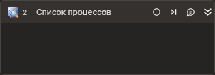

# Список процессов



Компонент, получающий список запущенных процессов, всех или текущего пользователя.

## Свойства
Символ `*` в названии свойства указывает на обязательность заполнения. 
Описание общих свойств см. в разделе [Свойства элемента](https://docs.primo-rpa.ru/primo-rpa/primo-studio/process/elements#svoistva-elementa).

**Процесс**
1. **Текущий пользователь** *[bool]* - Признак получения только процессов текущего пользователя.  
1. **Имя процесса\*** *[String]* - Шаблон поиска имени процесса (calc\*).  

**Вывод**
1. **Переменная\*** *[List\<System.Diagnostics.Process>]* - Переменная для хранения полученного списка.  

## Только код  
Пример использования элемента в процессе с типом **Только код** (Pure code):



```csharp
List<System.Diagnostics.Process> proc = LTools.Desktop.DesktopApp.GetProcesses(wf, "*", true);
foreach (var p in proc)
	LTools.Workflow.PrimoApp.AddToLog(wf, p.ProcessName);
```



```python
proc = LTools.Desktop.DesktopApp.GetProcesses(wf, "*", True)
for p in proc:
	LTools.Workflow.PrimoApp.AddToLog(wf, p.ProcessName)
```



```javascript
var proc = _lib.LTools.Desktop.DesktopApp.GetProcesses(wf, "*", true);
for (var i = 0; i < proc.Count; i++)
	_lib.LTools.Workflow.PrimoApp.AddToLog(wf, proc[i].ProcessName);
```


