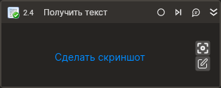

# Получить текст

Компонент, получающий текст выбранного элемента управления. Компонент корректно работает только внутри контейнера "Присоединиться к приложению".

## Свойства  
Символ `*` в названии свойства указывает на обязательность заполнения. Описание общих свойств см. в разделе [Свойства элемента](https://docs.primo-rpa.ru/primo-rpa/primo-studio/process/elements#svoistva-elementa).

1. **Шаблон поиска** *[String]* - Шаблон поиска элемента управления  
1. **Элемент** *[LTools.Desktop.Model.DUIControl]* - Ссылка на элемент управления  
1. **Переменная\*** *[String]* - Переменная для хранения полученного текста  
1. **Таймаут\*** *[Int32]* - Предельное время ожидания завершения процесса (мс)  

## Только код
В настоящее время функциональность для использования данного элемента в процессах с типом **Только код** (Pure code) не реализована.
