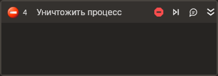

# Уничтожить процесс



Компонент, осуществляющий принудительное завершение внешнего приложения.

Данный компонент завершает все процессы, удовлетворяющие требованиям, указанным в свойствах. 
Если запущено 3 экземпляра одного процесса, то при указании его имени в свойстве **Имя процесса** будут закрыты все 3 экземпляра данного процесса.  

## Свойства
Символ `*` в названии свойства указывает на обязательность заполнения. 
Описание общих свойств см. в разделе [Свойства элемента](https://docs.primo-rpa.ru/primo-rpa/primo-studio/process/elements#svoistva-elementa).

**Процесс**
1. **Текущий пользователь** *[bool]* - Признак получения только процессов текущего пользователя.  
1. **Таймаут/*** *[Int32]* - Предельное время ожидания завершения процесса (мс).  

**Рабочий стол**
1. **Заголовок** *[String]* - Заголовок подключаемого приложения.  
1. **Имя процесса** *[String]* - Имя процесса.  

## Только код  
Пример использования элемента в процессе с типом **Только код** (Pure code):
> Для работы с примером необходимо установить приложение **mate-calc**.



```csharp
LTools.Desktop.DesktopApp.Kill(wf, "mate-calc", null, 10000, true);
```



```python
LTools.Desktop.DesktopApp.Kill(wf, "mate-calc", None, 10000, True)
```



```javascript
_lib.LTools.Desktop.DesktopApp.Kill(wf, "mate-calc", null, 10000, true);
```


