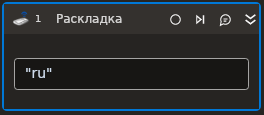

# Раскладка

Элемент, осуществляющий смену раскладки клавиатуры.

## Свойства
Символ `*` в названии свойства указывает на обязательность заполнения. 
Описание общих свойств см. в разделе [Свойства элемента](https://docs.primo-rpa.ru/primo-rpa/primo-studio/process/elements#svoistva-elementa).

1. **Раскладка** *[String]* - Раскладка для установки.
1. **Раскладка** *[String]* - Текущая раскладка клавиатуры.
1. **Раскладки** *[List\<String>]* - Имеющиеся раскладки.
1. **Горячая клавиша** - Сочетание клавиш для смены языка.
1. **Таймаут\*** *[Int32]* - Предельное время ожидания завершения процесса (мс).

## Только код

В настоящее время функциональность для использования данного элемента в процессах с типом **Только код** (Pure code) не реализована.
