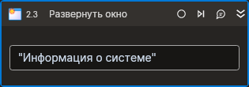

# Развернуть окно



Компонент, разворачивающий окно приложения. 
Элемент корректно работает только внутри контейнера **Присоединиться к приложению**.

## Свойства
Символ `*` в названии свойства указывает на обязательность заполнения. 
Описание общих свойств см. в разделе [Свойства элемента](https://docs.primo-rpa.ru/primo-rpa/primo-studio/process/elements#svoistva-elementa).

1. **Заголовок** *[String]* -  Заголовок окна  
1. **Заголовок (RegEx)** *[String]* - Заголовок окна (регулярное выражение)  

## Только код  
Пример использования элемента в процессе с типом **Только код** (Pure code):
> Для работы с примером необходимо установить приложение **kinfocenter**. В Astra Linux это приложение установлено по умолчанию.



```csharp
LTools.Desktop.DesktopApp.Start(wf, "kinfocenter");
LTools.Desktop.DesktopApp app = LTools.Desktop.DesktopApp.Init(wf, null , "Информация о системе");
app.MaximizeWindow("Информация о системе");
```



```python
LTools.Desktop.DesktopApp.Start(wf, "kinfocenter");
app = LTools.Desktop.DesktopApp.Init(wf, None , "Информация о системе");
app.MaximizeWindow("Информация о системе");
```



```javascript
_lib.LTools.Desktop.DesktopApp.Start(wf, "kinfocenter");
var app = _lib.LTools.Desktop.DesktopApp.Init(wf, null , "Информация о системе");
app.MaximizeWindow("Калькулятор");
```


