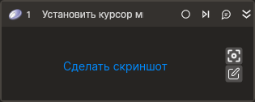

# Установить курсор мыши

Устанавливает курсор мыши на выбранном элементе управления или по координатам.

## Свойства

Символ `*` в названии свойства указывает на обязательность заполнения. Описание общих свойств см. в разделе [Свойства элемента](https://docs.primo-rpa.ru/primo-rpa/primo-studio/process/elements#svoistva-elementa).

1. **Шаблон поиска** *[String]* - Шаблон поиска элемента управления.  
1. **Элемент** *[LTools.Desktop.Model.DUIControl]* - Ссылка на элемент управления. Над этим элементом будет установлен курсор.  
1. **Координаты** *[System.Drawing.Rectangle]* - Координаты для установки курсора.  
1. **Позиция** *[LTools.Common.Model.ClickPositions]* - Позиция курсора при установке. Работает только при использовании параметра **Шаблон поиска** или **Элемент**. Значение по умолчанию - `Center`. Для того, чтобы изменить значение, щелкните на выпадающем списке.  
1. **Таймаут\*** *[Int32]* - Предельное время ожидания завершения процесса (мс). Значение по умолчанию - 10000.  

**Примечание:**   
Существует три способа установить курсор мыши. С каждым из таких способов ассоциирован один из параметров: **Шаблон поиска**, **Элемент**, **Координаты**. Другими словами, может быть использован только один такой параметр.

## Только код
В настоящее время функциональность для использования данного элемента в процессах с типом **Только код** (Pure code) не реализована.
