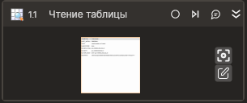

# Чтение таблицы



Компонент, производящий чтение данных табличного элемента управления. Компонент корректно работает только внутри контейнера **Присоединиться к приложению**.

## Свойства

Символ `*` в названии свойства указывает на обязательность заполнения. 
Описание общих свойств см. в разделе [Свойства элемента](https://docs.primo-rpa.ru/primo-rpa/primo-studio/process/elements#svoistva-elementa).

1. **Шаблон поиска** *[String]* - Шаблон поиска элемента управления.  
1. **Элемент** *[LTools.Desktop.Model.DUIControl]* - Ссылка на элемент управления.  
1. **Переменная** *[[LTools.Desktop.Model.UIDataTable](datatypes/uidatatable.md)]* - Переменная для хранения результатов чтения таблицы.  
1. **Переменная (таблица)** *[System.Data.DataTable]* - Переменная для хранения результатов чтения таблицы.  
1. **Таймаут\*** *[Int32]* - Предельное время ожидания завершения процесса (мс).

## Только код

Пример использования элемента в процессе с типом **Только код** (Pure code):



```csharp
string processName = "fly-admin-device-manager";
string applicationTitle = null;
int timeOut = 20000;
bool isCurrentUser = true;

LTools.Desktop.DesktopApp application = LTools.Desktop.DesktopApp.Init(wf, processName, applicationTitle, timeOut, isCurrentUser, LTools.Desktop.Model.DesktopTypes.UIAUTOMATION);

string searchPattern = "{\"WinName\":\"Менеджер устройств\",\"WinPath\":\"/org/a11y/atspi/accessible/2147483675\",\"WinId\":-1,\"AppName\":\"fly-admin-device-manager\",\"Items\":[{\"Name\":\"\",\"Role\":\"tree\",\"Description\":\"\",\"Index\":1,\"Items\":[]}]}";

LTools.Desktop.Model.UIDataTable uiDataTable = application.ReadDataGrid(searchPattern);
```



```python
processName = "fly-admin-device-manager"
applicationTitle = None
timeOut = 20000
isCurrentUser = True

application = LTools.Desktop.DesktopApp.Init(wf, processName, applicationTitle, timeOut, isCurrentUser, LTools.Desktop.Model.DesktopTypes.UIAUTOMATION)

searchPattern = "{\"WinName\":\"Менеджер устройств\",\"WinPath\":\"/org/a11y/atspi/accessible/2147483675\",\"WinId\":-1,\"AppName\":\"fly-admin-device-manager\",\"Items\":[{\"Name\":\"\",\"Role\":\"tree\",\"Description\":\"\",\"Index\":1,\"Items\":[]}]}"

uiDataTable = application.ReadDataGrid(searchPattern)
```



```javascript
var processName = "fly-admin-device-manager";
var applicationTitle = None;
var timeOut = 20000;
var isCurrentUser = True;

var application = _lib.LTools.Desktop.DesktopApp.Init(wf, processName, applicationTitle, timeOut, isCurrentUser, _lib.LTools.Desktop.Model.DesktopTypes.UIAUTOMATION);

var searchPattern = "{\"WinName\":\"Менеджер устройств\",\"WinPath\":\"/org/a11y/atspi/accessible/2147483675\",\"WinId\":-1,\"AppName\":\"fly-admin-device-manager\",\"Items\":[{\"Name\":\"\",\"Role\":\"tree\",\"Description\":\"\",\"Index\":1,\"Items\":[]}]}";

var uiDataTable = application.ReadDataGrid(searchPattern);
```


