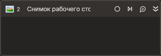

# Снимок рабочего стола



Компонент, создающий снимок рабочего стола. В случае, если нужно сделать снимок какого-либо запущенного процесса, указывается процесс. 
Если нужен снимок всего рабочего стола, свойства, относящиеся к процессу, не заполняются.

## Свойства
Символ `*` в названии свойства указывает на обязательность заполнения. 
Описание общих свойств см. в разделе [Свойства элемента](https://docs.primo-rpa.ru/primo-rpa/primo-studio/process/elements#svoistva-elementa).

1. **Переменная\*** *[System.Drawing.Bitmap]* - Переменная для сохранения изображения.  

## Только код  
Пример использования элемента в процессе с типом **Только код** (Pure code):



```csharp
using System;
using System.Collections.Generic;
using System.Text;
using LTools.Scripting.Model;
using LTools.Network.Model;
using SixLabors.ImageSharp;

public class PrimoScript
{
    public static LTools.Scripting.CSharp.ScriptDebugger __debug;

    public void main(LTools.Common.Model.WorkflowData wf)
    {
        SixLabors.ImageSharp.Image bmp = LTools.Desktop.DesktopApp.CreateScreenshot(wf);
        //Весь рабочий стол
        bmp.SaveAsPng("screen.png");
    }
}
```



```python
from System import *
from System.Collections.Generic import *
from System.Text import *
from LTools.Scripting.Model import *
from LTools.Network.Model import *
from SixLabors.ImageSharp import *

class PrimoScript(object):
    @classmethod
    def main(self, wf):
        bmp = LTools.Desktop.DesktopApp.CreateScreenshot(wf);
        #Весь рабочий стол        
        ImageExtensions.SaveAsPng(bmp, "screen.png")
```



```javascript
//Весь рабочий стол
var bmp = _lib.LTools.Desktop.DesktopApp.CreateScreenshot(wf);
bmp.SaveAsPng("screen.png");
```


