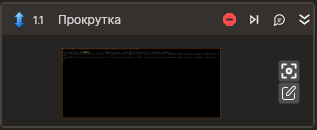

# Прокрутка



Элемент, осуществляющий прокрутку в визуальном компоненте.

Ограничения работы элемента:
- Работоспособность элемента зависит от реализации scroll bar в целевом приложении.
- Выбранный узел дерева должен содержать узел с ролью "scroll bar".
- Узел с ролью "scroll bar" должен являться непосредственным потомком выбранного узла дерева, либо быть с ним на одном уровне.
- Точность прокрутки не гарантируется.
- Точность определения ориентации узла с ролью "scroll bar" не гарантируется.

## Свойства
Символ `*` в названии свойства указывает на обязательность заполнения. 
Описание общих свойств см. в разделе [Свойства элемента](https://docs.primo-rpa.ru/primo-rpa/primo-studio/process/elements#svoistva-elementa).

1. **Шаблон поиска** *[String]* - Шаблон поиска элемента управления.  
1. **Элемент** *[LTools.Desktop.Model.DUIControl]* - Ссылка на элемент управления.  
1. **Горизонтальная** *[[double](https://learn.microsoft.com/ru-ru/dotnet/api/system.double?view=net-5.0&viewFallbackFrom=windowsdesktop-3.0)?]* - Горизонтальная прокрутка (%).  
1. **Вертикальная** *[double?]* - Вертикальная прокрутка (%).  
1. **Прокрутка** *[System.Drawing.Point]* - Текущее состояние прокрутки.  
1. **Таймаут\*** *[Int32]* - Предельное время ожидания завершения процесса (мс).

## Только код
Пример использования элемента в процессе с типом **Только код** (Pure code):



```csharp
string processName = "fly-term";
string applicationTitle = null;
int timeOut = 20000;
bool isCurrentUser = true;

LTools.Desktop.DesktopApp application = LTools.Desktop.DesktopApp.Init(wf, processName, applicationTitle, timeOut, isCurrentUser, LTools.Desktop.Model.DesktopTypes.UIAUTOMATION);

double? offsetByAxisX = null;
double? offsetByAxisY = 10.0;
string searchPattern = "{\"WinName\":\"linux-x64 : Primo.Studio\",\"WinPath\":\"/org/a11y/atspi/accessible/2147483676\",\"WinId\":-1,\"AppName\":\"fly-term\",\"Items\":[{\"Name\":\"\",\"Role\":\"terminal\",\"Description\":\"\",\"Index\":1,\"Items\":[]}]}";

System.Drawing.Point point = application.Scroll(searchPattern, offsetByAxisX, offsetByAxisY, timeOut);
```



```python
processName = "fly-term"
applicationTitle = None
timeOut = 20000
isCurrentUser = True

application = LTools.Desktop.DesktopApp.Init(wf, processName, applicationTitle, timeOut, isCurrentUser, LTools.Desktop.Model.DesktopTypes.UIAUTOMATION)

offsetByAxisX = None
offsetByAxisY = 10.0
searchPattern = "{\"WinName\":\"linux-x64 : Primo.Studio\",\"WinPath\":\"/org/a11y/atspi/accessible/2147483676\",\"WinId\":-1,\"AppName\":\"fly-term\",\"Items\":[{\"Name\":\"\",\"Role\":\"terminal\",\"Description\":\"\",\"Index\":1,\"Items\":[]}]}"

point = application.Scroll(searchPattern, offsetByAxisX, offsetByAxisY, timeOut)
```



```javascript
var processName = "fly-term";
var applicationTitle = None;
var timeOut = 20000;
var isCurrentUser = True;

var application = _lib.LTools.Desktop.DesktopApp.Init(wf, processName, applicationTitle, timeOut, isCurrentUser, _lib.LTools.Desktop.Model.DesktopTypes.UIAUTOMATION);

var offsetByAxisX = None;
var offsetByAxisY = 10.0;
var searchPattern = "{\"WinName\":\"linux-x64 : Primo.Studio\",\"WinPath\":\"/org/a11y/atspi/accessible/2147483676\",\"WinId\":-1,\"AppName\":\"fly-term\",\"Items\":[{\"Name\":\"\",\"Role\":\"terminal\",\"Description\":\"\",\"Index\":1,\"Items\":[]}]}";

var point = application.Scroll(searchPattern, offsetByAxisX, offsetByAxisY, timeOut);
```


