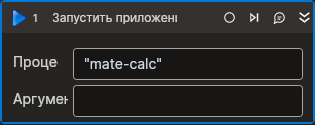

# Запустить приложение



Компонент, запускающий новый процесс.

## Свойства
Символ `*` в названии свойства указывает на обязательность заполнения. Описание общих свойств см. в разделе [Свойства элемента](https://docs.primo-rpa.ru/primo-rpa/primo-studio/process/elements#svoistva-elementa).

**Вывод**
1. **Переменная\*** *[System.Diagnostics.Process]* -  Переменная для хранения созданного процесса

**Процесс**
1. **Тип автоматизации** *[LTools.Desktop.Model.DesktopTypes]* - Тип используемой при взаимодействии с приложением автоматизации (UIAUTOMATION, RDP)  
1. **Приложение\*** *[String]* - Имя запускаемого приложения  
1. **Аргументы** *[String]* - Аргументы процесса. Возможно указать несколько аргументов через пробел: `"arg1 arg2"`  
1. **Рабочая папка** *[String]* - Путь к рабочей папке процесса  
1. **Ожидать запуск** *[Boolean]* - Ожидать запуск приложения  

## Только код
Пример использования элемента в процессе с типом **Только код** (Pure code):  
> Для работы с примером необходимо установить приложение **mate-calc**.



```csharp
LTools.Desktop.DesktopApp.Start(wf, "mate-calc", null, null, LTools.Desktop.Model.DesktopTypes.UIAUTOMATION, true);
LTools.Desktop.DesktopApp.Start(wf, "mate-calc", "--version");
```



```python
LTools.Desktop.DesktopApp.Start(wf, "mate-calc", None, None, LTools.Desktop.Model.DesktopTypes.UIAUTOMATION, True)
LTools.Desktop.DesktopApp.Start(wf, "mate-calc", "--version")
```



```javascript
_lib.LTools.Desktop.DesktopApp.Start(wf, "mate-calc", null, null, _lib.LTools.Desktop.Model.DesktopTypes.UIAUTOMATION, true);
_lib.LTools.Desktop.DesktopApp.Start(wf, "mate-calc", "--version");
```


