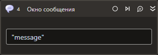

# Окно сообщения



Компонент, производящий отображение окна с заданным сообщением.

## Свойства

Символ `*` в названии свойства указывает на обязательность заполнения. Описание общих свойств см. в разделе [Свойства элемента](https://docs.primo-rpa.ru/primo-rpa/primo-studio/process/elements#svoistva-elementa).

1. **Текст\*** *[String]* - Отображаемое сообщение

## Только код  
Пример использования элемента в процессе с типом **Только код** (Pure code):



```csharp
LTools.Workflow.PrimoApp.MessageBox(wf, "text");
```



```python
LTools.Workflow.PrimoApp.MessageBox(wf, "text")
```



```javascript
_lib.LTools.Workflow.PrimoApp.MessageBox(wf, "text");
```


