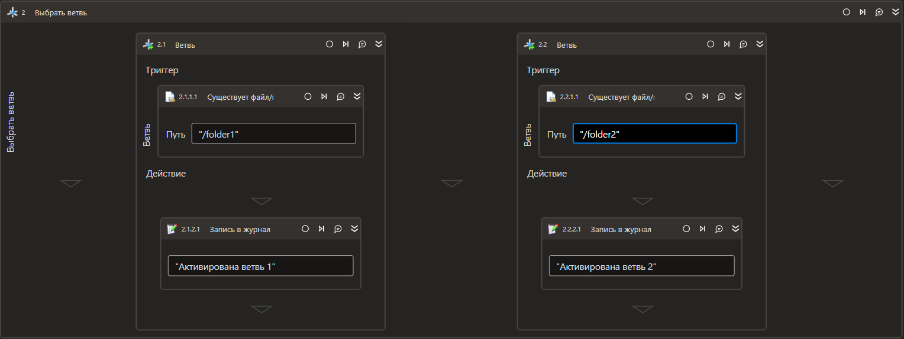

# Выбрать ветвь

**Выбрать ветвь (Pick)** - контейнер, в котором можно разместить две и более ветвей (их количество зависит от вашего усмотрения). 

Как производится выбор ветви: 
1. В параллельном режиме запускается ожидание срабатывания триггера одной из ветвей.
2. Первая ветвь, вернувшая значение **true** (условие истинно), выполнит настроенное для нее действие.
3. Остальные ветви будут проигнорированы.

Компонент обладает общими свойствами, описанными в разделе  [**Работа с элементами**](https://docs.primo-rpa.ru/primo-rpa/primo-studio/process/elements).
