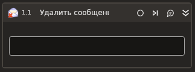

# Удалить сообщения



Компонент, удаляющий сообщения электронной почты в MS Exchange.

## Свойства
Символ `*` в названии свойства указывает на обязательность заполнения. Описание общих свойств см. в разделе [Свойства элемента](https://docs.primo-rpa.ru/primo-rpa/primo-studio/process/elements#svoistva-elementa).

1. **Тип операции** *[LTools.Office.Model.OMailDeleteTypes]* - Тип операции удаления.
1. **Сообщения\*** *[List<[LTools.Office.Model.OMailMessage](../datatypes/omailmessage.md)>]* - Список писем для удаления.

## Только код
Пример использования элемента в процессе с типом **Только код** (Pure code):



```csharp
var version = Microsoft.Exchange.WebServices.Data.ExchangeVersion.Exchange2010;
var url = "url";
var login = "login";
var password = "password";
var domain = "domain";
var russianTimeZone = false;

LTools.Office.MSExchangeApp app = LTools.Office.MSExchangeApp.InitSvc(wf, version, url, login, password, domain, russianTimeZone);

List<LTools.Office.Model.OMailMessage> messages = null;
var deleteType = LTools.Office.Model.OMailDeleteTypes.MoveToDeletedItems;

app.DeleteMail(messages, deleteType);
```



```python
version = Microsoft.Exchange.WebServices.Data.ExchangeVersion.Exchange2010;
url = "url";
login = "login";
password = "password";
domain = "domain";
russianTimeZone = False;

app = LTools.Office.MSExchangeApp.InitSvc(wf, version, url, login, password, domain, russianTimeZone);

messages = None;
deleteType = LTools.Office.Model.OMailDeleteTypes.MoveToDeletedItems;

app.DeleteMail(messages, deleteType);
```



```javascript
var version = Microsoft.Exchange.WebServices.Data.ExchangeVersion.Exchange2010;
var url = "url";
var login = "login";
var password = "password";
var domain = "domain";
var russianTimeZone = false;

var app = _lib.LTools.Office.MSExchangeApp.InitSvc(wf, version, url, login, password, domain, russianTimeZone);

var messages = Null;
var deleteType = _lib.LTools.Office.Model.OMailDeleteTypes.MoveToDeletedItems;

app.DeleteMail(messages, deleteType);
```


