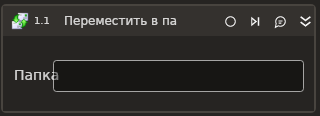

# Переместить в папку



Компонент, осуществляющий перемещение сообщений между папками MS Exchange.

## Свойства

Символ `*` в названии свойства указывает на обязательность заполнения. Описание общих свойств см. в разделе [Свойства элемента](https://docs.primo-rpa.ru/primo-rpa/primo-studio/process/elements#svoistva-elementa)

**Exchange**
1. **Папка назначения\*** *[String]* - Папка назначения.
1. **Письма\*** *[List<[LTools.Office.Model.OMailMessage](../datatypes/omailmessage.md)>]* - Массив сообщений.
1. **Общий ящик** *[String]* - Укажите общий почтовый ящик, если письма нужно перемещать в нем.

## Только код
Пример использования элемента в процессе с типом **Только код (Pure code)**:



```csharp
var version = Microsoft.Exchange.WebServices.Data.ExchangeVersion.Exchange2010;
var url = "url";
var login = "login";
var password = "password";
var domain = "domain";
var russianTimeZone = false;

LTools.Office.MSExchangeApp app = LTools.Office.MSExchangeApp.InitSvc(wf, version, url, login, password, domain, russianTimeZone);

List<LTools.Office.Model.OMailMessage> messages = null;
var outbox = "outbox";
var shared = "shared";

app.MoveToFolder(messages, outbox, shared);
```



```python
version = Microsoft.Exchange.WebServices.Data.ExchangeVersion.Exchange2010;
url = "url";
login = "login";
password = "password";
domain = "domain";
russianTimeZone = False;

app = LTools.Office.MSExchangeApp.InitSvc(wf, version, url, login, password, domain, russianTimeZone);

messages = None;
outbox = "outbox";
shared = "shared";

app.MoveToFolder(messages, outbox, shared)
```



```javascript
var version = Microsoft.Exchange.WebServices.Data.ExchangeVersion.Exchange2010;
var url = "url";
var login = "login";
var password = "password";
var domain = "domain";
var russianTimeZone = false;

var app = _lib.LTools.Office.MSExchangeApp.InitSvc(wf, version, url, login, password, domain, russianTimeZone);

var messages = Null;
var outbox = "outbox";
var shared = "shared";

app.MoveToFolder(messages, outbox, shared);
```


