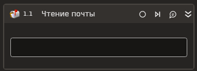

# Чтение почты



Компонент вычитывает электронную почту из MS Exchange.

## Свойства
Описание общих свойств элемента см. в разделе [Свойства элемента](https://docs.primo-rpa.ru/primo-rpa/primo-studio/process/elements#svoistva-elementa).\
Символ `*` в названии свойства указывает на обязательность заполнения.

1. **Путь к папке** *[String]* - Путь к папке MS Exchange. Пример: `"Inbox"`.
1. **Только непрочитанные** *[Boolean]* - Определяет, нужно ли читать только непрочитанные сообщения.
1. **Кол-во** *[Int32]* - Количество читаемых сообщений. По умолчанию `30`.
1. **Вложения** *[Boolean]* - Определяет, нужно ли получать вложения из писем.
1. **Запрос** *[String]* - Текст запроса фильтра.
1. **Общий ящик** *[String]* - Укажите адрес [общего почтового ящика](https://learn.microsoft.com/ru-ru/exchange/collaboration/shared-mailboxes/shared-mailboxes?view=exchserver-2019), если требуется вычитывать его почту. Пример:  `"info@company.com"`.
1. **Переменная\*** *[List<[LTools.Office.Model.OMailMessage](../datatypes/omailmessage.md)>]* - Переменная вывода для сохранения списка полученных писем.

## Только код
Пример использования элемента в процессе с типом **Только код** (Pure code):



```csharp
var version = Microsoft.Exchange.WebServices.Data.ExchangeVersion.Exchange2010;
var url = "url";
var login = "login";
var password = "password";
var domain = "domain";
var russianTimeZone = false;

LTools.Office.MSExchangeApp app = LTools.Office.MSExchangeApp.InitSvc(wf, version, url, login, password, domain, russianTimeZone);

var inbox = "inbox";
var isOnlyUnread = true;
var isReadingAttachment = false;
var messageCount = 30;
var query = "query";

List<LTools.Office.Model.OMailMessage> messages = app.ReadMail(inbox, isOnlyUnread, isReadingAttachment, messageCount, query);
```



```python
version = Microsoft.Exchange.WebServices.Data.ExchangeVersion.Exchange2010;
url = "url";
login = "login";
password = "password";
domain = "domain";
russianTimeZone = False;

app = LTools.Office.MSExchangeApp.InitSvc(wf, version, url, login, password, domain, russianTimeZone);

inbox = "inbox";
isOnlyUnread = True;
isReadingAttachment = False;
messageCount = 30;
query = "query";

messages = app.ReadMail(inbox, isOnlyUnread, isReadingAttachment, messageCount, query);
```



```javascript
var version = Microsoft.Exchange.WebServices.Data.ExchangeVersion.Exchange2010;
var url = "url";
var login = "login";
var password = "password";
var domain = "domain";
var russianTimeZone = false;

var app = _lib.LTools.Office.MSExchangeApp.InitSvc(wf, version, url, login, password, domain, russianTimeZone);

var inbox = "inbox";
var isOnlyUnread = true;
var isReadingAttachment = false;
var  messageCount = 30;
var query = "query";

var messages = app.ReadMail(inbox, isOnlyUnread, isReadingAttachment, messageCount, query);
```


