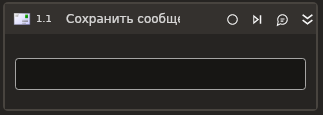

# Сохранить сообщение



Позволяет сохранить на диск письмо из электронной почты MS Exchange. Корректно работает только внутри контейнера **Сервер MS Exchange**.

## Свойства
Символ `*` в названии свойства указывает на обязательность заполнения. Описание общих свойств см. в разделе [Свойства элемента](https://docs.primo-rpa.ru/primo-rpa/primo-studio/process/elements#svoistva-elementa).

1. **Путь\*** *[String]* - Путь сохранения файла в формате \*.eml.
1. **Сообщение\*** *[[LTools.Office.Model.OMailMessage](../els\_mail/datatypes/omailmessage.md)]* - Письмо для сохранения, переменная.

## Только код
Пример использования элемента в процессе с типом **Только код** (Pure code):



```csharp
var version = Microsoft.Exchange.WebServices.Data.ExchangeVersion.Exchange2010;
var url = "url";
var login = "login";
var password = "password";
var domain = "domain";
var russianTimeZone = false;

LTools.Office.MSExchangeApp app = LTools.Office.MSExchangeApp.InitSvc(wf, version, url, login, password, domain, russianTimeZone);

LTools.Office.Model.OMailMessage message = null;
var pathToFile = "pathToFile";

app.SaveMessage(message, pathToFile);
```



```python
version = Microsoft.Exchange.WebServices.Data.ExchangeVersion.Exchange2010;
url = "url";
login = "login";
password = "password";
domain = "domain";
russianTimeZone = False;

app = LTools.Office.MSExchangeApp.InitSvc(wf, version, url, login, password, domain, russianTimeZone);

message = None;
pathToFile = "pathToFile";

app.SaveMessage(message, pathToFile)
```



```javascript
var version = Microsoft.Exchange.WebServices.Data.ExchangeVersion.Exchange2010;
var url = "url";
var login = "login";
var password = "password";
var domain = "domain";
var russianTimeZone = false;

var app = _lib.LTools.Office.MSExchangeApp.InitSvc(wf, version, url, login, password, domain, russianTimeZone);

message = Null;
pathToFile = "pathToFile";

app.SaveMessage(message, pathToFile);
```


