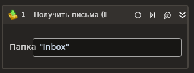

# Получить письма (IMAP)



Элемент используется для получения почтовых сообщений по протоколу IMAP. Cвойства элемента представлены ниже.

## Свойства
Символ `*` в названии свойства указывает на обязательность заполнения. 
Описание общих свойств см. в разделе [Свойства элемента](https://docs.primo-rpa.ru/primo-rpa/primo-studio/process/elements#svoistva-elementa).
                     
**Сервер**
1. **Сервер\*** *[String]* - Адрес почтового сервера.
1. **Порт\*** *[Int32]* - Порт почтового сервера. По умолчанию `993`.
1. **Логин\*** *[String]* - Логин почтового сервера.
1. **Пароль** *[String]* - Пароль почтового сервера.
1. **Защищенный пароль** *[SecureString]* - При использовании зашифрованного пароля укажите его в этом поле. Пароль в формате SecureString не хранится в открытом виде даже в памяти компьютера. Получить его можно, например, из Диспетчера учетных данных (Credential Manager).
1. **Использовать SSO** *[Boolean]* - Определяет, нужно ли использовать Secure Socket Options (SSO) - набор параметров и настроек для безопасной передачи данных через защищенное сокет-соединение. По умолчанию параметр отключен.                                                        
1. **SSO** - Способ указания шифрования, которое должно использоваться для сокет-соединения. Значение учитывается, только если включен параметр «Использовать SSO». В этом случае при подключении к почтовому серверу будет использовано SSO и проигнорировано свойство SSL.
1. **SSL\*** *[Boolean]* - Признак использования сервером соединения SSL.
1. **Игнорировать сертификат** *[Boolean]* - Установка флага отключает проверку SSL-сертификата сервера. По умолчанию сертификат сервера проверяется. **Отключение проверки SSL-сертификата может привести к проблемам информационной безопасности (!)**, поэтому параметр следует использовать только в исключительных случаях, когда невозможно без него обойтись.
1. **Папка\*** *[String]* - Папка входящих сообщений.
1. **Только непрочитанные\*** *[Boolean]* - Получать только непрочитанные сообщения.
1. **Метить, как прочитанные\*** *[Boolean]* - Автоматически метить полученные сообщения, как прочитанные.
1. **Метить, как непрочитанные\*** *[Boolean]* - Автоматически метить полученные сообщения, как непрочитанные.
1. **Дата от\*** *[DateTime?]* - Дата начала фильтра сообщений.
1. **Дата до\*** *[DateTime?]* - Дата окончания фильтра сообщений.
1. **Получать вложения\*** *[Boolean]* - Признак получения вложений.
1. **Идентификаторы** *[List\<String>]* - Массив идентификаторов получаемых сообщений.
1. **Письма** *[List <[LTools.Network.Model.EMail.MailMessage](datatypes/mailmessage.md)>]* - Массив сообщений.
1. **Количество** *[Int32]* - Количество сообщений.
1. **Сортировка** - Тип сортировки сообщений. По умолчанию установлено значение **Default** - сортировка, используемая на сервере. Возможно выбрать сортировку по дате отправке письма: 1) **By Date Asc** - сортировка по возрастанию даты (от старой к новой); 2) **By Date Desc** - сортировка по убыванию даты (от новой к старой).
1. **Программная сортировка** *[Boolean]* - Параметр включает сортировку писем на стороне робота. Позволяет использовать сортировку в тех случаях, когда почтовый сервер ее не поддерживает (например, mail.ru). **Ограничение**: не рекомендуем использовать эту функцию при работе с большим количеством писем, например, свыше тысячи. Поскольку для сортировки необходимо считывать все письма из электронного ящика, это может потреблять много оперативной памяти.
1. **Таймаут\*** *[Int32]* - Предельное время ожидания завершения процесса, указывается в миллисекундах. По умолчанию `10000`.

**Сообщение**
1. **Результат\*** *[List <[LTools.Network.Model.EMail.MailMessage](datatypes/mailmessage.md)>]* - Массив полученных сообщений.


## Только код

Пример использования элемента в процессе с типом **Только код** (Pure code):



```csharp
var server = "server";
var port = 443;
var login = "login";
var password = "password";
var inbox = "inbox";
var isOnlyUnread = false;
var markRead = true;
var markUnread = false;
List<LTools.Network.Model.EMail.MailMessage> messages = null;
List<string> messageIds = null;
DateTime? dateFrom = null;
DateTime? dateTo = null;
var isReadingAttachment = false;
var isSsl = false;
var isProgramSorting = false;
var isProgramFiltering = false;
var sortingType = LTools.Network.Model.EMail.ImapSortTypes..Default;
var messageCount = 10;
var ignoreCertificate = false;
var timeout = 10000;

List<LTools.Network.Model.EMail.MailMessage> mails = LTools.Network.MailApp.IMAPReceive(wf, server, port, login, password, inbox, isOnlyUnread, markRead, markUnread, messages, dateFrom, dateTo, isReadingAttachment, isSsl, isProgramSorting, isProgramFiltering, sortingType, messageCount, ignoreCertificate, timeout);

List<LTools.Network.Model.EMail.MailMessage> mails2 = LTools.Network.MailApp.IMAPReceive(wf, server, port, login, password, inbox, isOnlyUnread, markRead, markUnread, messageIds, dateFrom, dateTo, isReadingAttachment, isSsl, isProgramSorting, isProgramFiltering, sortingType, messageCount, ignoreCertificate, timeout);
```



```python
server = "server";
port = 443;
login = "login";
password = "password";
inbox = "inbox";
isOnlyUnread = False;
markRead = True;
markUnread = False;
messages = None;
messageIds = None;
dateFrom = None;
dateTo = None;
isReadingAttachment = False;
isSsl = False;
isProgramSorting = False;
isProgramFiltering = False;
sortingType = LTools.Network.Model.EMail.ImapSortTypes..Default;
messageCount = 10;
ignoreCertificate = False;
timeout = 10000;

mails = LTools.Network.MailApp.IMAPReceive(wf, server, port, login, password, inbox, isOnlyUnread, markRead, markUnread, messages, dateFrom, dateTo, isReadingAttachment, isSsl, isProgramSorting, isProgramFiltering, sortingType, messageCount, ignoreCertificate, timeout)

mails2 = LTools.Network.MailApp.IMAPReceive(wf, server, port, login, password, inbox, isOnlyUnread, markRead, markUnread, messageIds, dateFrom, dateTo, isReadingAttachment, isSsl, isProgramSorting, isProgramFiltering, sortingType, messageCount, ignoreCertificate, timeout);
```



```javascript
var server = "server";
var port = 443;
var login = "login";
var password = "password";
var inbox = "inbox";
var isOnlyUnread = false;
var markRead = true;
var markUnread = false;
var messages = Null;
var = Null;
var dateFrom = Null;
var dateTo = Null;
var isReadingAttachment = false;
var isSsl = false;
var isProgramSorting = False;
var isProgramFiltering = False;
var sortingType = LTools.Network.Model.EMail.ImapSortTypes..Default;
var messageCount = 10;
var ignoreCertificate = false;
var timeout = 10000;

var mails = _lib.LTools.Network.MailApp.IMAPReceive(wf, server, port, login, password, inbox, isOnlyUnread, markRead, markUnread, messages, dateFrom, dateTo, isReadingAttachment, isSsl, isProgramSorting, isProgramFiltering, sortingType, messageCount, ignoreCertificate, timeout);

var mails2 = _lib.LTools.Network.MailApp.IMAPReceive(wf, server, port, login, password, inbox, isOnlyUnread, markRead, markUnread, messageIds, dateFrom, dateTo, isReadingAttachment, isSsl, isProgramSorting, isProgramFiltering, sortingType, messageCount, ignoreCertificate, timeout);
```


