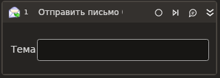

# Отправить письмо (SMTP)



Компонент, осуществляющий отправку почтового сообщения по протоколу SMTP.

## Свойства
Символ `*` в названии свойства указывает на обязательность заполнения. 
Описание общих свойств см. в разделе [Свойства элемента](https://docs.primo-rpa.ru/primo-rpa/primo-studio/process/elements#svoistva-elementa).

1. **От\*** *[String]* - Адресат - От кого.
1. **Кому\*** *[String]* - Адресат - Кому.
1. **Тема** *[String]* - Тема сообщения.
1. **Содержимое\*** *[String]* - Содержимое сообщения.
1. **HTML** *[Boolean]* - Признак HTML-содержимого сообщения.
1. **Вложения** *[List\<String>]* - Пути к файлам вложений.
1. **Сервер\*** *[String]* - Адрес почтового сервера.
1. **Порт\*** *[Int32]* - Порт почтового сервера.
1. **Логин\*** *[String]* - Логин почтового сервера.
1. **Пароль\*** *[String]* - Пароль почтового сервера.
1. **SSL\*** *[Boolean]* - Признак использования сервером соединения SSL.
1. **Таймаут\*** *[Int32]* - Предельное время ожидания завершения процесса (мс).

## Только код

Пример использования элемента в процессе с типом **Только код** (Pure code):



```csharp
var fromEmailAddress = "fromEmailAddress";
var toEmailAddress = "toEmailAddress";
var subject = "subject";
var body = "body";
var server = "server";
var port = 443;
var login = "login";
var password = "password";
var isHtml = false;
var isSsl = false;
List<string> attachments = null;
var timeout = 10000;
var ignoreCertificate = false;
var useSso = false;
var sso = MailKit.Security.SecureSocketOptions.Auto;
string emailAddressToSendCopy = null;
string emailAddressToSendSecondCopy = null;

LTools.Network.MailApp.SMTPSend(wf, fromEmailAddress, toEmailAddress, subject, body, server, port, login, password, isHtml, isSsl, attachments, timeout, ignoreCertificate, useSso, sso, emailAddressToSendCopy, emailAddressToSendSecondCopy);
```



```python
fromEmailAddress = "fromEmailAddress";
toEmailAddress = "toEmailAddress";
subject = "subject";
body = "body";
server = "server";
port = 443;
login = "login";
password = "password";
isHtml = False;
isSsl = False;
attachments = None;
timeout = 10000;
ignoreCertificate = False;
useSso = False;
sso = MailKit.Security.SecureSocketOptions.Auto;
emailAddressToSendCopy = None;
emailAddressToSendSecondCopy = None;

LTools.Network.MailApp.SMTPSend(wf, fromEmailAddress, toEmailAddress, subject, body, server, port, login, password, isHtml, isSsl, attachments, timeout, ignoreCertificate, useSso, sso, emailAddressToSendCopy, emailAddressToSendSecondCopy);
```



```javascript
var fromEmailAddress = "fromEmailAddress";
var toEmailAddress = "toEmailAddress";
var subject = "subject";
var body = "body";
var server = "server";
var port = 443;
var login = "login";
var password = "password";
var isHtml = false;
var isSsl = false;
var attachments = Null;
var timeout = 10000;
var ignoreCertificate = false;
var useSso = false;
var sso = MailKit.Security.SecureSocketOptions.Auto;
var emailAddressToSendCopy = Null;
var emailAddressToSendSecondCopy = Null;

_lib.LTools.Network.MailApp.SMTPSend(wf, fromEmailAddress, toEmailAddress, subject, body, server, port, login, password, isHtml, isSsl, attachments, timeout, ignoreCertificate, useSso, sso, emailAddressToSendCopy, emailAddressToSendSecondCopy);
```


