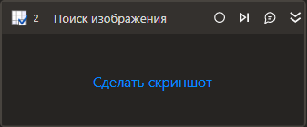

# Поиск изображения



Компонент, производящий поиск заданного изображения на экране.

В случае, если значение Искомого изображения не указано, растр берется из скриншота компонента.

## Свойства

Символ `*` в названии свойства указывает на обязательность заполнения. Описание общих свойств см. в разделе [Свойства элемента](https://docs.primo-rpa.ru/primo-rpa/primo-studio/process/elements#svoistva-elementa).

**OCR**
1. **Искомое изображение** *[[SixLabors.ImageSharp.Image](https://docs.sixlabors.com/api/ImageSharp/SixLabors.ImageSharp.Image.html)]* - Растр искомого изображения.
1. **Таймаут\*** *[Int32]* - Предельное время ожидания завершения процесса (мс).
1. **Точность** *[[Double](https://learn.microsoft.com/ru-ru/dotnet/api/system.double?view=net-5.0&viewFallbackFrom=windowsdesktop-3.0)]* - Точность совпадения растра (% от 0 до 1).
1. **Ядро** *[Open/External]* - Тип ядра разбора.

**Прочее**
1. **Координаты** *[[System.Drawing.Rectangle](https://learn.microsoft.com/ru-ru/dotnet/api/system.drawing.rectangle?view=netcore-3.0)]* - Координаты найденного изображения.
1. **Результат** *[[System.Boolean](https://learn.microsoft.com/ru-ru/dotnet/api/system.boolean?view=net-5.0)]* - Результат поиска изображения.


## Только код

Пример использования элемента в процессе с типом **Только код** (Pure code):


```csharp
System.Drawing.Rectangle coords = LTools.OCR.OcrApp.Exists(wf, (System.Drawing.Bitmap)System.Drawing.Bitmap.FromFile("Файл 1"), 0.9, 10000);
```



```python
coords = LTools.OCR.OcrApp.Exists(wf, System.Drawing.Bitmap.FromFile("Файл 1"), 0.9, 10000)
```



```javascript
var coords = _lib.LTools.OCR.OcrApp.Exists(wf, _lib.System.Drawing.Bitmap.FromFile("Файл 1"), 0.9, 10000);
```


