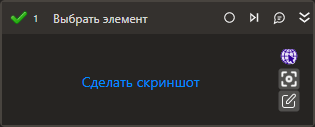

# Выбрать элемент

Изменяет состояние выбранного элемента управления. Используется для чекбоксов и радиокнопок.

## Свойства
Описание общих свойств элемента см. в разделе [Свойства элемента](https://docs.primo-rpa.ru/primo-rpa/primo-studio/process/elements#svoistva-elementa).\
Символ `*` в названии свойства указывает на обязательность заполнения.\
Символ ? в типе данных указывает на то, что значение может быть null.

***Процесс***
1. **Шаблон поиска** *[String]* - Элемента управления
1. **Элемент** *[LTools.UIInteraction.Model.UIControl]* - Ссылка на элемент управления
1. **Новое состояние** *[Boolean?]* - Новое состояние элемента
1. **Таймаут\*** *[Int32]* - Предельное время ожидания завершения процесса (мс)

***Вывод***
1. **Состояние** *[Boolean?]* - Переменная вывода для сохранения текущего состояния элемента
