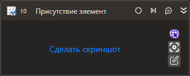

# Присутствие элемента

Компонент производит поиск элемента управления.

## Свойства
Описание общих свойств элемента см. в разделе [Свойства элемента](https://docs.primo-rpa.ru/primo-rpa/primo-studio/process/elements#svoistva-elementa).\
Символ `*` в названии свойства указывает на обязательность заполнения.

***Процесс***      
1. **Шаблон поиска\*** - *[String]* - Шаблон поиска элемента управления
1. **Видимость** *[Boolean]* - Определяет, нужно ли проверять видимость элемента
1. **Таймаут\*** *[Int32]* - Предельное время ожидания завершения процесса (мс). По умолчанию `10000`

***Вывод*** 
1. **Результат** *[Boolean]* - Переменная, хранящая результаты поиска
1. **Элемент** *[LTools.UIInteraction.Model.UIControl]* - Переменная для хранения ссылки на элемент управления
1. **Элементы** *[List\<LTools.UIInteraction.Model.UIControl>]* Переменная для хранения ссылок на элементы управления
