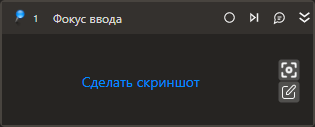

# Фокус ввода

Устанавливает фокус ввода на выбранном элементе управления.

## Свойства
Описание общих свойств элемента см. в разделе [Свойства элемента](https://docs.primo-rpa.ru/primo-rpa/primo-studio/process/elements#svoistva-elementa).\
Символ `*` в названии свойства указывает на обязательность заполнения.

1. **Шаблон поиска** *[String]* - Шаблон поиска элемента управления
1. **Элемент** *[LTools.UIInteraction.Model.UIControl]* - Переменная со ссылкой на элемент управления, который был найден и сохранен
1. **Таймаут\*** *[Int32]* - Предельное время ожидания завершения процесса (мс)
