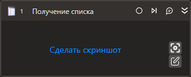

# Получение списка

Компонент, получающий значения из комбобокса (поле ввода со списком подсказок) или списка.

## Свойства
Описание общих свойств элемента см. в разделе [Свойства элемента](https://docs.primo-rpa.ru/primo-rpa/primo-studio/process/elements#svoistva-elementa).\
Символ `*` в названии свойства указывает на обязательность заполнения.

***Процесс*** 
1. **Шаблон поиска** *[String]* - Шаблон поиска элемента управления
1. **Элемент** *[LTools.UIInteraction.Model.UIControl]* - Ссылка на элемент управления
1. **Таймаут\*** *[Int32]* - Предельное время ожидания завершения процесса (мс)

***Вывод***
1. **Значения** *[List\<String>]* - Переменная для хранения всех полученных значений списка
1. **Выбранные** *[List\<String>]* - Переменная для хранения только выбранных значений списка
