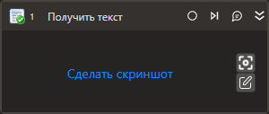

# Получить текст

Компонент позволяет получить текст из выбранного элемента управления.

## Свойства
Описание общих свойств элемента см. в разделе [Свойства элемента](https://docs.primo-rpa.ru/primo-rpa/primo-studio/process/elements#svoistva-elementa).\
Символ `*` в названии свойства указывает на обязательность заполнения.

**Процесс:**
1. **Шаблон поиска** *[String]* - Шаблон поиска элемента управления.
1. **Элемент** *[LTools.UIInteraction.Model.UIControl]* - Ссылка на элемент управления.
1. **Таймаут\*** *[Int32]* - Предельное время ожидания завершения процесса (мс). По умолчанию `10000` мс.

**Вывод:**
1. **Переменная** *[String]* - Переменная вывода для сохранения полученного текста.
