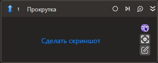

# Прокрутка

Осуществляет прокрутку в визуальном компоненте.

## Свойства
Описание общих свойств элемента см. в разделе [Свойства элемента](https://docs.primo-rpa.ru/primo-rpa/primo-studio/process/elements#svoistva-elementa).\
Символ `*` в названии свойства указывает на обязательность заполнения.\
Символ `?` в типе данных указывает на то, что значение может быть null.

***Процесс***
1. **Шаблон поиска** *[String]* - Шаблон поиска элемента управления.
1. **Элемент** *[LTools.UIInteraction.Model.UIControl]* - Ссылка на элемент управления.
1.  **Таймаут\*** *[Int32]* - Предельное время ожидания завершения процесса (мс).

***Прокрутка***
1. **Горизонтальная** *[[double](https://learn.microsoft.com/ru-ru/dotnet/api/system.double?view=net-5.0&viewFallbackFrom=windowsdesktop-3.0)?]* - Горизонтальная прокрутка (%; для браузера: пиксели).
1. **Вертикальная** *[double?]* - Вертикальная прокрутка (%; для браузера: пиксели).

***Вывод***
1. **Прокрутка** *[[System.Drawing.Point](https://learn.microsoft.com/ru-ru/dotnet/api/System.Drawing.Point?view=netcore-1.1)]* - Переменная, которая сохранит текущее состояние прокрутки (%; для браузера: пиксели).

> Для браузерного типа приложения есть возможность прокрутить содержимое страницы целиком. Для этого нужно в шаблоне поиска выбрать корневой элемент `HTML`. Так как пикер не позволяет выбирать корневой элемент страницы непосредственно, есть способ как это сделать по-другому. Для этого необходимо выбрать пикером любой элемент на странице. Затем в редакторе шаблона необходимо задать новое значение параметра Тэг – `HTML`. Остальные свойства `Текст`, `Css selector`, `Индекс` нужно очистить, а дополнительные свойства (атрибуты), если они есть, необходимо удалить.
