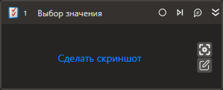

# Выбор значения

Компонент позволяет выбирать значения в комбобоксе или списке.

## Свойства
Описание общих свойств элемента см. в разделе [Свойства элемента](https://docs.primo-rpa.ru/primo-rpa/primo-studio/process/elements#svoistva-elementa).\
Символ `*` в названии свойства указывает на обязательность заполнения.

1. **Шаблон поиска** *[String]* - Шаблон поиска элемента управления.
1. **Элемент** *[[LTools.UIInteraction.Model.UIControl]]* - Ссылка на элемент управления.
1. **Значение** *[String]* - Выбираемое значение.
1. **Значения** *[List\<String>]* - Список выбираемых значений  (не поддерживается для десктопного приложения).
1. **Индекс** *[Int32]* - Индекс значения.
1. **Индексы** *[List\<Int32>]* - Индексы значений  (не поддерживается для десктопного приложения).
1. **Очистить** *[Boolean]* - Определяет, нужно ли очистить список перед выбором (не поддерживается для десктопного приложения).
1. **Таймаут\*** *[Int32]* - Предельное время ожидания завершения процесса (мс). По умолчанию `10000`.
1. **Область** *[[System.Drawing.Rectangle](https://learn.microsoft.com/ru-ru/dotnet/api/system.drawing.rectangle?view=netcore-3.0)]* — область поиска компонента. Используется для ограничения поиска компонентов с использованием абсолютной системы координат экрана и работает только с типом приложения `Рабочий стол`. Есть ограничение в использовании этого свойства. Так как система координат области поиска абсолютная, то есть вероятность, что окно приложения в системе этих координат в следующий раз откроется в случайном месте и выбранная область уже будет недействительной. Чтобы обойти это ограничение, рекомендуется задавать это свойство только на развернутом окне, а перед использованием данной активности необходимо также развернуть это окно при помощи активности [Развернуть окно](https://docs.primo-rpa.ru/primo-rpa/g_elements/vstroennye-dlya-linux/els-desktop/el-desktop-maximize).
