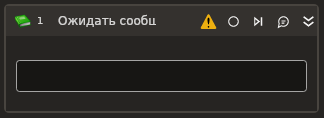

# Ожидать сообщения из очереди



Компонент ожидает появления нового элемента в [очереди обмена данных](https://docs.primo-rpa.ru/primo-rpa/orchestrator/basics/data-queues). При появлении элемента, робот извлечет его из очереди Оркестратора и сохранит в переменную. Извлеченный элемент перейдет из состояния New в InProgress. Это означает, что он будет доступен вашему роботу для дальнейшей обработки в рамках сценария автоматизации. Подробнее о статусах элемента см. [здесь](https://docs.primo-rpa.ru/primo-rpa/orchestrator/basics/data-queues/items#statusy-elementa).

Если во время выполнения компонента указанная очередь окажется пустой, то робот будет опрашивать очередь в течение заданного времени из свойства **Период**. Это отличает данный компонент от других способов извлечения элемента, например, от [**Получить из очереди**](https://docs.primo-rpa.ru/primo-rpa/g_elements/el_basic/els_orch/els_queues/readfromqueue).  


### Свойства
Символ `*` в названии свойства указывает на обязательность заполнения. Описание общих свойств элемента см. в разделе [Свойства элемента](https://docs.primo-rpa.ru/primo-rpa/primo-studio/process/elements#svoistva-elementa).

Обратите внимание, что переменная, в которую будет записан элемент, может быть  в виде объекта, DataTable или строки. Выбор переменной осуществляется на ваше усмотрение.

**Процесс**
1. **Очередь\*** *[String]* - Название очереди в Оркестраторе. Пример: `"PrimoTestQueue"`.
1. **Период** *[Int32]* - Период опроса очереди в миллисекундах. По умолчанию `1000`.

**Вывод**
1. **Таблица** *[[DataTable](https://learn.microsoft.com/ru-ru/dotnet/api/system.data.datatable?view=net-8.0&viewFallbackFrom=net-4.6.1)]* - Переменная, которая будет хранить полученный элемент очереди в виде таблицы.
1. **Результат** *[String]* - Переменная, которая будет хранить полученный элемент очереди в виде строки.
1. **Элемент** *[[LTools.Enterprise.Model.QueueItem](https://docs.primo-rpa.ru/primo-rpa/g\_elements/osnovnye-elementy/orkestrator/els\_queues/datatypes)]* - Переменная, которая будет хранить полученный элемент очереди в виде объекта.


## Только код

Пример использования элемента в процессе с типом **Только код** (Pure code):



```csharp
//Свойства элемента:
//wf: [LTools.Common.Model.WorkflowData] ссылка на вызывающий алгоритм
//queue - Очередь: [String] Имя очереди

object ret = LTools.Enterprise.OrchestratorApp.WaitQueue(wf, queue);		
//Вывод в лог
LTools.Workflow.PrimoApp.AddToLog(wf, "Полученное значение из очереди - " + ret.ToString(), LTools.Enums.LogMessageType.Info);
```



```python
#Свойства элемента:
#wf: [LTools.Common.Model.WorkflowData] - Ссылка на вызывающий алгоритм
#queue - Очередь: [String] Имя очереди

ret = LTools.Enterprise.OrchestratorApp.WaitQueue(wf, queue)		
#Вывод в лог
LTools.Workflow.PrimoApp.AddToLog(wf, "Полученное значение из очереди - " + str(ret), LTools.Enums.LogMessageType.Info)
```



```javascript
//Свойства элемента:
//wf: [LTools.Common.Model.WorkflowData] - Ссылка на вызывающий алгоритм
//queue - Queue: [String] Имя очереди

let ret = _lib.LTools.Enterprise.OrchestratorApp.WaitQueue(wf, queue);		
//Вывод в лог	
_lib.LTools.Workflow.PrimoApp.AddToLog(wf, "Полученное значение из очереди - " + ret.toString(), _lib.LTools.Enums.LogMessageType.Info);
```



