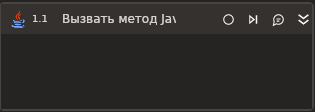

# Вызвать метод Java

Элемент вызывает указанный метод в экземпляре Java из загруженного .jar файла.

## Свойства
Символ `*` в названии свойства указывает на обязательность его заполнения. Кроме метода, потребуется указать либо свойство **Тип**, либо **Объект Java**.

Описание общих свойств элемента см. в разделе [Свойства элемента](https://docs.primo-rpa.ru/primo-rpa/primo-studio/process/elements#svoistva-elementa).

***Метод***
1. **Имя метода\*** *[String]* - Имя вызываемого метода.
1. **Параметры** *[List\<object\>]* - Параметры вызываемого метода: достаточно указать значения, без указания типа данных. **Важно**: значение параметра не может быть null. Возможно загружать параметры из существующих переменных процесса.
1. **Тип**  *[String]* - Пакет и имя класса вызываемого метода. Должен иметь вид: `"package.name.ClassName"`. Если тип указан, то поле **Объект Java** заполнять не нужно.
1. **Объект Java** *[Primo.Java.Linux.Models.JavaObject]* - Объект Java, в котором необходимо вызвать метод. Если задан, поле **Тип** оставьте пустым.

***Вывод***
1. **Результат** *[Primo.Java.Linux.Models.JavaObject]* - Переменная, в которой будет сохранен вызванный метод Java.
