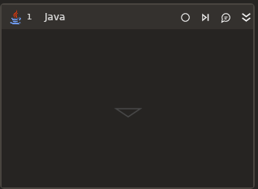

# Java

:bangbang: ***Требует установленной Java JDK >= 23 или Java JRE >= 67.***

Элемент-контейнер, который устанавливает соединение с Java. Все элементы из пакета Java корректно работают только внутри этого контейнера.

## Свойства

Описание общих свойств элемента см. в разделе [Свойства элемента](https://docs.primo-rpa.ru/primo-rpa/primo-studio/process/elements#svoistva-elementa).\
Символ `*` в названии свойства указывает на обязательность его заполнения.

***Соединение***
1. **Путь к java\*** *[String]* - Укажите путь к файлу java. Пример: `"/usr/bin/java"`
1. **Тайм-аут\*** *[Int32]* - Максимальное время ожидания в миллисекундах для установки соединения с Java. По умолчанию **5000**.
