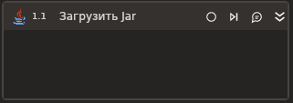

# Загрузить Jar

Элемент загружает файл \*.jar в контекст Java для последующих действий. Например, [вызвать метод](https://docs.primo-rpa.ru/primo-rpa/g_elements/el_extra/els_java/el_invokemethod) возможно только после загрузки jar-файла.

## Свойства
Описание общих свойств элемента см. в разделе [Свойства элемента](https://docs.primo-rpa.ru/primo-rpa/primo-studio/process/elements#svoistva-elementa).\
Символ `*` в названии свойства указывает на обязательность его заполнения.

***Jar***
1. **Путь\*** *[String]* - Укажите путь к файлу \*.jar.
